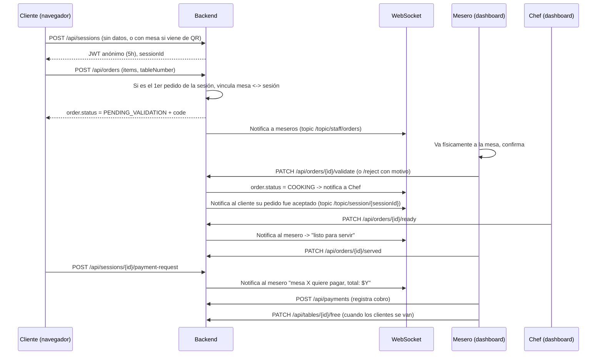

# Project Context

## Directory Structure

```text
restoflow/
    .gitattributes
    .gitignore
    docker-compose.yml
    project_context.md
    restoflow-spec-tecnica.md
    backend/
        Dockerfile
        HELP.md
        mvnw
        mvnw.cmd
        pom.xml
        .mvn/
            wrapper/
                maven-wrapper.properties
        src/
            main/
                java/
                    com/
                        restoflow/
                            RestoflowApplication.java
                            application/
                                usecase/
                                    package-info.java
                            domain/
                                model/
                                    package-info.java
                                port/
                                    in/
                                        package-info.java
                                    out/
                                        package-info.java
                                vo/
                                    package-info.java
                            infrastructure/
                                adapter/
                                    in/
                                        rest/
                                            package-info.java
                                        websocket/
                                            package-info.java
                                    out/
                                        notification/
                                            package-info.java
                                        persistence/
                                            package-info.java
                                        security/
                                            package-info.java
                                config/
                                    package-info.java
                resources/
                    application.yml
                    db/
                        migration/
                    static/
                    templates/
            test/
                java/
                    com/
                        restoflow/
                            RestoflowApplicationTests.java
                            TestcontainersConfiguration.java
                            TestRestoflowApplication.java
    frontend/
        .env
        .gitignore
        .oxlintrc.json
        index.html
        package-lock.json
        package.json
        README.md
        tsconfig.app.json
        tsconfig.json
        tsconfig.node.json
        vite.config.ts
        public/
            favicon.svg
            icons.svg
        src/
            App.css
            App.tsx
            index.css
            main.tsx
            assets/
                hero.png
                react.svg
                vite.svg
            features/
                admin/
                    AdminDashboard.tsx
                chef/
                    ChefDashboard.tsx
                client/
                    ClientDashboard.tsx
                waiter/
                    WaiterDashboard.tsx
            shared/
                api/
                    apiClient.ts
                components/
                websocket/
```

## File Contents

### `.gitattributes`

```text
/mvnw text eol=lf
*.cmd text eol=crlf
```

### `.gitignore`

```text
# System Files
.DS_Store
Thumbs.db

# IDE Settings
.idea/
.vscode/
*.iml
*.iws
*.ipr
.settings/
.classpath
.project
.factorypath
.apt_generated
.sts4-cache
.springBeans

# Backend (Maven)
backend/target/
backend/.mvn/wrapper/maven-wrapper.jar
!**/src/main/**/target/
!**/src/test/**/target/

# Frontend (Node / React / Vite)
frontend/node_modules/
frontend/dist/
frontend/.env
frontend/.env.local
frontend/.env.development.local
frontend/.env.test.local
frontend/.env.production.local
frontend/npm-debug.log*
frontend/yarn-debug.log*
frontend/yarn-error.log*
frontend/pnpm-debug.log*

# OS specific files
log/
*.log
```

### `docker-compose.yml`

```yml
version: '3.8'

services:
  db:
    image: postgres:16
    container_name: restoflow-db
    environment:
      POSTGRES_DB: restoflow
      POSTGRES_USER: restoflow
      POSTGRES_PASSWORD: restoflow
    ports:
      - "5432:5432"
    volumes:
      - restoflow_db_data:/var/lib/postgresql/data

  app:
    build:
      context: ./backend
      dockerfile: Dockerfile
    container_name: restoflow-backend
    depends_on:
      - db
    ports:
      - "8080:8080"
    environment:
      SPRING_PROFILES_ACTIVE: docker
      SPRING_DATASOURCE_URL: jdbc:postgresql://db:5432/restoflow
      SPRING_DATASOURCE_USERNAME: restoflow
      SPRING_DATASOURCE_PASSWORD: restoflow

volumes:
  restoflow_db_data:
```

### `restoflow-spec-tecnica.md`

```md
# RestoFlow — Especificación técnica completa
### Sistema de pedidos para restaurante con validación de mesa en tiempo real
**Stack objetivo:** Spring Boot (Java) + Arquitectura Hexagonal (Ports & Adapters) + PostgreSQL + WebSocket + JWT

> Este documento está escrito para ser **precisa y directamente utilizable por un agente de IA** (Claude Code, Cursor, etc.) como brief de desarrollo. Contiene decisiones de diseño ya tomadas — no ambigüedades para que el agente "adivine".

---

## 0. Resumen del sistema

RestoFlow es una plataforma web para restaurantes con 4 roles (`ADMIN`, `CHEF`, `MESERO`, `CLIENTE`). El cliente **no crea cuenta**: obtiene una sesión anónima (JWT, 5h de validez) al entrar, indica su número de mesa en su primer pedido, y desde ese momento la mesa queda "reclamada" por esa sesión. Cada pedido nuevo pasa por una **validación humana del mesero** (anti-fraude: evita pedidos remotos de gente que no está físicamente en el restaurante) antes de llegar a cocina.

---

## 0.1 Estructura del repositorio: Monorepo (decisión y layout)

**Decisión: un único repositorio, con `backend/` y `frontend/` como carpetas de primer nivel.** Los repos separados solo se justifican con equipos y ciclos de deploy independientes, que no es el caso de un proyecto de portafolio construido por una sola persona.

```
restoflow/
├── README.md                      # visión general del producto (problema, demo, arquitectura)
├── docker-compose.yml             # levanta backend + frontend + Postgres juntos
├── docs/
│   ├── architecture.md
│   └── security.md
├── backend/
│   ├── src/main/java/com/restoflow/...   # estructura hexagonal (sección 5)
│   └── pom.xml
├── frontend/
│   ├── src/
│   │   ├── features/               # client/, waiter/, chef/, admin/ (por rol)
│   │   ├── shared/                 # componentes UI reutilizables, cliente HTTP, cliente WebSocket
│   │   └── App.tsx
│   └── package.json
└── .github/
    └── workflows/
        ├── backend-ci.yml          # trigger: paths: backend/**
        └── frontend-ci.yml         # trigger: paths: frontend/**
```

Cada carpeta (`backend/`, `frontend/`) puede tener su propio README técnico con detalle de setup, pero el `README.md` de la raíz es el que ve primero un recruiter y debe explicar el producto completo, no solo una mitad.

---

## 1. Roles y permisos

| Acción | Cliente (anónimo) | Mesero | Chef | Admin |
|---|---|---|---|---|
| Ver menú | ✅ | ✅ | ✅ | ✅ (+editar) |
| Crear sesión anónima / indicar mesa | ✅ | — | — | — |
| Enviar pedido | ✅ (solo su sesión/mesa) | — | — | — |
| Ver estado de sus pedidos y total | ✅ | — | — | — |
| Solicitar pago | ✅ | — | — | — |
| Validar/rechazar pedido | — | ✅ | — | — |
| Ver mesas libres/ocupadas | — | ✅ | — | ✅ |
| Liberar mesa | — | ✅ | — | ✅ |
| Marcar pedido como "listo" | — | — | ✅ | — |
| Ver cola de cocina | — | — | ✅ | ✅ |
| Marcar plato agotado/disponible | — | — | ✅ | ✅ (también) |
| Registrar cobro | — | ✅ | — | ✅ (reportes) |
| CRUD de menú, mesas, usuarios de staff | — | — | — | ✅ |
| Ver reportes (ventas, tiempos) | — | — | — | ✅ |

Login **solo existe para** `MESERO`, `CHEF`, `ADMIN` (email + password). El cliente nunca hace login.

---

## 2. Flujo completo del cliente



**Regla clave de negocio:** una mesa solo puede estar vinculada a **una sesión activa a la vez**. Si otra sesión intenta crear un pedido para una mesa ya ocupada por otra sesión, el backend rechaza con `409 Conflict` (`TABLE_ALREADY_CLAIMED`). Esto se decide en el dominio, no en el frontend.

---

## 3. Máquinas de estado

**Order (Pedido):**
```
CREATED → PENDING_VALIDATION → COOKING → READY → SERVED
                ↓
            CANCELLED (requiere reasonCode + reasonText, solo el mesero puede cancelar desde PENDING_VALIDATION)
```

**Table (Mesa):**
```
FREE → OCCUPIED (al vincularse a una sesión) → FREE (mesero libera manualmente tras el pago)
```

**ClientSession (Sesión anónima):**
```
ACTIVE → EXPIRED (a las 5h) | CLOSED (mesero libera la mesa -> cierra la sesión)
```

Ningún estado se salta pasos vía API — cada transición es un endpoint específico con reglas de guardia en el dominio (ver sección 6).

---

## 4. Modelo de datos (PostgreSQL)

```sql
-- Staff (login real)
CREATE TABLE staff_users (
  id UUID PRIMARY KEY DEFAULT gen_random_uuid(),
  email VARCHAR(255) UNIQUE NOT NULL,
  password_hash VARCHAR(255) NOT NULL,
  full_name VARCHAR(255) NOT NULL,
  role VARCHAR(20) NOT NULL CHECK (role IN ('ADMIN','CHEF','MESERO')),
  active BOOLEAN DEFAULT TRUE,
  created_at TIMESTAMP DEFAULT now()
);

CREATE TABLE restaurant_tables (
  id UUID PRIMARY KEY DEFAULT gen_random_uuid(),
  number INT UNIQUE NOT NULL,
  capacity INT NOT NULL,
  status VARCHAR(20) NOT NULL DEFAULT 'FREE' CHECK (status IN ('FREE','OCCUPIED')),
  current_session_id UUID NULL
);

CREATE TABLE client_sessions (
  id UUID PRIMARY KEY DEFAULT gen_random_uuid(),
  table_id UUID NULL REFERENCES restaurant_tables(id),
  status VARCHAR(20) NOT NULL DEFAULT 'ACTIVE' CHECK (status IN ('ACTIVE','EXPIRED','CLOSED')),
  created_at TIMESTAMP DEFAULT now(),
  expires_at TIMESTAMP NOT NULL
);

CREATE TABLE menu_categories (
  id UUID PRIMARY KEY DEFAULT gen_random_uuid(),
  name VARCHAR(50) NOT NULL CHECK (name IN ('BEBIDA','COMIDA','POSTRE'))
);

CREATE TABLE menu_items (
  id UUID PRIMARY KEY DEFAULT gen_random_uuid(),
  category_id UUID NOT NULL REFERENCES menu_categories(id),
  name VARCHAR(150) NOT NULL,
  description TEXT,
  price NUMERIC(10,2) NOT NULL CHECK (price >= 0),
  available BOOLEAN DEFAULT TRUE,
  image_url VARCHAR(500)
);

CREATE TABLE orders (
  id UUID PRIMARY KEY DEFAULT gen_random_uuid(),
  session_id UUID NOT NULL REFERENCES client_sessions(id),
  table_id UUID NOT NULL REFERENCES restaurant_tables(id),
  status VARCHAR(20) NOT NULL DEFAULT 'CREATED',
  validation_code VARCHAR(6) NOT NULL,
  validated_by UUID NULL REFERENCES staff_users(id),
  validated_at TIMESTAMP NULL,
  cancel_reason_code VARCHAR(50) NULL,
  cancel_reason_text VARCHAR(255) NULL,
  total_amount NUMERIC(10,2) NOT NULL DEFAULT 0,
  created_at TIMESTAMP DEFAULT now()
);

CREATE TABLE order_items (
  id UUID PRIMARY KEY DEFAULT gen_random_uuid(),
  order_id UUID NOT NULL REFERENCES orders(id) ON DELETE CASCADE,
  menu_item_id UUID NOT NULL REFERENCES menu_items(id),
  quantity INT NOT NULL CHECK (quantity > 0),
  unit_price NUMERIC(10,2) NOT NULL,
  notes VARCHAR(255)
);

CREATE TABLE payments (
  id UUID PRIMARY KEY DEFAULT gen_random_uuid(),
  session_id UUID NOT NULL REFERENCES client_sessions(id),
  registered_by UUID NOT NULL REFERENCES staff_users(id),
  total_amount NUMERIC(10,2) NOT NULL,
  payment_method VARCHAR(20) NOT NULL CHECK (payment_method IN ('EFECTIVO','TARJETA','TRANSFERENCIA')),
  paid_at TIMESTAMP DEFAULT now()
);

CREATE INDEX idx_orders_status ON orders(status);
CREATE INDEX idx_orders_session ON orders(session_id);
CREATE INDEX idx_tables_status ON restaurant_tables(status);
```

---

## 5. Arquitectura hexagonal — estructura de paquetes exacta

```
src/main/java/com/restoflow/
├── domain/
│   ├── model/               # Order, OrderItem, Table, ClientSession, MenuItem, StaffUser, Payment
│   ├── vo/                  # OrderStatus, TableStatus, Role, Money, ValidationCode
│   ├── exception/           # TableAlreadyClaimedException, InvalidOrderTransitionException...
│   └── port/
│       ├── in/               # PlaceOrderUseCase, ValidateOrderUseCase, MarkOrderReadyUseCase,
│       │                     # RequestPaymentUseCase, RegisterPaymentUseCase, FreeTableUseCase...
│       └── out/               # OrderRepositoryPort, TableRepositoryPort, SessionRepositoryPort,
│                              # NotificationPort, ClockPort, CodeGeneratorPort
│
├── application/
│   └── usecase/              # Implementaciones de los puertos "in". Sin anotaciones de Spring
│                              # aquí salvo @Service. Orquestan dominio + puertos "out".
│
├── infrastructure/
│   ├── adapter/
│   │   ├── in/
│   │   │   ├── rest/          # Controllers REST + DTOs + mappers (uno por rol: ClientController,
│   │   │   │                  # WaiterController, ChefController, AdminController, AuthController)
│   │   │   └── websocket/     # STOMP: OrderNotificationHandler
│   │   └── out/
│   │       ├── persistence/   # Entidades JPA + Spring Data Repos + implementación de *RepositoryPort
│   │       ├── security/      # JwtTokenProvider, JwtAuthFilter, ClientSessionAuthFilter
│   │       └── notification/  # WebSocketNotificationAdapter implements NotificationPort
│   └── config/                # SecurityConfig, WebSocketConfig, RateLimitConfig, OpenApiConfig
│
└── RestoflowApplication.java
```

**Regla de dependencia (la clave de hexagonal):** `domain` no importa nada de Spring ni de JPA. `application` solo depende de `domain`. `infrastructure` depende de `domain` y `application`, nunca al revés. Esto es lo que un entrevistador senior te va a preguntar primero al ver el repo — asegúrate de que sea cierto y no solo carpetas con el nombre correcto.

---

## 6. Reglas de dominio importantes (para que el agente de IA no las invente mal)

1. **Vinculación de mesa:** al crear un pedido, si `ClientSession.tableId == null`, se asigna la mesa indicada y se marca `restaurant_tables.status = OCCUPIED`. Si `ClientSession.tableId != null`, el pedido debe usar esa misma mesa — si el cliente manda otra mesa, `400 Bad Request`.
2. **Un pedido nunca se auto-valida.** Solo transiciona de `PENDING_VALIDATION` a `COOKING` vía el endpoint del mesero. No existe timeout automático que la valide sola (evita que alguien "spamee" pedidos sabiendo que se aprueban solos).
3. **Rate limiting:** máximo 1 pedido en estado `PENDING_VALIDATION` simultáneo por sesión (el cliente no puede crear un segundo pedido hasta que el primero sea validado o rechazado) — esto es intencional, no solo anti-abuso: evita que el mesero reciba una avalancha de códigos de la misma mesa. Además, máximo 10 pedidos por sesión en 5 horas (límite duro).
4. **El total del cliente** (`GET /api/sessions/{id}/summary`) es la suma de `total_amount` de todos sus pedidos con estado distinto de `CANCELLED`.
5. **Liberar mesa** solo lo puede hacer el mesero/admin, y solo si no hay pedidos en estado `PENDING_VALIDATION` o `COOKING` sin servir asociados a la sesión activa (evita liberar una mesa con comida pendiente).
6. **Código de validación:** se genera al crear el pedido (`SecureRandom`, 6 dígitos), se muestra únicamente en el dashboard del mesero (nunca se envía al cliente por API) — es una referencia visual para que el mesero confirme "pedido #… código 482913" al llegar a la mesa, no un secreto criptográfico. Si en el futuro quieres que el cliente también lo escriba como doble factor, es un cambio de V2 (ver roadmap).

---

## 7. Endpoints REST

**Auth / Sesión**
```
POST /api/auth/login                    (staff: email+password -> JWT con rol)
POST /api/sessions                      (cliente: crea sesión anónima -> JWT 5h)
GET  /api/sessions/{id}/summary         (cliente: pedidos + total)
POST /api/sessions/{id}/payment-request (cliente: notifica al mesero)
```

**Menú**
```
GET    /api/menu                        (público, filtrable por categoría)
POST   /api/admin/menu-items            (admin)
PUT    /api/admin/menu-items/{id}       (admin)
PATCH  /api/chef/menu-items/{id}/availability   (chef: marcar agotado/disponible)
```

**Pedidos**
```
POST   /api/orders                      (cliente)
GET    /api/orders?status=PENDING_VALIDATION   (mesero)
PATCH  /api/orders/{id}/validate        (mesero)
PATCH  /api/orders/{id}/reject          (mesero, body: reasonCode, reasonText)
GET    /api/chef/orders?status=COOKING  (chef)
PATCH  /api/orders/{id}/ready           (chef)
PATCH  /api/orders/{id}/served          (mesero)
```

**Mesas**
```
GET    /api/tables                      (mesero/admin: libres/ocupadas)
PATCH  /api/tables/{id}/free            (mesero/admin)
```

**Pagos**
```
POST   /api/payments                    (mesero: registra cobro)
GET    /api/admin/reports/sales         (admin)
```

---

## 8. WebSocket (notificaciones en tiempo real)

Usa **STOMP sobre WebSocket** (`spring-boot-starter-websocket`), no polling — es lo correcto para este caso de uso y es un punto fuerte técnico para tu portafolio.

| Topic | Quién escucha | Evento |
|---|---|---|
| `/topic/staff/orders` | Todos los meseros conectados | Nuevo pedido `PENDING_VALIDATION` |
| `/topic/chef/queue` | Chef | Pedido pasó a `COOKING` |
| `/topic/staff/ready` | Meseros | Chef marcó pedido `READY` |
| `/topic/staff/payments` | Meseros | Cliente solicitó pagar |
| `/topic/session/{sessionId}` | El cliente específico (su navegador) | Su pedido cambió de estado |

El cliente se suscribe a su propio topic con su `sessionId` al conectar — así ve en tiempo real "tu pedido fue aceptado / está listo" sin refrescar la página.

---

## 9. Seguridad

- **Dos flujos de autenticación distintos**, ambos con JWT pero distinto propósito:
  - **Staff:** login clásico (email + password con BCrypt), JWT contiene `role` y expira en, por ejemplo, 8h (turno laboral).
  - **Cliente:** JWT anónimo sin credenciales, claim `sessionId`, expira en 5h. Se emite en `POST /api/sessions` sin body ni auth previa.
- **Nunca confíes en el `tableNumber` que manda el cliente en el body** una vez la sesión ya tiene mesa asignada — siempre se valida contra `ClientSession.tableId` en el backend (regla de dominio #1).
- **Rate limiting** con **Bucket4j** (no viene en Spring Initializr, se agrega a mano) sobre el endpoint `POST /api/orders`, keyed por `sessionId`.
- **CORS** configurado explícitamente (whitelist del dominio del frontend), nunca `*` en producción.
- **Validación de input** con `spring-boot-starter-validation` (`@Valid`, `@NotNull`, `@Positive` en cantidades, etc.) en todos los DTOs.
- **Autorización por rol** con `@PreAuthorize("hasRole('MESERO')")` a nivel de método en los use cases expuestos, no solo en el controller.

**Vulnerabilidades a practicar deliberadamente y luego corregir (para tu sección de seguridad del README):**
- IDOR: que un mesero pueda validar pedidos de un restaurante/sucursal que no es la suya (si en el futuro hay multi-sucursal) — corrige comprobando pertenencia.
- Que el cliente pueda editar `unit_price` en el body del pedido (nunca debe hacerlo — el precio siempre se recalcula server-side desde `menu_items`, ignora cualquier precio que venga del cliente).
- Que el JWT anónimo no tenga expiración corta — pruébalo con uno que no expire, luego corrige a 5h reales.

---

## 10. Dependencias de Spring Initializr

**Generador:** https://start.spring.io — Project: Maven, Language: Java, Spring Boot: última versión estable 3.x, Packaging: Jar, Java: 21 (LTS).

Marca estas dependencias directamente en el Initializr:

| Dependencia | Para qué |
|---|---|
| **Spring Web** | REST controllers |
| **Spring Data JPA** | Persistencia |
| **PostgreSQL Driver** | Conexión a la base de datos |
| **Spring Security** | Auth de staff + filtros JWT |
| **Validation** | `@Valid` en DTOs |
| **WebSocket** | STOMP para notificaciones en tiempo real |
| **Lombok** | Reduce boilerplate (getters/builders) |
| **Spring Boot Actuator** | Healthchecks/observabilidad |
| **Flyway Migration** | Migraciones de base de datos versionadas |
| **Testcontainers** | Tests de integración contra Postgres real en Docker |
| **Spring Boot DevTools** | Solo para desarrollo local |

**Añadir manualmente al `pom.xml` después de generar el proyecto** (no están en el Initializr):
```xml
<!-- JWT -->
<dependency>
  <groupId>io.jsonwebtoken</groupId>
  <artifactId>jjwt-api</artifactId>
  <version>0.12.6</version>
</dependency>
<dependency>
  <groupId>io.jsonwebtoken</groupId>
  <artifactId>jjwt-impl</artifactId>
  <version>0.12.6</version>
  <scope>runtime</scope>
</dependency>
<dependency>
  <groupId>io.jsonwebtoken</groupId>
  <artifactId>jjwt-jackson</artifactId>
  <version>0.12.6</version>
  <scope>runtime</scope>
</dependency>

<!-- Rate limiting -->
<dependency>
  <groupId>com.bucket4j</groupId>
  <artifactId>bucket4j-core</artifactId>
  <version>8.10.1</version>
</dependency>

<!-- Documentación OpenAPI/Swagger -->
<dependency>
  <groupId>org.springdoc</groupId>
  <artifactId>springdoc-openapi-starter-webmvc-ui</artifactId>
  <version>2.6.0</version>
</dependency>
```
*(Verifica siempre la última versión estable de cada una en Maven Central antes de fijarla — las de arriba son referencia, no las copies a ciegas dentro de 6 meses.)*

---

## 11. Testing

- **Unit tests** (JUnit 5 + Mockito): lógica de dominio pura — sobre todo las reglas de la sección 6 (vinculación de mesa, rate limiting, transiciones de estado inválidas deben lanzar excepción).
- **Integration tests** (Testcontainers + `@SpringBootTest`): flujo completo `POST /api/sessions` → `POST /api/orders` → `PATCH /validate` → `PATCH /ready` → `PATCH /served`, contra una PostgreSQL real en Docker, no H2 (evita falsos positivos por diferencias de dialecto SQL).
- **Contract tests del WebSocket:** verifica que al validar un pedido efectivamente se publica en `/topic/chef/queue`.

---

## 12. Docker y despliegue gratuito

```yaml
# docker-compose.yml (desarrollo local)
services:
  db:
    image: postgres:16
    environment:
      POSTGRES_DB: restoflow
      POSTGRES_USER: restoflow
      POSTGRES_PASSWORD: restoflow
    ports: ["5432:5432"]
  app:
    build: .
    depends_on: [db]
    ports: ["8080:8080"]
    environment:
      SPRING_DATASOURCE_URL: jdbc:postgresql://db:5432/restoflow
```

**Despliegue gratuito recomendado (sin tarjeta ni AWS todavía):** [Render.com](https://render.com) (free tier para web services + PostgreSQL gratuito con límite de almacenamiento) o **Railway** (crédito gratuito mensual). Cuando avances con el roadmap de cloud de tu plan general, migra a AWS (RDS + ECS) como hiciste con ShiftSync — la arquitectura hexagonal no cambia, solo el adaptador de persistencia y el despliegue.

---

## 13. Roadmap MVP → V2 → V3

**MVP:** sesión anónima, menú, crear pedido, validación por mesero, cocina marca listo, mesero marca servido, solicitud y registro de pago, liberar mesa. Un solo turno, un solo local.

**V2:** doble validación (mesero **y** cliente ingresan el código), soporte de "mesa compartida" por varias sesiones (grupos), impresión de comanda física para cocina, historial de pedidos por mesa para el admin, notificaciones push (no solo WebSocket mientras la pestaña está abierta).

**V3:** múltiples sucursales, panel de métricas (tiempo promedio de validación, tiempo de cocina por plato), sistema de propinas, integración con pasarela de pago real (Stripe/MercadoPago) en vez de solo "registrar cobro manual".

---

## 14. Plan de implementación paso a paso (orden de construcción del MVP)

**Por qué este orden y no otro:** en arquitectura hexagonal el error más común es empezar por los controllers REST porque "es lo que se ve". Eso te obliga a inventar el dominio sobre la marcha y termina en lógica de negocio metida dentro de los controllers. El orden correcto es de adentro hacia afuera: **dominio puro → puertos → casos de uso → adaptadores de salida (persistencia) → adaptadores de entrada (REST/WebSocket) → seguridad y cross-cutting → integración end-to-end**.

Cada fase de abajo es **una sesión de trabajo independiente** con tu agente de IA. No pases a la siguiente fase hasta cumplir el "Definición de terminado" de la actual — eso es literalmente lo que hace un equipo profesional (cerrar un sprint antes de abrir el siguiente), y es lo que vas a poder explicar en una entrevista: *"construí esto en capas, validando cada una antes de avanzar"*.

### Fase 0 — Andamiaje del proyecto
**Objetivo:** tener el proyecto arrancando en local, con base de datos, sin ninguna lógica todavía.
**Construir:**
- Proyecto generado desde start.spring.io con las dependencias de la sección 10.
- Estructura de carpetas vacía exactamente como en la sección 5 (con un `package-info.java` o `.gitkeep` si hace falta para que Git trackee carpetas vacías).
- `docker-compose.yml` (sección 12) levantando PostgreSQL.
- `application.yml` con perfiles `local` y `docker`.
- Primer commit + repo en GitHub + README inicial (solo título y stack).
**Definición de terminado:** `./mvnw spring-boot:run` levanta la app sin errores y se conecta a Postgres en Docker. No hay endpoints todavía, y **eso está bien**.
**Prompt para el agente:**
```
Genera el proyecto Spring Boot inicial descrito en la sección 5 (estructura de paquetes)
y sección 10 (dependencias) del documento adjunto. Crea solo el andamiaje: pom.xml,
application.yml con perfiles local/docker, docker-compose.yml con PostgreSQL, y la
estructura de carpetas vacía de domain/application/infrastructure. NO implementes
ninguna entidad, endpoint ni lógica todavía. El objetivo de esta fase es solo que el
proyecto arranque y conecte a la base de datos.
```

### Fase 1 — Dominio puro (sin Spring)
**Objetivo:** modelar las reglas de negocio de la sección 6 como código Java plano, testeable sin levantar el framework.
**Construir:**
- Clases en `domain/model`: `Order`, `OrderItem`, `RestaurantTable`, `ClientSession`, `MenuItem`, `StaffUser`, `Payment`.
- `domain/vo`: `OrderStatus`, `TableStatus`, `Role`, `Money`, `ValidationCode`.
- Métodos de negocio **dentro** de las entidades (no anémicas): ej. `Order.validate(StaffUserId)`, `Order.reject(reason)`, `RestaurantTable.claimBy(sessionId)`, con las excepciones de dominio de la sección 6 lanzadas ahí mismo.
- `domain/exception`: `TableAlreadyClaimedException`, `InvalidOrderTransitionException`, `OrderLimitExceededException`.
**Definición de terminado:** tests unitarios JUnit (sin Spring context) que prueban: no se puede validar un pedido dos veces, no se puede reclamar una mesa ya ocupada, no se puede exceder el límite de pedidos por sesión. Todo pasa con `mvn test` en segundos, sin base de datos.
**Prompt para el agente:**
```
Implementa SOLO el paquete domain/ del proyecto (sin anotaciones de Spring, sin JPA).
Modela Order, OrderItem, RestaurantTable, ClientSession, MenuItem, StaffUser, Payment
como clases Java planas con lógica de negocio dentro de la entidad, no en servicios
externos. Aplica exactamente las reglas de negocio de la sección 6 del documento:
una mesa solo puede reclamarse si está FREE, un pedido solo transiciona
PENDING_VALIDATION -> COOKING vía un método explícito de validación, máximo 1 pedido
PENDING_VALIDATION por sesión. Lanza las excepciones de dominio correspondientes.
Escribe tests unitarios JUnit 5 puros (sin @SpringBootTest) para cada regla.
No crees controllers, repositorios ni nada de infraestructura en esta fase.
```

### Fase 2 — Puertos (contratos)
**Objetivo:** definir las interfaces que conectan dominio con el mundo exterior, sin implementarlas todavía.
**Construir:** interfaces en `domain/port/in` (`PlaceOrderUseCase`, `ValidateOrderUseCase`, `RejectOrderUseCase`, `MarkOrderReadyUseCase`, `MarkOrderServedUseCase`, `RequestPaymentUseCase`, `RegisterPaymentUseCase`, `FreeTableUseCase`) y `domain/port/out` (`OrderRepositoryPort`, `TableRepositoryPort`, `SessionRepositoryPort`, `MenuRepositoryPort`, `NotificationPort`, `ClockPort`, `CodeGeneratorPort`).
**Definición de terminado:** compila. Son solo interfaces, cero implementación. Este paso es corto a propósito.
**Prompt para el agente:**
```
A partir del dominio ya implementado en la Fase 1, define las interfaces de
domain/port/in y domain/port/out listadas en la sección 5 del documento.
Son solo contratos (interfaces), sin implementación. No toques el paquete domain/model
que ya existe.
```

### Fase 3 — Casos de uso (application)
**Objetivo:** orquestar el dominio a través de los puertos, sin saber todavía cómo se persiste nada (usa mocks/fakes en los tests).
**Construir:** `application/usecase` implementando cada puerto "in", inyectando los puertos "out" por constructor.
**Definición de terminado:** tests unitarios con Mockito mockeando los puertos "out" (repos y notificaciones falsas), verificando que cada caso de uso llama correctamente al dominio y a los puertos en el orden correcto (ej. `ValidateOrderUseCase` llama a `Order.validate()`, guarda, y luego notifica).
**Prompt para el agente:**
```
Implementa application/usecase/ para todos los puertos "in" definidos en la Fase 2,
usando los puertos "out" solo como interfaces inyectadas por constructor (no los
implementes todavía). Escribe tests con Mockito mockeando los puertos "out" para
verificar la orquestación de cada caso de uso. No agregues anotaciones de Spring
salvo @Service en la implementación del caso de uso.
```

### Fase 4 — Persistencia (adaptador de salida)
**Objetivo:** implementar los puertos "out" contra PostgreSQL real.
**Construir:** entidades JPA (separadas de las del dominio, con mappers entre ambas — no mezcles `@Entity` con tu modelo de dominio), Spring Data repositories, clases `*RepositoryAdapter` en `infrastructure/adapter/out/persistence` que implementan los puertos "out", migraciones Flyway con el esquema de la sección 4.
**Definición de terminado:** tests de integración con **Testcontainers** (Postgres real en Docker) que prueban guardar y recuperar cada entidad, y que las migraciones Flyway corren limpias desde cero.
**Prompt para el agente:**
```
Implementa infrastructure/adapter/out/persistence/: entidades JPA equivalentes al
esquema SQL de la sección 4 del documento, Spring Data JPA repositories, y clases
adapter que implementen los puertos "out" de domain/port/out usando mappers explícitos
entre entidad JPA y modelo de dominio (no anotes el modelo de dominio con @Entity).
Crea las migraciones Flyway en src/main/resources/db/migration siguiendo el esquema
de la sección 4. Escribe tests de integración con Testcontainers (PostgreSQL real)
para cada repositorio.
```

### Fase 5 — Autenticación y seguridad base
**Objetivo:** los dos flujos de JWT (staff y cliente anónimo) funcionando end-to-end.
**Construir:** `JwtTokenProvider`, filtros de seguridad, `SecurityConfig`, endpoint `POST /api/auth/login` (staff) y `POST /api/sessions` (cliente anónimo), con BCrypt para passwords de staff.
**Definición de terminado:** puedes loguearte como mesero/chef/admin y recibir un JWT con rol; puedes crear una sesión anónima y recibir un JWT de 5h; un endpoint protegido rechaza sin token y acepta con el rol correcto.
**Prompt para el agente:**
```
Implementa la seguridad descrita en la sección 9: JwtTokenProvider, SecurityConfig,
un filtro para JWT de staff (con rol) y otro para JWT de sesión anónima de cliente.
Implementa POST /api/auth/login (staff, BCrypt) y POST /api/sessions (cliente, sin
credenciales, expira en 5h). No implementes todavía los endpoints de negocio
(pedidos, menú, etc.) - solo autenticación y la configuración de seguridad.
```

### Fase 6 — REST: flujo del cliente
**Objetivo:** el cliente puede ver el menú y crear pedidos de principio a fin (aunque el mesero todavía no tenga dashboard).
**Construir:** `ClientController` con `GET /api/menu`, `POST /api/orders`, `GET /api/sessions/{id}/summary`, `POST /api/sessions/{id}/payment-request`. DTOs de request/response y mappers hacia los casos de uso de la Fase 3.
**Definición de terminado:** con Postman/curl puedes crear una sesión, ver el menú, crear un pedido indicando mesa, y ver que queda en `PENDING_VALIDATION`. Puedes validarlo manualmente actualizando la BD a mano todavía (el endpoint del mesero viene en la siguiente fase).
**Prompt para el agente:**
```
Implementa infrastructure/adapter/in/rest/ClientController usando los casos de uso
ya implementados (Fase 3) y la seguridad de sesión anónima (Fase 5). Endpoints:
GET /api/menu, POST /api/orders, GET /api/sessions/{id}/summary,
POST /api/sessions/{id}/payment-request. Crea los DTOs necesarios y mappers hacia
los casos de uso. No implementes todavía los endpoints de mesero/chef/admin.
```

### Fase 7 — REST: flujo de mesero, chef y admin
**Objetivo:** cerrar el ciclo completo del pedido.
**Construir:** `WaiterController` (`GET /api/orders?status=`, `validate`, `reject`, `served`, `GET /api/tables`, `free`), `ChefController` (`ready`, disponibilidad de platos), `AdminController` (CRUD de menú/mesas/usuarios, reportes básicos).
**Definición de terminado:** puedes ejecutar el flujo completo de la sección 2 (secuencia) de punta a punta vía API, sin WebSocket todavía (el mesero refresca manualmente para ver pedidos nuevos).
**Prompt para el agente:**
```
Implementa WaiterController, ChefController y AdminController siguiendo los endpoints
de la sección 7 del documento, usando los casos de uso ya existentes y protegidos por
rol con @PreAuthorize. Verifica que el flujo completo cliente -> validación mesero ->
cocina -> servido -> pago -> liberar mesa funcione de punta a punta vía llamadas REST
manuales (Postman/curl), sin WebSocket todavía.
```

### Fase 8 — WebSocket (tiempo real)
**Objetivo:** reemplazar el refresco manual por notificaciones push.
**Construir:** `WebSocketConfig` con STOMP, `WebSocketNotificationAdapter implements NotificationPort`, y que los casos de uso ya existentes (Fase 3) empiecen a recibir esa implementación real en vez de un mock.
**Definición de terminado:** conectas dos pestañas del navegador (o Postman con WS), una simulando mesero y otra cliente, y ves las notificaciones de la tabla de la sección 8 llegar en tiempo real al validar/marcar listo/etc.
**Prompt para el agente:**
```
Implementa infrastructure/adapter/out/notification/WebSocketNotificationAdapter
(implementa NotificationPort) y la configuración STOMP de WebSocketConfig, con los
topics exactos de la tabla de la sección 8. Conecta esta implementación real a los
casos de uso de la Fase 3 (que hasta ahora usaban un NotificationPort mock/no-op).
No cambies la lógica de los casos de uso, solo la implementación del puerto.
```

### Fase 9 — Rate limiting y hardening
**Objetivo:** aplicar la sección 6 regla 3 (límites de pedidos) y las vulnerabilidades a corregir de la sección 9.
**Construir:** filtro Bucket4j sobre `POST /api/orders` keyed por `sessionId`, y revisión explícita de que el precio se recalcula server-side (no confiar en el cliente).
**Definición de terminado:** un test que intenta crear 2 pedidos `PENDING_VALIDATION` seguidos para la misma sesión recibe `429`/`409`; un test que manda un `unitPrice` manipulado en el body es ignorado y se usa el precio real de `menu_items`.
**Prompt para el agente:**
```
Agrega rate limiting con Bucket4j al endpoint POST /api/orders, aplicando la regla de
la sección 6 (máximo 1 pedido PENDING_VALIDATION simultáneo por sesión, máximo 10 en
la ventana de 5h). Además, audita ClientController/PlaceOrderUseCase para confirmar
que el precio de cada order_item se recalcula siempre desde MenuItem en el servidor
y que cualquier precio recibido en el request se ignora. Escribe tests que prueben
ambos casos.
```

### Fase 10 — Integración end-to-end, documentación y pulido
**Objetivo:** el proyecto queda demostrable, no solo funcional.
**Construir:** test de integración completo del flujo de la sección 2, documentación OpenAPI/Swagger (springdoc), README profesional (problema que resuelve, arquitectura con diagrama, cómo correrlo local en 3 comandos), `docs/security.md` documentando las vulnerabilidades corregidas.
**Definición de terminado:** cualquier persona clona el repo, hace `docker-compose up`, y en menos de 5 minutos tiene la app corriendo y puede seguir el flujo completo desde Swagger UI.
**Prompt para el agente:**
```
Escribe un test de integración end-to-end que ejecute el flujo completo de la
sección 2 del documento (crear sesión -> pedido -> validar -> cocinar -> listo ->
servido -> solicitar pago -> registrar pago -> liberar mesa). Agrega springdoc-openapi
y verifica que Swagger UI documente todos los endpoints. Genera un README.md
profesional con: descripción del problema, diagrama de arquitectura (usa el mermaid
de la sección 2), instrucciones de setup local con docker-compose, y un docs/security.md
resumiendo las decisiones de seguridad de la sección 9.
```

---

## 14.1 Frontend — stack y fases (ritmadas con el backend)

**Stack:** React + TypeScript + Vite (consistente con el resto de tu portafolio), React Router (rutas por rol: `/cliente`, `/mesero`, `/chef`, `/admin`), Tailwind CSS, `@tanstack/react-query` (manejo de llamadas a la API, cache, reintentos — evita `useEffect` + `fetch` a mano por todos lados), `@stomp/stompjs` + `sockjs-client` (consumo del WebSocket de la sección 8), Zustand o Context API para el estado mínimo de sesión (JWT del cliente/staff guardado en memoria + `localStorage`).

**Regla de ritmo general:** el **maquetado visual** (F0-F1) puede arrancar en paralelo al backend desde el día 1, con datos falsos (mocks). La **integración real** de cada pantalla (F2 en adelante) siempre espera a que la fase de backend correspondiente esté "terminada" según su propia definición de terminado — no antes, porque conectarías contra un contrato que todavía puede cambiar.

| Fase Frontend | Depende de (Backend) | Se puede hacer en paralelo con |
|---|---|---|
| F0 — Setup del proyecto | Fase 0 (ninguna dependencia real) | Backend Fase 0-1 |
| F1 — Maquetado con datos falsos | Ninguna | Backend Fase 1-4 |
| F2 — Cliente: sesión + menú real | Backend Fase 5 (auth) y Fase 6 (REST cliente) | — (secuencial) |
| F3 — Cliente: flujo de pedido completo | Backend Fase 6 | — (secuencial) |
| F4 — Mesero: login + mesas + validación | Backend Fase 5 y Fase 7 | — (secuencial) |
| F5 — Chef: cola de cocina | Backend Fase 7 | Frontend F4 (mismo momento) |
| F6 — Admin: CRUD de menú/mesas/usuarios | Backend Fase 7 | Frontend F4-F5 |
| F7 — WebSocket: notificaciones en tiempo real | Backend Fase 8 | — (secuencial, reemplaza polling de F3-F6) |
| F8 — Pulido, manejo de errores, responsive, deploy | Backend Fase 9-10 | Backend Fase 10 |

### Fase F0 — Setup del frontend
**Objetivo:** proyecto React corriendo, sin pantallas reales.
**Construir:** Vite + React + TS, Tailwind configurado, React Router con rutas vacías por rol, cliente HTTP base (Axios o fetch wrapper) apuntando a `http://localhost:8080` vía variable de entorno.
**Definición de terminado:** `npm run dev` levanta la app y navega entre 4 rutas vacías (`/cliente`, `/mesero`, `/chef`, `/admin`).
**Prompt para el agente:**
```
Crea el proyecto frontend/ con Vite + React + TypeScript + Tailwind CSS + React Router.
Define rutas vacías para /cliente, /mesero, /chef, /admin (solo un placeholder de texto
en cada una). Configura un cliente HTTP base (axios) que lea la URL del backend desde
una variable de entorno VITE_API_URL. No conectes a ningún endpoint real todavía.
```

### Fase F1 — Maquetado con datos falsos (mock data)
**Objetivo:** todas las pantallas visualmente terminadas, sin backend real detrás.
**Construir:** vista de menú con categorías (Bebida/Comida/Postre) y carrito, dashboard de mesero (grid de mesas libres/ocupadas + lista de pedidos pendientes), dashboard de chef (cola de pedidos), panel admin (tablas de menú/mesas/usuarios) — todo con arrays de JavaScript hardcodeados simulando la respuesta de la API.
**Definición de terminado:** puedes navegar y "usar" visualmente las 4 pantallas principales, aunque ningún botón haga nada real todavía.
**Prompt para el agente:**
```
Maqueta las pantallas principales del frontend usando datos falsos (arrays hardcodeados
en el propio componente, con la misma forma que tendrá la respuesta real de la API
según los DTOs de la sección 7 del documento backend): vista de menú + carrito para
cliente, dashboard de mesas y pedidos pendientes para mesero, cola de cocina para chef,
tablas CRUD para admin. No conectes a ningún endpoint todavía ni implementes lógica
de negocio - es solo maquetado visual con Tailwind.
```

### Fase F2 — Cliente: sesión y menú real
**Objetivo:** reemplazar los mocks del menú por datos reales del backend.
**Construir:** llamada a `POST /api/sessions` al entrar (guardar JWT anónimo), `GET /api/menu` real con React Query, manejo del token en cada request subsiguiente.
**Definición de terminado:** el menú que ves en pantalla viene de tu backend corriendo en Docker, no de datos hardcodeados.
**Prompt para el agente:**
```
Conecta la pantalla de cliente a la API real: al entrar, llama POST /api/sessions y
guarda el JWT devuelto (localStorage + header Authorization en las siguientes
peticiones). Reemplaza los datos falsos del menú por una llamada real a GET /api/menu
usando React Query. El backend ya expone estos endpoints (Fase 5 y 6 del documento
de backend) - no modifiques nada del backend.
```

### Fase F3 — Cliente: flujo de pedido completo
**Objetivo:** el cliente puede pedir, ver el estado en vivo (todavía sin WebSocket, con polling) y solicitar pagar.
**Construir:** carrito funcional → `POST /api/orders` con el número de mesa, pantalla de "esperando validación" con polling cada pocos segundos a `GET /api/sessions/{id}/summary`, botón de "pedir la cuenta" → `POST /api/sessions/{id}/payment-request`.
**Definición de terminado:** puedes hacer un pedido real de principio a fin desde el navegador y ver su estado cambiar (aunque sea refrescando/polling, el WebSocket llega en F7).
**Prompt para el agente:**
```
Implementa el flujo completo de pedido del cliente: carrito -> POST /api/orders
(incluye tableNumber solo en el primer pedido de la sesión) -> pantalla de estado del
pedido con polling cada 5s a GET /api/sessions/{id}/summary -> botón "Pedir la cuenta"
que llama POST /api/sessions/{id}/payment-request. Usa React Query para el polling
(refetchInterval). El WebSocket se implementa en una fase posterior, por ahora usa
polling simple.
```

### Fase F4 — Mesero: login, mesas y validación
**Objetivo:** el mesero puede loguearse y cerrar el ciclo de validación.
**Construir:** pantalla de login (`POST /api/auth/login`), dashboard con grid de mesas (`GET /api/tables`), lista de pedidos pendientes de validar con botones "Validar"/"Rechazar" (con motivo), botón "Marcar servido", botón "Liberar mesa".
**Definición de terminado:** puedes loguearte como mesero real y validar un pedido creado desde la pantalla de cliente (F3), viendo el ciclo completo funcionar entre dos pestañas del navegador.
**Prompt para el agente:**
```
Implementa login de staff (POST /api/auth/login, guarda JWT con rol) y el dashboard
de mesero: grid de mesas desde GET /api/tables, lista de pedidos PENDING_VALIDATION
con acciones Validar/Rechazar (PATCH /api/orders/{id}/validate y /reject con motivo),
botón para marcar servido y botón para liberar mesa. Usa polling simple por ahora.
```

### Fase F5 — Chef: cola de cocina
**Objetivo:** cerrar el ciclo de cocina.
**Construir:** dashboard de chef con pedidos en `COOKING`, botón "Marcar listo", vista simple de disponibilidad de platos.
**Definición de terminado:** puedes marcar un pedido como listo desde la pantalla de chef y verlo reflejado (con polling) en la de mesero.
**Prompt para el agente:**
```
Implementa el dashboard de chef: lista de pedidos con status COOKING (GET
/api/chef/orders?status=COOKING), botón "Marcar listo" (PATCH /api/orders/{id}/ready),
y una vista simple para marcar platos como agotados/disponibles.
```

### Fase F6 — Admin: CRUD de menú, mesas y usuarios
**Objetivo:** el admin puede gestionar el sistema sin tocar la base de datos a mano.
**Construir:** tablas CRUD para menú, mesas y usuarios de staff, con formularios de creación/edición.
**Definición de terminado:** puedes crear un plato nuevo desde el panel admin y verlo aparecer en el menú del cliente.
**Prompt para el agente:**
```
Implementa el panel de admin: CRUD de menu_items, restaurant_tables y staff_users,
usando los endpoints /api/admin/* del backend. Tablas con formularios de creación
y edición, sin lógica de negocio adicional del lado del frontend.
```

### Fase F7 — WebSocket en el frontend
**Objetivo:** reemplazar todo el polling por notificaciones en tiempo real.
**Construir:** cliente STOMP (`@stomp/stompjs`), suscripción a los topics de la sección 8 según el rol conectado, actualización del estado local (React Query cache o Zustand) al recibir un mensaje, en vez de refetch por intervalo.
**Definición de terminado:** apagas el polling y el sistema sigue actualizándose en tiempo real en las 4 pantallas al hacer una acción desde cualquiera de ellas.
**Prompt para el agente:**
```
Reemplaza el polling de las fases F3-F6 por WebSocket real usando @stomp/stompjs y
sockjs-client. Suscribe cada pantalla al topic correspondiente de la sección 8 del
documento backend (/topic/staff/orders, /topic/chef/queue, /topic/staff/ready,
/topic/staff/payments, /topic/session/{sessionId}). Al recibir un mensaje, invalida o
actualiza directamente la cache de React Query correspondiente en vez de esperar al
próximo refetch por intervalo.
```

### Fase F8 — Pulido y despliegue
**Objetivo:** el frontend queda demostrable, no solo funcional.
**Construir:** manejo de errores (toasts/mensajes claros en vez de pantallas rotas), estados de carga, diseño responsive (funciona en el celular del mesero, no solo en desktop), build de producción, despliegue (Vercel o Netlify, ambos con capa gratuita generosa para SPAs).
**Definición de terminado:** cualquier persona abre el link en vivo desde su celular y puede hacer un pedido real como cliente sin errores visibles.
**Prompt para el agente:**
```
Agrega manejo de errores consistente (toasts para errores de red/validación), estados
de loading en cada pantalla, y ajusta el diseño para que sea usable en móvil (sobre
todo la vista de cliente, que se usará desde el celular en la mesa). Prepara el build
de producción y configura el despliegue en Vercel, leyendo VITE_API_URL desde variables
de entorno de la plataforma.
```

---

## 15. Brief condensado para pegar directamente a un agente de IA (visión general del proyecto)

Usa esto **una sola vez, al principio**, para que el agente entienda el proyecto completo — pero para el trabajo real, dale los prompts fase por fase de la sección 14, uno por sesión de trabajo, no todo junto.

```
Construye "RestoFlow", un backend Spring Boot 3.x + Java 21 con arquitectura hexagonal
(paquetes domain/application/infrastructure, domain sin dependencias de Spring/JPA).

Roles: ADMIN, CHEF, MESERO (login con email+password, JWT 8h) y CLIENTE (sesión anónima
sin login, JWT 5h emitido en POST /api/sessions).

Flujo: el cliente crea sesión -> ve menú (GET /api/menu) -> crea pedido (POST /api/orders,
requiere tableNumber en el primer pedido de la sesión, vincula mesa a sesión) -> pedido
queda PENDING_VALIDATION con un código de 6 dígitos generado con SecureRandom -> el mesero
lo ve en su dashboard vía WebSocket (topic /topic/staff/orders) y llama a
PATCH /api/orders/{id}/validate (pasa a COOKING) o /reject con motivo (pasa a CANCELLED) ->
el chef ve la cola en /topic/chef/queue y llama a PATCH /api/orders/{id}/ready -> el mesero
ve /topic/staff/ready y llama a PATCH /api/orders/{id}/served -> el cliente pide pagar
(POST /api/sessions/{id}/payment-request) -> el mesero recibe notificación en
/topic/staff/payments y registra el cobro (POST /api/payments) -> libera la mesa
(PATCH /api/tables/{id}/free, solo si no hay pedidos PENDING_VALIDATION o COOKING sin servir).

Reglas de dominio obligatorias:
- Una mesa solo puede estar vinculada a una sesión ACTIVE a la vez (409 si ya está OCCUPIED
  por otra sesión).
- Máximo 1 pedido PENDING_VALIDATION simultáneo por sesión, máximo 10 pedidos por sesión
  en su ventana de 5h.
- El precio de cada order_item SIEMPRE se recalcula server-side desde menu_items; nunca se
  confía en un precio enviado por el cliente.
- Ningún pedido se auto-valida; solo transiciona vía el endpoint del mesero.

Usa PostgreSQL (esquema en la sección 4 de este documento), Flyway para migraciones,
Spring Security con dos filtros JWT distintos (staff vs cliente anónimo), STOMP sobre
WebSocket para notificaciones en tiempo real, Bucket4j para rate limiting en POST /api/orders,
Testcontainers para tests de integración contra Postgres real, y springdoc-openapi para
documentación Swagger. Sigue exactamente la estructura de paquetes de la sección 5.

Empieza por el MVP de la sección 13. No implementes V2/V3 todavía.
```

---

**Siguiente paso sugerido:** genera el proyecto en start.spring.io con las dependencias de la sección 10, pega el brief de la sección 14 a tu agente de IA para el scaffolding inicial, y luego revisa cada use case a mano — no dejes que el agente escriba las reglas de negocio de la sección 6 sin que tú entiendas exactamente qué hacen. Eso es lo que te van a preguntar en la entrevista.
```

### `backend\Dockerfile`

```text
# Stage 1: Build stage
FROM maven:3.9.6-eclipse-temurin-21-alpine AS build
WORKDIR /app
COPY pom.xml .
RUN mvn dependency:go-offline -B
COPY src ./src
RUN mvn package -DskipTests

# Stage 2: Runtime stage
FROM eclipse-temurin:21-jre-alpine
WORKDIR /app
COPY --from=build /app/target/*.jar app.jar
EXPOSE 8080
ENTRYPOINT ["java", "-jar", "app.jar"]
```

### `backend\HELP.md`

```md
# Getting Started

### Reference Documentation
For further reference, please consider the following sections:

* [Official Apache Maven documentation](https://maven.apache.org/guides/index.html)
* [Spring Boot Maven Plugin Reference Guide](https://docs.spring.io/spring-boot/4.1.0/maven-plugin)
* [Create an OCI image](https://docs.spring.io/spring-boot/4.1.0/maven-plugin/build-image.html)
* [Spring Boot Testcontainers support](https://docs.spring.io/spring-boot/4.1.0/reference/testing/testcontainers.html#testing.testcontainers)
* [Testcontainers Postgres Module Reference Guide](https://java.testcontainers.org/modules/databases/postgres/)
* [Spring Web](https://docs.spring.io/spring-boot/4.1.0/reference/web/servlet.html)
* [Spring Data JPA](https://docs.spring.io/spring-boot/4.1.0/reference/data/sql.html#data.sql.jpa-and-spring-data)
* [Spring Security](https://docs.spring.io/spring-boot/4.1.0/reference/web/spring-security.html)
* [Validation](https://docs.spring.io/spring-boot/4.1.0/reference/io/validation.html)
* [WebSocket](https://docs.spring.io/spring-boot/4.1.0/reference/messaging/websockets.html)
* [Spring Boot Actuator](https://docs.spring.io/spring-boot/4.1.0/reference/actuator/index.html)
* [Flyway Migration](https://docs.spring.io/spring-boot/4.1.0/how-to/data-initialization.html#howto.data-initialization.migration-tool.flyway)
* [Testcontainers](https://java.testcontainers.org/)
* [Spring Boot DevTools](https://docs.spring.io/spring-boot/4.1.0/reference/using/devtools.html)

### Guides
The following guides illustrate how to use some features concretely:

* [Building a RESTful Web Service](https://spring.io/guides/gs/rest-service/)
* [Serving Web Content with Spring MVC](https://spring.io/guides/gs/serving-web-content/)
* [Building REST services with Spring](https://spring.io/guides/tutorials/rest/)
* [Accessing Data with JPA](https://spring.io/guides/gs/accessing-data-jpa/)
* [Securing a Web Application](https://spring.io/guides/gs/securing-web/)
* [Spring Boot and OAuth2](https://spring.io/guides/tutorials/spring-boot-oauth2/)
* [Authenticating a User with LDAP](https://spring.io/guides/gs/authenticating-ldap/)
* [Validation](https://spring.io/guides/gs/validating-form-input/)
* [Using WebSocket to build an interactive web application](https://spring.io/guides/gs/messaging-stomp-websocket/)
* [Building a RESTful Web Service with Spring Boot Actuator](https://spring.io/guides/gs/actuator-service/)

### Testcontainers support

This project uses [Testcontainers at development time](https://docs.spring.io/spring-boot/4.1.0/reference/features/dev-services.html#features.dev-services.testcontainers).

Testcontainers has been configured to use the following Docker images:

* [`postgres:latest`](https://hub.docker.com/_/postgres)

Please review the tags of the used images and set them to the same as you're running in production.

### Maven Parent overrides

Due to Maven's design, elements are inherited from the parent POM to the project POM.
While most of the inheritance is fine, it also inherits unwanted elements like `<license>` and `<developers>` from the parent.
To prevent this, the project POM contains empty overrides for these elements.
If you manually switch to a different parent and actually want the inheritance, you need to remove those overrides.

```

### `backend\mvnw`

```text
#!/bin/sh
# ----------------------------------------------------------------------------
# Licensed to the Apache Software Foundation (ASF) under one
# or more contributor license agreements.  See the NOTICE file
# distributed with this work for additional information
# regarding copyright ownership.  The ASF licenses this file
# to you under the Apache License, Version 2.0 (the
# "License"); you may not use this file except in compliance
# with the License.  You may obtain a copy of the License at
#
#    http://www.apache.org/licenses/LICENSE-2.0
#
# Unless required by applicable law or agreed to in writing,
# software distributed under the License is distributed on an
# "AS IS" BASIS, WITHOUT WARRANTIES OR CONDITIONS OF ANY
# KIND, either express or implied.  See the License for the
# specific language governing permissions and limitations
# under the License.
# ----------------------------------------------------------------------------

# ----------------------------------------------------------------------------
# Apache Maven Wrapper startup batch script, version 3.3.4
#
# Optional ENV vars
# -----------------
#   JAVA_HOME - location of a JDK home dir, required when download maven via java source
#   MVNW_REPOURL - repo url base for downloading maven distribution
#   MVNW_USERNAME/MVNW_PASSWORD - user and password for downloading maven
#   MVNW_VERBOSE - true: enable verbose log; debug: trace the mvnw script; others: silence the output
# ----------------------------------------------------------------------------

set -euf
[ "${MVNW_VERBOSE-}" != debug ] || set -x

# OS specific support.
native_path() { printf %s\\n "$1"; }
case "$(uname)" in
CYGWIN* | MINGW*)
  [ -z "${JAVA_HOME-}" ] || JAVA_HOME="$(cygpath --unix "$JAVA_HOME")"
  native_path() { cygpath --path --windows "$1"; }
  ;;
esac

# set JAVACMD and JAVACCMD
set_java_home() {
  # For Cygwin and MinGW, ensure paths are in Unix format before anything is touched
  if [ -n "${JAVA_HOME-}" ]; then
    if [ -x "$JAVA_HOME/jre/sh/java" ]; then
      # IBM's JDK on AIX uses strange locations for the executables
      JAVACMD="$JAVA_HOME/jre/sh/java"
      JAVACCMD="$JAVA_HOME/jre/sh/javac"
    else
      JAVACMD="$JAVA_HOME/bin/java"
      JAVACCMD="$JAVA_HOME/bin/javac"

      if [ ! -x "$JAVACMD" ] || [ ! -x "$JAVACCMD" ]; then
        echo "The JAVA_HOME environment variable is not defined correctly, so mvnw cannot run." >&2
        echo "JAVA_HOME is set to \"$JAVA_HOME\", but \"\$JAVA_HOME/bin/java\" or \"\$JAVA_HOME/bin/javac\" does not exist." >&2
        return 1
      fi
    fi
  else
    JAVACMD="$(
      'set' +e
      'unset' -f command 2>/dev/null
      'command' -v java
    )" || :
    JAVACCMD="$(
      'set' +e
      'unset' -f command 2>/dev/null
      'command' -v javac
    )" || :

    if [ ! -x "${JAVACMD-}" ] || [ ! -x "${JAVACCMD-}" ]; then
      echo "The java/javac command does not exist in PATH nor is JAVA_HOME set, so mvnw cannot run." >&2
      return 1
    fi
  fi
}

# hash string like Java String::hashCode
hash_string() {
  str="${1:-}" h=0
  while [ -n "$str" ]; do
    char="${str%"${str#?}"}"
    h=$(((h * 31 + $(LC_CTYPE=C printf %d "'$char")) % 4294967296))
    str="${str#?}"
  done
  printf %x\\n $h
}

verbose() { :; }
[ "${MVNW_VERBOSE-}" != true ] || verbose() { printf %s\\n "${1-}"; }

die() {
  printf %s\\n "$1" >&2
  exit 1
}

trim() {
  # MWRAPPER-139:
  #   Trims trailing and leading whitespace, carriage returns, tabs, and linefeeds.
  #   Needed for removing poorly interpreted newline sequences when running in more
  #   exotic environments such as mingw bash on Windows.
  printf "%s" "${1}" | tr -d '[:space:]'
}

scriptDir="$(dirname "$0")"
scriptName="$(basename "$0")"

# parse distributionUrl and optional distributionSha256Sum, requires .mvn/wrapper/maven-wrapper.properties
while IFS="=" read -r key value; do
  case "${key-}" in
  distributionUrl) distributionUrl=$(trim "${value-}") ;;
  distributionSha256Sum) distributionSha256Sum=$(trim "${value-}") ;;
  esac
done <"$scriptDir/.mvn/wrapper/maven-wrapper.properties"
[ -n "${distributionUrl-}" ] || die "cannot read distributionUrl property in $scriptDir/.mvn/wrapper/maven-wrapper.properties"

case "${distributionUrl##*/}" in
maven-mvnd-*bin.*)
  MVN_CMD=mvnd.sh _MVNW_REPO_PATTERN=/maven/mvnd/
  case "${PROCESSOR_ARCHITECTURE-}${PROCESSOR_ARCHITEW6432-}:$(uname -a)" in
  *AMD64:CYGWIN* | *AMD64:MINGW*) distributionPlatform=windows-amd64 ;;
  :Darwin*x86_64) distributionPlatform=darwin-amd64 ;;
  :Darwin*arm64) distributionPlatform=darwin-aarch64 ;;
  :Linux*x86_64*) distributionPlatform=linux-amd64 ;;
  *)
    echo "Cannot detect native platform for mvnd on $(uname)-$(uname -m), use pure java version" >&2
    distributionPlatform=linux-amd64
    ;;
  esac
  distributionUrl="${distributionUrl%-bin.*}-$distributionPlatform.zip"
  ;;
maven-mvnd-*) MVN_CMD=mvnd.sh _MVNW_REPO_PATTERN=/maven/mvnd/ ;;
*) MVN_CMD="mvn${scriptName#mvnw}" _MVNW_REPO_PATTERN=/org/apache/maven/ ;;
esac

# apply MVNW_REPOURL and calculate MAVEN_HOME
# maven home pattern: ~/.m2/wrapper/dists/{apache-maven-<version>,maven-mvnd-<version>-<platform>}/<hash>
[ -z "${MVNW_REPOURL-}" ] || distributionUrl="$MVNW_REPOURL$_MVNW_REPO_PATTERN${distributionUrl#*"$_MVNW_REPO_PATTERN"}"
distributionUrlName="${distributionUrl##*/}"
distributionUrlNameMain="${distributionUrlName%.*}"
distributionUrlNameMain="${distributionUrlNameMain%-bin}"
MAVEN_USER_HOME="${MAVEN_USER_HOME:-${HOME}/.m2}"
MAVEN_HOME="${MAVEN_USER_HOME}/wrapper/dists/${distributionUrlNameMain-}/$(hash_string "$distributionUrl")"

exec_maven() {
  unset MVNW_VERBOSE MVNW_USERNAME MVNW_PASSWORD MVNW_REPOURL || :
  exec "$MAVEN_HOME/bin/$MVN_CMD" "$@" || die "cannot exec $MAVEN_HOME/bin/$MVN_CMD"
}

if [ -d "$MAVEN_HOME" ]; then
  verbose "found existing MAVEN_HOME at $MAVEN_HOME"
  exec_maven "$@"
fi

case "${distributionUrl-}" in
*?-bin.zip | *?maven-mvnd-?*-?*.zip) ;;
*) die "distributionUrl is not valid, must match *-bin.zip or maven-mvnd-*.zip, but found '${distributionUrl-}'" ;;
esac

# prepare tmp dir
if TMP_DOWNLOAD_DIR="$(mktemp -d)" && [ -d "$TMP_DOWNLOAD_DIR" ]; then
  clean() { rm -rf -- "$TMP_DOWNLOAD_DIR"; }
  trap clean HUP INT TERM EXIT
else
  die "cannot create temp dir"
fi

mkdir -p -- "${MAVEN_HOME%/*}"

# Download and Install Apache Maven
verbose "Couldn't find MAVEN_HOME, downloading and installing it ..."
verbose "Downloading from: $distributionUrl"
verbose "Downloading to: $TMP_DOWNLOAD_DIR/$distributionUrlName"

# select .zip or .tar.gz
if ! command -v unzip >/dev/null; then
  distributionUrl="${distributionUrl%.zip}.tar.gz"
  distributionUrlName="${distributionUrl##*/}"
fi

# verbose opt
__MVNW_QUIET_WGET=--quiet __MVNW_QUIET_CURL=--silent __MVNW_QUIET_UNZIP=-q __MVNW_QUIET_TAR=''
[ "${MVNW_VERBOSE-}" != true ] || __MVNW_QUIET_WGET='' __MVNW_QUIET_CURL='' __MVNW_QUIET_UNZIP='' __MVNW_QUIET_TAR=v

# normalize http auth
case "${MVNW_PASSWORD:+has-password}" in
'') MVNW_USERNAME='' MVNW_PASSWORD='' ;;
has-password) [ -n "${MVNW_USERNAME-}" ] || MVNW_USERNAME='' MVNW_PASSWORD='' ;;
esac

if [ -z "${MVNW_USERNAME-}" ] && command -v wget >/dev/null; then
  verbose "Found wget ... using wget"
  wget ${__MVNW_QUIET_WGET:+"$__MVNW_QUIET_WGET"} "$distributionUrl" -O "$TMP_DOWNLOAD_DIR/$distributionUrlName" || die "wget: Failed to fetch $distributionUrl"
elif [ -z "${MVNW_USERNAME-}" ] && command -v curl >/dev/null; then
  verbose "Found curl ... using curl"
  curl ${__MVNW_QUIET_CURL:+"$__MVNW_QUIET_CURL"} -f -L -o "$TMP_DOWNLOAD_DIR/$distributionUrlName" "$distributionUrl" || die "curl: Failed to fetch $distributionUrl"
elif set_java_home; then
  verbose "Falling back to use Java to download"
  javaSource="$TMP_DOWNLOAD_DIR/Downloader.java"
  targetZip="$TMP_DOWNLOAD_DIR/$distributionUrlName"
  cat >"$javaSource" <<-END
	public class Downloader extends java.net.Authenticator
	{
	  protected java.net.PasswordAuthentication getPasswordAuthentication()
	  {
	    return new java.net.PasswordAuthentication( System.getenv( "MVNW_USERNAME" ), System.getenv( "MVNW_PASSWORD" ).toCharArray() );
	  }
	  public static void main( String[] args ) throws Exception
	  {
	    setDefault( new Downloader() );
	    java.nio.file.Files.copy( java.net.URI.create( args[0] ).toURL().openStream(), java.nio.file.Paths.get( args[1] ).toAbsolutePath().normalize() );
	  }
	}
	END
  # For Cygwin/MinGW, switch paths to Windows format before running javac and java
  verbose " - Compiling Downloader.java ..."
  "$(native_path "$JAVACCMD")" "$(native_path "$javaSource")" || die "Failed to compile Downloader.java"
  verbose " - Running Downloader.java ..."
  "$(native_path "$JAVACMD")" -cp "$(native_path "$TMP_DOWNLOAD_DIR")" Downloader "$distributionUrl" "$(native_path "$targetZip")"
fi

# If specified, validate the SHA-256 sum of the Maven distribution zip file
if [ -n "${distributionSha256Sum-}" ]; then
  distributionSha256Result=false
  if [ "$MVN_CMD" = mvnd.sh ]; then
    echo "Checksum validation is not supported for maven-mvnd." >&2
    echo "Please disable validation by removing 'distributionSha256Sum' from your maven-wrapper.properties." >&2
    exit 1
  elif command -v sha256sum >/dev/null; then
    if echo "$distributionSha256Sum  $TMP_DOWNLOAD_DIR/$distributionUrlName" | sha256sum -c - >/dev/null 2>&1; then
      distributionSha256Result=true
    fi
  elif command -v shasum >/dev/null; then
    if echo "$distributionSha256Sum  $TMP_DOWNLOAD_DIR/$distributionUrlName" | shasum -a 256 -c >/dev/null 2>&1; then
      distributionSha256Result=true
    fi
  else
    echo "Checksum validation was requested but neither 'sha256sum' or 'shasum' are available." >&2
    echo "Please install either command, or disable validation by removing 'distributionSha256Sum' from your maven-wrapper.properties." >&2
    exit 1
  fi
  if [ $distributionSha256Result = false ]; then
    echo "Error: Failed to validate Maven distribution SHA-256, your Maven distribution might be compromised." >&2
    echo "If you updated your Maven version, you need to update the specified distributionSha256Sum property." >&2
    exit 1
  fi
fi

# unzip and move
if command -v unzip >/dev/null; then
  unzip ${__MVNW_QUIET_UNZIP:+"$__MVNW_QUIET_UNZIP"} "$TMP_DOWNLOAD_DIR/$distributionUrlName" -d "$TMP_DOWNLOAD_DIR" || die "failed to unzip"
else
  tar xzf${__MVNW_QUIET_TAR:+"$__MVNW_QUIET_TAR"} "$TMP_DOWNLOAD_DIR/$distributionUrlName" -C "$TMP_DOWNLOAD_DIR" || die "failed to untar"
fi

# Find the actual extracted directory name (handles snapshots where filename != directory name)
actualDistributionDir=""

# First try the expected directory name (for regular distributions)
if [ -d "$TMP_DOWNLOAD_DIR/$distributionUrlNameMain" ]; then
  if [ -f "$TMP_DOWNLOAD_DIR/$distributionUrlNameMain/bin/$MVN_CMD" ]; then
    actualDistributionDir="$distributionUrlNameMain"
  fi
fi

# If not found, search for any directory with the Maven executable (for snapshots)
if [ -z "$actualDistributionDir" ]; then
  # enable globbing to iterate over items
  set +f
  for dir in "$TMP_DOWNLOAD_DIR"/*; do
    if [ -d "$dir" ]; then
      if [ -f "$dir/bin/$MVN_CMD" ]; then
        actualDistributionDir="$(basename "$dir")"
        break
      fi
    fi
  done
  set -f
fi

if [ -z "$actualDistributionDir" ]; then
  verbose "Contents of $TMP_DOWNLOAD_DIR:"
  verbose "$(ls -la "$TMP_DOWNLOAD_DIR")"
  die "Could not find Maven distribution directory in extracted archive"
fi

verbose "Found extracted Maven distribution directory: $actualDistributionDir"
printf %s\\n "$distributionUrl" >"$TMP_DOWNLOAD_DIR/$actualDistributionDir/mvnw.url"
mv -- "$TMP_DOWNLOAD_DIR/$actualDistributionDir" "$MAVEN_HOME" || [ -d "$MAVEN_HOME" ] || die "fail to move MAVEN_HOME"

clean || :
exec_maven "$@"
```

### `backend\mvnw.cmd`

```cmd
<# : batch portion
@REM ----------------------------------------------------------------------------
@REM Licensed to the Apache Software Foundation (ASF) under one
@REM or more contributor license agreements.  See the NOTICE file
@REM distributed with this work for additional information
@REM regarding copyright ownership.  The ASF licenses this file
@REM to you under the Apache License, Version 2.0 (the
@REM "License"); you may not use this file except in compliance
@REM with the License.  You may obtain a copy of the License at
@REM
@REM    http://www.apache.org/licenses/LICENSE-2.0
@REM
@REM Unless required by applicable law or agreed to in writing,
@REM software distributed under the License is distributed on an
@REM "AS IS" BASIS, WITHOUT WARRANTIES OR CONDITIONS OF ANY
@REM KIND, either express or implied.  See the License for the
@REM specific language governing permissions and limitations
@REM under the License.
@REM ----------------------------------------------------------------------------

@REM ----------------------------------------------------------------------------
@REM Apache Maven Wrapper startup batch script, version 3.3.4
@REM
@REM Optional ENV vars
@REM   MVNW_REPOURL - repo url base for downloading maven distribution
@REM   MVNW_USERNAME/MVNW_PASSWORD - user and password for downloading maven
@REM   MVNW_VERBOSE - true: enable verbose log; others: silence the output
@REM ----------------------------------------------------------------------------

@IF "%__MVNW_ARG0_NAME__%"=="" (SET __MVNW_ARG0_NAME__=%~nx0)
@SET __MVNW_CMD__=
@SET __MVNW_ERROR__=
@SET __MVNW_PSMODULEP_SAVE=%PSModulePath%
@SET PSModulePath=
@FOR /F "usebackq tokens=1* delims==" %%A IN (`powershell -noprofile "& {$scriptDir='%~dp0'; $script='%__MVNW_ARG0_NAME__%'; icm -ScriptBlock ([Scriptblock]::Create((Get-Content -Raw '%~f0'))) -NoNewScope}"`) DO @(
  IF "%%A"=="MVN_CMD" (set __MVNW_CMD__=%%B) ELSE IF "%%B"=="" (echo %%A) ELSE (echo %%A=%%B)
)
@SET PSModulePath=%__MVNW_PSMODULEP_SAVE%
@SET __MVNW_PSMODULEP_SAVE=
@SET __MVNW_ARG0_NAME__=
@SET MVNW_USERNAME=
@SET MVNW_PASSWORD=
@IF NOT "%__MVNW_CMD__%"=="" ("%__MVNW_CMD__%" %*)
@echo Cannot start maven from wrapper >&2 && exit /b 1
@GOTO :EOF
: end batch / begin powershell #>

$ErrorActionPreference = "Stop"
if ($env:MVNW_VERBOSE -eq "true") {
  $VerbosePreference = "Continue"
}

# calculate distributionUrl, requires .mvn/wrapper/maven-wrapper.properties
$distributionUrl = (Get-Content -Raw "$scriptDir/.mvn/wrapper/maven-wrapper.properties" | ConvertFrom-StringData).distributionUrl
if (!$distributionUrl) {
  Write-Error "cannot read distributionUrl property in $scriptDir/.mvn/wrapper/maven-wrapper.properties"
}

switch -wildcard -casesensitive ( $($distributionUrl -replace '^.*/','') ) {
  "maven-mvnd-*" {
    $USE_MVND = $true
    $distributionUrl = $distributionUrl -replace '-bin\.[^.]*$',"-windows-amd64.zip"
    $MVN_CMD = "mvnd.cmd"
    break
  }
  default {
    $USE_MVND = $false
    $MVN_CMD = $script -replace '^mvnw','mvn'
    break
  }
}

# apply MVNW_REPOURL and calculate MAVEN_HOME
# maven home pattern: ~/.m2/wrapper/dists/{apache-maven-<version>,maven-mvnd-<version>-<platform>}/<hash>
if ($env:MVNW_REPOURL) {
  $MVNW_REPO_PATTERN = if ($USE_MVND -eq $False) { "/org/apache/maven/" } else { "/maven/mvnd/" }
  $distributionUrl = "$env:MVNW_REPOURL$MVNW_REPO_PATTERN$($distributionUrl -replace "^.*$MVNW_REPO_PATTERN",'')"
}
$distributionUrlName = $distributionUrl -replace '^.*/',''
$distributionUrlNameMain = $distributionUrlName -replace '\.[^.]*$','' -replace '-bin$',''

$MAVEN_M2_PATH = "$HOME/.m2"
if ($env:MAVEN_USER_HOME) {
  $MAVEN_M2_PATH = "$env:MAVEN_USER_HOME"
}

if (-not (Test-Path -Path $MAVEN_M2_PATH)) {
    New-Item -Path $MAVEN_M2_PATH -ItemType Directory | Out-Null
}

$MAVEN_WRAPPER_DISTS = $null
if ((Get-Item $MAVEN_M2_PATH).Target[0] -eq $null) {
  $MAVEN_WRAPPER_DISTS = "$MAVEN_M2_PATH/wrapper/dists"
} else {
  $MAVEN_WRAPPER_DISTS = (Get-Item $MAVEN_M2_PATH).Target[0] + "/wrapper/dists"
}

$MAVEN_HOME_PARENT = "$MAVEN_WRAPPER_DISTS/$distributionUrlNameMain"
$MAVEN_HOME_NAME = ([System.Security.Cryptography.SHA256]::Create().ComputeHash([byte[]][char[]]$distributionUrl) | ForEach-Object {$_.ToString("x2")}) -join ''
$MAVEN_HOME = "$MAVEN_HOME_PARENT/$MAVEN_HOME_NAME"

if (Test-Path -Path "$MAVEN_HOME" -PathType Container) {
  Write-Verbose "found existing MAVEN_HOME at $MAVEN_HOME"
  Write-Output "MVN_CMD=$MAVEN_HOME/bin/$MVN_CMD"
  exit $?
}

if (! $distributionUrlNameMain -or ($distributionUrlName -eq $distributionUrlNameMain)) {
  Write-Error "distributionUrl is not valid, must end with *-bin.zip, but found $distributionUrl"
}

# prepare tmp dir
$TMP_DOWNLOAD_DIR_HOLDER = New-TemporaryFile
$TMP_DOWNLOAD_DIR = New-Item -Itemtype Directory -Path "$TMP_DOWNLOAD_DIR_HOLDER.dir"
$TMP_DOWNLOAD_DIR_HOLDER.Delete() | Out-Null
trap {
  if ($TMP_DOWNLOAD_DIR.Exists) {
    try { Remove-Item $TMP_DOWNLOAD_DIR -Recurse -Force | Out-Null }
    catch { Write-Warning "Cannot remove $TMP_DOWNLOAD_DIR" }
  }
}

New-Item -Itemtype Directory -Path "$MAVEN_HOME_PARENT" -Force | Out-Null

# Download and Install Apache Maven
Write-Verbose "Couldn't find MAVEN_HOME, downloading and installing it ..."
Write-Verbose "Downloading from: $distributionUrl"
Write-Verbose "Downloading to: $TMP_DOWNLOAD_DIR/$distributionUrlName"

$webclient = New-Object System.Net.WebClient
if ($env:MVNW_USERNAME -and $env:MVNW_PASSWORD) {
  $webclient.Credentials = New-Object System.Net.NetworkCredential($env:MVNW_USERNAME, $env:MVNW_PASSWORD)
}
[Net.ServicePointManager]::SecurityProtocol = [Net.SecurityProtocolType]::Tls12
$webclient.DownloadFile($distributionUrl, "$TMP_DOWNLOAD_DIR/$distributionUrlName") | Out-Null

# If specified, validate the SHA-256 sum of the Maven distribution zip file
$distributionSha256Sum = (Get-Content -Raw "$scriptDir/.mvn/wrapper/maven-wrapper.properties" | ConvertFrom-StringData).distributionSha256Sum
if ($distributionSha256Sum) {
  if ($USE_MVND) {
    Write-Error "Checksum validation is not supported for maven-mvnd. `nPlease disable validation by removing 'distributionSha256Sum' from your maven-wrapper.properties."
  }
  Import-Module $PSHOME\Modules\Microsoft.PowerShell.Utility -Function Get-FileHash
  if ((Get-FileHash "$TMP_DOWNLOAD_DIR/$distributionUrlName" -Algorithm SHA256).Hash.ToLower() -ne $distributionSha256Sum) {
    Write-Error "Error: Failed to validate Maven distribution SHA-256, your Maven distribution might be compromised. If you updated your Maven version, you need to update the specified distributionSha256Sum property."
  }
}

# unzip and move
Expand-Archive "$TMP_DOWNLOAD_DIR/$distributionUrlName" -DestinationPath "$TMP_DOWNLOAD_DIR" | Out-Null

# Find the actual extracted directory name (handles snapshots where filename != directory name)
$actualDistributionDir = ""

# First try the expected directory name (for regular distributions)
$expectedPath = Join-Path "$TMP_DOWNLOAD_DIR" "$distributionUrlNameMain"
$expectedMvnPath = Join-Path "$expectedPath" "bin/$MVN_CMD"
if ((Test-Path -Path $expectedPath -PathType Container) -and (Test-Path -Path $expectedMvnPath -PathType Leaf)) {
  $actualDistributionDir = $distributionUrlNameMain
}

# If not found, search for any directory with the Maven executable (for snapshots)
if (!$actualDistributionDir) {
  Get-ChildItem -Path "$TMP_DOWNLOAD_DIR" -Directory | ForEach-Object {
    $testPath = Join-Path $_.FullName "bin/$MVN_CMD"
    if (Test-Path -Path $testPath -PathType Leaf) {
      $actualDistributionDir = $_.Name
    }
  }
}

if (!$actualDistributionDir) {
  Write-Error "Could not find Maven distribution directory in extracted archive"
}

Write-Verbose "Found extracted Maven distribution directory: $actualDistributionDir"
Rename-Item -Path "$TMP_DOWNLOAD_DIR/$actualDistributionDir" -NewName $MAVEN_HOME_NAME | Out-Null
try {
  Move-Item -Path "$TMP_DOWNLOAD_DIR/$MAVEN_HOME_NAME" -Destination $MAVEN_HOME_PARENT | Out-Null
} catch {
  if (! (Test-Path -Path "$MAVEN_HOME" -PathType Container)) {
    Write-Error "fail to move MAVEN_HOME"
  }
} finally {
  try { Remove-Item $TMP_DOWNLOAD_DIR -Recurse -Force | Out-Null }
  catch { Write-Warning "Cannot remove $TMP_DOWNLOAD_DIR" }
}

Write-Output "MVN_CMD=$MAVEN_HOME/bin/$MVN_CMD"
```

### `backend\pom.xml`

```xml
<?xml version="1.0" encoding="UTF-8"?>
<project xmlns="http://maven.apache.org/POM/4.0.0" xmlns:xsi="http://www.w3.org/2001/XMLSchema-instance"
	xsi:schemaLocation="http://maven.apache.org/POM/4.0.0 https://maven.apache.org/xsd/maven-4.0.0.xsd">
	<modelVersion>4.0.0</modelVersion>
	<parent>
		<groupId>org.springframework.boot</groupId>
		<artifactId>spring-boot-starter-parent</artifactId>
		<version>4.1.0</version>
		<relativePath/> <!-- lookup parent from repository -->
	</parent>
	<groupId>com.restoflow</groupId>
	<artifactId>restoflow</artifactId>
	<version>0.0.1-SNAPSHOT</version>
	<name/>
	<description/>
	<url/>
	<licenses>
		<license/>
	</licenses>
	<developers>
		<developer/>
	</developers>
	<scm>
		<connection/>
		<developerConnection/>
		<tag/>
		<url/>
	</scm>
	<properties>
		<java.version>21</java.version>
	</properties>
	<dependencies>
		<dependency>
			<groupId>org.springframework.boot</groupId>
			<artifactId>spring-boot-starter-actuator</artifactId>
		</dependency>
		<dependency>
			<groupId>org.springframework.boot</groupId>
			<artifactId>spring-boot-starter-data-jpa</artifactId>
		</dependency>
		<dependency>
			<groupId>org.springframework.boot</groupId>
			<artifactId>spring-boot-starter-flyway</artifactId>
		</dependency>
		<dependency>
			<groupId>org.springframework.boot</groupId>
			<artifactId>spring-boot-starter-security</artifactId>
		</dependency>
		<dependency>
			<groupId>org.springframework.boot</groupId>
			<artifactId>spring-boot-starter-validation</artifactId>
		</dependency>
		<dependency>
			<groupId>org.springframework.boot</groupId>
			<artifactId>spring-boot-starter-webmvc</artifactId>
		</dependency>
		<dependency>
			<groupId>org.springframework.boot</groupId>
			<artifactId>spring-boot-starter-websocket</artifactId>
		</dependency>
		<dependency>
			<groupId>org.flywaydb</groupId>
			<artifactId>flyway-database-postgresql</artifactId>
		</dependency>

		<dependency>
			<groupId>org.springframework.boot</groupId>
			<artifactId>spring-boot-devtools</artifactId>
			<scope>runtime</scope>
			<optional>true</optional>
		</dependency>
		<dependency>
			<groupId>org.postgresql</groupId>
			<artifactId>postgresql</artifactId>
			<scope>runtime</scope>
		</dependency>
		<dependency>
			<groupId>org.projectlombok</groupId>
			<artifactId>lombok</artifactId>
			<optional>true</optional>
		</dependency>
		<dependency>
			<groupId>org.springframework.boot</groupId>
			<artifactId>spring-boot-starter-actuator-test</artifactId>
			<scope>test</scope>
		</dependency>
		<dependency>
			<groupId>org.springframework.boot</groupId>
			<artifactId>spring-boot-starter-data-jpa-test</artifactId>
			<scope>test</scope>
		</dependency>
		<dependency>
			<groupId>org.springframework.boot</groupId>
			<artifactId>spring-boot-starter-flyway-test</artifactId>
			<scope>test</scope>
		</dependency>
		<dependency>
			<groupId>org.springframework.boot</groupId>
			<artifactId>spring-boot-starter-security-test</artifactId>
			<scope>test</scope>
		</dependency>
		<dependency>
			<groupId>org.springframework.boot</groupId>
			<artifactId>spring-boot-starter-validation-test</artifactId>
			<scope>test</scope>
		</dependency>
		<dependency>
			<groupId>org.springframework.boot</groupId>
			<artifactId>spring-boot-starter-webmvc-test</artifactId>
			<scope>test</scope>
		</dependency>
		<dependency>
			<groupId>org.springframework.boot</groupId>
			<artifactId>spring-boot-starter-websocket-test</artifactId>
			<scope>test</scope>
		</dependency>
		<dependency>
			<groupId>org.springframework.boot</groupId>
			<artifactId>spring-boot-testcontainers</artifactId>
			<scope>test</scope>
		</dependency>
		<dependency>
			<groupId>org.testcontainers</groupId>
			<artifactId>testcontainers-junit-jupiter</artifactId>
			<scope>test</scope>
		</dependency>
		<dependency>
			<groupId>org.testcontainers</groupId>
			<artifactId>testcontainers-postgresql</artifactId>
			<scope>test</scope>
		</dependency>

		<!-- JWT -->
		<dependency>
			<groupId>io.jsonwebtoken</groupId>
			<artifactId>jjwt-api</artifactId>
			<version>0.12.6</version>
		</dependency>
		<dependency>
			<groupId>io.jsonwebtoken</groupId>
			<artifactId>jjwt-impl</artifactId>
			<version>0.12.6</version>
			<scope>runtime</scope>
		</dependency>
		<dependency>
			<groupId>io.jsonwebtoken</groupId>
			<artifactId>jjwt-jackson</artifactId>
			<version>0.12.6</version>
			<scope>runtime</scope>
		</dependency>

		<!-- Rate limiting -->
		<dependency>
			<groupId>com.bucket4j</groupId>
			<artifactId>bucket4j-core</artifactId>
			<version>8.10.1</version>
		</dependency>

		<!-- Documentacion OpenAPI/Swagger -->
		<dependency>
			<groupId>org.springdoc</groupId>
			<artifactId>springdoc-openapi-starter-webmvc-ui</artifactId>
			<version>2.6.0</version>
		</dependency>
	</dependencies>

	<build>
		<plugins>
			<plugin>
				<groupId>org.springframework.boot</groupId>
				<artifactId>spring-boot-maven-plugin</artifactId>
			</plugin>
			<plugin>
				<groupId>org.apache.maven.plugins</groupId>
				<artifactId>maven-compiler-plugin</artifactId>
				<executions>
					<execution>
						<id>default-compile</id>
						<phase>compile</phase>
						<goals>
							<goal>compile</goal>
						</goals>
						<configuration>
							<annotationProcessorPaths>
								<path>
									<groupId>org.projectlombok</groupId>
									<artifactId>lombok</artifactId>
								</path>
							</annotationProcessorPaths>
						</configuration>
					</execution>
					<execution>
						<id>default-testCompile</id>
						<phase>test-compile</phase>
						<goals>
							<goal>testCompile</goal>
						</goals>
						<configuration>
							<annotationProcessorPaths>
								<path>
									<groupId>org.projectlombok</groupId>
									<artifactId>lombok</artifactId>
								</path>
							</annotationProcessorPaths>
						</configuration>
					</execution>
				</executions>
			</plugin>
		</plugins>
	</build>

</project>
```

### `backend\.mvn\wrapper\maven-wrapper.properties`

```properties
wrapperVersion=3.3.4
distributionType=only-script
distributionUrl=https://repo.maven.apache.org/maven2/org/apache/maven/apache-maven/3.9.16/apache-maven-3.9.16-bin.zip
```

### `backend\src\main\java\com\restoflow\RestoflowApplication.java`

```java
package com.restoflow;

import org.springframework.boot.SpringApplication;
import org.springframework.boot.autoconfigure.SpringBootApplication;

@SpringBootApplication
public class RestoflowApplication {

	public static void main(String[] args) {
		SpringApplication.run(RestoflowApplication.class, args);
	}

}
```

### `backend\src\main\java\com\restoflow\application\usecase\package-info.java`

```java
package com.restoflow.application.usecase;
```

### `backend\src\main\java\com\restoflow\domain\model\package-info.java`

```java
package com.restoflow.domain.model;
```

### `backend\src\main\java\com\restoflow\domain\port\in\package-info.java`

```java
package com.restoflow.domain.port.in;
```

### `backend\src\main\java\com\restoflow\domain\port\out\package-info.java`

```java
package com.restoflow.domain.port.out;
```

### `backend\src\main\java\com\restoflow\domain\vo\package-info.java`

```java
package com.restoflow.domain.vo;
```

### `backend\src\main\java\com\restoflow\infrastructure\adapter\in\rest\package-info.java`

```java
package com.restoflow.infrastructure.adapter.in.rest;
```

### `backend\src\main\java\com\restoflow\infrastructure\adapter\in\websocket\package-info.java`

```java
package com.restoflow.infrastructure.adapter.in.websocket;
```

### `backend\src\main\java\com\restoflow\infrastructure\adapter\out\notification\package-info.java`

```java
package com.restoflow.infrastructure.adapter.out.notification;
```

### `backend\src\main\java\com\restoflow\infrastructure\adapter\out\persistence\package-info.java`

```java
package com.restoflow.infrastructure.adapter.out.persistence;
```

### `backend\src\main\java\com\restoflow\infrastructure\adapter\out\security\package-info.java`

```java
package com.restoflow.infrastructure.adapter.out.security;
```

### `backend\src\main\java\com\restoflow\infrastructure\config\package-info.java`

```java
package com.restoflow.infrastructure.config;
```

### `backend\src\main\resources\application.yml`

```yml
spring:
  application:
    name: restoflow
  profiles:
    active: local

---
spring:
  config:
    activate:
      on-profile: local
  datasource:
    url: jdbc:postgresql://localhost:5432/restoflow
    username: restoflow
    password: restoflow
    driver-class-name: org.postgresql.Driver
  jpa:
    hibernate:
      ddl-auto: validate
    show-sql: true
    properties:
      hibernate:
        format_sql: true
  flyway:
    enabled: true
    baseline-on-migrate: true

server:
  port: 8080

---
spring:
  config:
    activate:
      on-profile: docker
  datasource:
    url: jdbc:postgresql://db:5432/restoflow
    username: restoflow
    password: restoflow
    driver-class-name: org.postgresql.Driver
  jpa:
    hibernate:
      ddl-auto: validate
    show-sql: false
  flyway:
    enabled: true
    baseline-on-migrate: true

server:
  port: 8080
```

### `backend\src\test\java\com\restoflow\RestoflowApplicationTests.java`

```java
package com.restoflow;

import org.junit.jupiter.api.Test;
import org.springframework.boot.test.context.SpringBootTest;
import org.springframework.context.annotation.Import;

@Import(TestcontainersConfiguration.class)
@SpringBootTest
class RestoflowApplicationTests {

	@Test
	void contextLoads() {
	}

}
```

### `backend\src\test\java\com\restoflow\TestcontainersConfiguration.java`

```java
package com.restoflow.restoflow;

import org.springframework.boot.test.context.TestConfiguration;
import org.springframework.boot.testcontainers.service.connection.ServiceConnection;
import org.springframework.context.annotation.Bean;
import org.testcontainers.containers.PostgreSQLContainer;
import org.testcontainers.utility.DockerImageName;

@TestConfiguration(proxyBeanMethods = false)
class TestcontainersConfiguration {

    @Bean
    @ServiceConnection
    PostgreSQLContainer<?> postgresContainer() {
        return new PostgreSQLContainer<>(DockerImageName.parse("postgres:16"));
    }

}
```

### `backend\src\test\java\com\restoflow\TestRestoflowApplication.java`

```java
package com.restoflow;

import org.springframework.boot.SpringApplication;

public class TestRestoflowApplication {

	public static void main(String[] args) {
		SpringApplication.from(RestoflowApplication::main).with(TestcontainersConfiguration.class).run(args);
	}

}
```

### `frontend\.env`

```text
# URL del Servidor API Backend de RestoFlow
VITE_API_URL=http://localhost:8080
```

### `frontend\.gitignore`

```text
# Logs
logs
*.log
npm-debug.log*
yarn-debug.log*
yarn-error.log*
pnpm-debug.log*
lerna-debug.log*

node_modules
dist
dist-ssr
*.local

# Editor directories and files
.vscode/*
!.vscode/extensions.json
.idea
.DS_Store
*.suo
*.ntvs*
*.njsproj
*.sln
*.sw?
```

### `frontend\.oxlintrc.json`

```json
{
  "$schema": "./node_modules/oxlint/configuration_schema.json",
  "plugins": ["react", "typescript", "oxc"],
  "rules": {
    "react/rules-of-hooks": "error",
    "react/only-export-components": ["warn", { "allowConstantExport": true }]
  }
}
```

### `frontend\index.html`

```html
<!doctype html>
<html lang="en">
  <head>
    <meta charset="UTF-8" />
    <link rel="icon" type="image/svg+xml" href="/favicon.svg" />
    <meta name="viewport" content="width=device-width, initial-scale=1.0" />
    <title>frontend</title>
  </head>
  <body>
    <div id="root"></div>
    <script type="module" src="/src/main.tsx"></script>
  </body>
</html>
```

### `frontend\package-lock.json`

```json
{
  "name": "frontend",
  "version": "0.0.0",
  "lockfileVersion": 3,
  "requires": true,
  "packages": {
    "": {
      "name": "frontend",
      "version": "0.0.0",
      "dependencies": {
        "@stomp/stompjs": "^7.3.0",
        "@tailwindcss/vite": "^4.3.3",
        "@tanstack/react-query": "^5.101.4",
        "axios": "^1.19.0",
        "react": "^19.2.8",
        "react-dom": "^19.2.8",
        "react-router-dom": "^7.18.2",
        "sockjs-client": "^1.6.1",
        "tailwindcss": "^4.3.3"
      },
      "devDependencies": {
        "@types/node": "^24.13.3",
        "@types/react": "^19.2.17",
        "@types/react-dom": "^19.2.3",
        "@types/sockjs-client": "^1.5.4",
        "@vitejs/plugin-react": "^6.0.4",
        "oxlint": "^1.75.0",
        "typescript": "~6.0.2",
        "vite": "^8.2.0"
      }
    },
    "node_modules/@jridgewell/gen-mapping": {
      "version": "0.3.13",
      "resolved": "https://registry.npmjs.org/@jridgewell/gen-mapping/-/gen-mapping-0.3.13.tgz",
      "integrity": "sha512-2kkt/7niJ6MgEPxF0bYdQ6etZaA+fQvDcLKckhy1yIQOzaoKjBBjSj63/aLVjYE3qhRt5dvM+uUyfCg6UKCBbA==",
      "license": "MIT",
      "dependencies": {
        "@jridgewell/sourcemap-codec": "^1.5.0",
        "@jridgewell/trace-mapping": "^0.3.24"
      }
    },
    "node_modules/@jridgewell/remapping": {
      "version": "2.3.5",
      "resolved": "https://registry.npmjs.org/@jridgewell/remapping/-/remapping-2.3.5.tgz",
      "integrity": "sha512-LI9u/+laYG4Ds1TDKSJW2YPrIlcVYOwi2fUC6xB43lueCjgxV4lffOCZCtYFiH6TNOX+tQKXx97T4IKHbhyHEQ==",
      "license": "MIT",
      "dependencies": {
        "@jridgewell/gen-mapping": "^0.3.5",
        "@jridgewell/trace-mapping": "^0.3.24"
      }
    },
    "node_modules/@jridgewell/resolve-uri": {
      "version": "3.1.2",
      "resolved": "https://registry.npmjs.org/@jridgewell/resolve-uri/-/resolve-uri-3.1.2.tgz",
      "integrity": "sha512-bRISgCIjP20/tbWSPWMEi54QVPRZExkuD9lJL+UIxUKtwVJA8wW1Trb1jMs1RFXo1CBTNZ/5hpC9QvmKWdopKw==",
      "license": "MIT",
      "engines": {
        "node": ">=6.0.0"
      }
    },
    "node_modules/@jridgewell/sourcemap-codec": {
      "version": "1.5.5",
      "resolved": "https://registry.npmjs.org/@jridgewell/sourcemap-codec/-/sourcemap-codec-1.5.5.tgz",
      "integrity": "sha512-cYQ9310grqxueWbl+WuIUIaiUaDcj7WOq5fVhEljNVgRfOUhY9fy2zTvfoqWsnebh8Sl70VScFbICvJnLKB0Og==",
      "license": "MIT"
    },
    "node_modules/@jridgewell/trace-mapping": {
      "version": "0.3.31",
      "resolved": "https://registry.npmjs.org/@jridgewell/trace-mapping/-/trace-mapping-0.3.31.tgz",
      "integrity": "sha512-zzNR+SdQSDJzc8joaeP8QQoCQr8NuYx2dIIytl1QeBEZHJ9uW6hebsrYgbz8hJwUQao3TWCMtmfV8Nu1twOLAw==",
      "license": "MIT",
      "dependencies": {
        "@jridgewell/resolve-uri": "^3.1.0",
        "@jridgewell/sourcemap-codec": "^1.4.14"
      }
    },
    "node_modules/@oxc-project/types": {
      "version": "0.144.0",
      "resolved": "https://registry.npmjs.org/@oxc-project/types/-/types-0.144.0.tgz",
      "integrity": "sha512-nuhZIOLuI6TFQ32I/WnUx+SCPY7SdSKwgnFHydAuoS1+Z4BRcaP+RRJmGzl9lw+0OFF7UmaESf7KQRXaNLHypg==",
      "license": "MIT",
      "funding": {
        "url": "https://github.com/sponsors/Boshen"
      }
    },
    "node_modules/@oxlint/binding-android-arm-eabi": {
      "version": "1.78.0",
      "resolved": "https://registry.npmjs.org/@oxlint/binding-android-arm-eabi/-/binding-android-arm-eabi-1.78.0.tgz",
      "integrity": "sha512-Bu819lmAfZMUHErrpe0cEWj3iaefuUODHSU8+UbXy67V/r7/7f4K3FL0NmbD85E+wiFLDYuhP8Zlv0XnVeXshw==",
      "cpu": [
        "arm"
      ],
      "dev": true,
      "license": "MIT",
      "optional": true,
      "os": [
        "android"
      ],
      "engines": {
        "node": "^20.19.0 || >=22.12.0"
      }
    },
    "node_modules/@oxlint/binding-android-arm64": {
      "version": "1.78.0",
      "resolved": "https://registry.npmjs.org/@oxlint/binding-android-arm64/-/binding-android-arm64-1.78.0.tgz",
      "integrity": "sha512-CDfxZgB61B7buRdY2FJoAYYPPXCZ1EoC1LKscnC5dg3kjobdxiconvAvvN1BmHyW4PyFT3jRLDag/BY/roSNBQ==",
      "cpu": [
        "arm64"
      ],
      "dev": true,
      "license": "MIT",
      "optional": true,
      "os": [
        "android"
      ],
      "engines": {
        "node": "^20.19.0 || >=22.12.0"
      }
    },
    "node_modules/@oxlint/binding-darwin-arm64": {
      "version": "1.78.0",
      "resolved": "https://registry.npmjs.org/@oxlint/binding-darwin-arm64/-/binding-darwin-arm64-1.78.0.tgz",
      "integrity": "sha512-2Y2U9Ahrz+OO0Ej88f9SJYq51/jUBp1Mc7iZu0ukrbeeZ3gpRGfzIFnoqfHDY96xr0GEfNrPUBFEy0nN5aD7HA==",
      "cpu": [
        "arm64"
      ],
      "dev": true,
      "license": "MIT",
      "optional": true,
      "os": [
        "darwin"
      ],
      "engines": {
        "node": "^20.19.0 || >=22.12.0"
      }
    },
    "node_modules/@oxlint/binding-darwin-x64": {
      "version": "1.78.0",
      "resolved": "https://registry.npmjs.org/@oxlint/binding-darwin-x64/-/binding-darwin-x64-1.78.0.tgz",
      "integrity": "sha512-rpych6eJq6m9jDRypTEaPD1xysaEW5h9+xuxhGK/QhOg+/xaqPZrCrTNoIl/f3nEjuJeCEmstNDlrE9rJi/3/g==",
      "cpu": [
        "x64"
      ],
      "dev": true,
      "license": "MIT",
      "optional": true,
      "os": [
        "darwin"
      ],
      "engines": {
        "node": "^20.19.0 || >=22.12.0"
      }
    },
    "node_modules/@oxlint/binding-freebsd-x64": {
      "version": "1.78.0",
      "resolved": "https://registry.npmjs.org/@oxlint/binding-freebsd-x64/-/binding-freebsd-x64-1.78.0.tgz",
      "integrity": "sha512-IcMGrQT3QizkOESUJd5et+rOhVqSkNDfNik1cvrKDqIbzqx9KMtRswpFgkCuNTSwylCFLKhGUu8KmqY1ZnC0Dg==",
      "cpu": [
        "x64"
      ],
      "dev": true,
      "license": "MIT",
      "optional": true,
      "os": [
        "freebsd"
      ],
      "engines": {
        "node": "^20.19.0 || >=22.12.0"
      }
    },
    "node_modules/@oxlint/binding-linux-arm-gnueabihf": {
      "version": "1.78.0",
      "resolved": "https://registry.npmjs.org/@oxlint/binding-linux-arm-gnueabihf/-/binding-linux-arm-gnueabihf-1.78.0.tgz",
      "integrity": "sha512-/uLdoJ0IXE6vo/0f0LKjinQAp+re+VMaCWaNT8ENIv2EOCkSsc8SGaflXAuW0Jua2dq5+GLVWm1NQK7P3UFSNQ==",
      "cpu": [
        "arm"
      ],
      "dev": true,
      "license": "MIT",
      "optional": true,
      "os": [
        "linux"
      ],
      "engines": {
        "node": "^20.19.0 || >=22.12.0"
      }
    },
    "node_modules/@oxlint/binding-linux-arm-musleabihf": {
      "version": "1.78.0",
      "resolved": "https://registry.npmjs.org/@oxlint/binding-linux-arm-musleabihf/-/binding-linux-arm-musleabihf-1.78.0.tgz",
      "integrity": "sha512-7xi4Wb/O8NRJhLoUXmDJMUVpNYvB5kefdhFU1Jb8rtae4QoXlTiLwI14X4YvAXVZLNZChP8m5qO9SQAlWQTbkQ==",
      "cpu": [
        "arm"
      ],
      "dev": true,
      "license": "MIT",
      "optional": true,
      "os": [
        "linux"
      ],
      "engines": {
        "node": "^20.19.0 || >=22.12.0"
      }
    },
    "node_modules/@oxlint/binding-linux-arm64-gnu": {
      "version": "1.78.0",
      "resolved": "https://registry.npmjs.org/@oxlint/binding-linux-arm64-gnu/-/binding-linux-arm64-gnu-1.78.0.tgz",
      "integrity": "sha512-4hFW0+fVXa3OIh1Y4A5SPkmvI4wuuBSrCVKzOyE7PTjhc7yEqZ1pmvEEeS5Lj/MaqvegFxXyF33N+6jkehxdyg==",
      "cpu": [
        "arm64"
      ],
      "dev": true,
      "license": "MIT",
      "optional": true,
      "os": [
        "linux"
      ],
      "engines": {
        "node": "^20.19.0 || >=22.12.0"
      }
    },
    "node_modules/@oxlint/binding-linux-arm64-musl": {
      "version": "1.78.0",
      "resolved": "https://registry.npmjs.org/@oxlint/binding-linux-arm64-musl/-/binding-linux-arm64-musl-1.78.0.tgz",
      "integrity": "sha512-oC0mvsgBJjlMijSDEhx9KuvR9zYeHXceA9MjbuXB1F8NSR78Yj2unOBrstEvTVaq+pko+kuue6DajC00eqvTdg==",
      "cpu": [
        "arm64"
      ],
      "dev": true,
      "license": "MIT",
      "optional": true,
      "os": [
        "linux"
      ],
      "engines": {
        "node": "^20.19.0 || >=22.12.0"
      }
    },
    "node_modules/@oxlint/binding-linux-ppc64-gnu": {
      "version": "1.78.0",
      "resolved": "https://registry.npmjs.org/@oxlint/binding-linux-ppc64-gnu/-/binding-linux-ppc64-gnu-1.78.0.tgz",
      "integrity": "sha512-XAllT5SUZS+ohjuZ3/5S0cwe0r7eboiuigeStCZ5DXRYx/2KVM2UvQXvAfyzXEimtQjAB7cDQ2YxDe2Zl2WNQQ==",
      "cpu": [
        "ppc64"
      ],
      "dev": true,
      "license": "MIT",
      "optional": true,
      "os": [
        "linux"
      ],
      "engines": {
        "node": "^20.19.0 || >=22.12.0"
      }
    },
    "node_modules/@oxlint/binding-linux-riscv64-gnu": {
      "version": "1.78.0",
      "resolved": "https://registry.npmjs.org/@oxlint/binding-linux-riscv64-gnu/-/binding-linux-riscv64-gnu-1.78.0.tgz",
      "integrity": "sha512-trucMER/0QtecoXvc1y/UVqE3kwJipDwrx4oHfj+nNm3dq2zjP44WT0CfHNDPM3G1DXIkx/gY6lAD21NSCZVhA==",
      "cpu": [
        "riscv64"
      ],
      "dev": true,
      "license": "MIT",
      "optional": true,
      "os": [
        "linux"
      ],
      "engines": {
        "node": "^20.19.0 || >=22.12.0"
      }
    },
    "node_modules/@oxlint/binding-linux-riscv64-musl": {
      "version": "1.78.0",
      "resolved": "https://registry.npmjs.org/@oxlint/binding-linux-riscv64-musl/-/binding-linux-riscv64-musl-1.78.0.tgz",
      "integrity": "sha512-cm3O4F/HQbdzOUX5mKHqG5KDL6E5w0pnlZ+fbBy2rmLryPOowkuLagFHTopQsEIpjcaZoPOrL+BmmAytAG9HFg==",
      "cpu": [
        "riscv64"
      ],
      "dev": true,
      "license": "MIT",
      "optional": true,
      "os": [
        "linux"
      ],
      "engines": {
        "node": "^20.19.0 || >=22.12.0"
      }
    },
    "node_modules/@oxlint/binding-linux-s390x-gnu": {
      "version": "1.78.0",
      "resolved": "https://registry.npmjs.org/@oxlint/binding-linux-s390x-gnu/-/binding-linux-s390x-gnu-1.78.0.tgz",
      "integrity": "sha512-33wRf6HqGNsybJ3qX4cGaQN2ODPxNmc1rMa0mrTmx3eFq1VzOnvQooi9bIGVYakW8a/wmqVx1mgsUm8R2xfTiw==",
      "cpu": [
        "s390x"
      ],
      "dev": true,
      "license": "MIT",
      "optional": true,
      "os": [
        "linux"
      ],
      "engines": {
        "node": "^20.19.0 || >=22.12.0"
      }
    },
    "node_modules/@oxlint/binding-linux-x64-gnu": {
      "version": "1.78.0",
      "resolved": "https://registry.npmjs.org/@oxlint/binding-linux-x64-gnu/-/binding-linux-x64-gnu-1.78.0.tgz",
      "integrity": "sha512-rRdISSYegj6VganMZ9tjRjijowfHJ09IZU01i0toBAqr6n5LEtwHq2IeS4FjW2RoskOHlb6efB26H5izYb3GEQ==",
      "cpu": [
        "x64"
      ],
      "dev": true,
      "license": "MIT",
      "optional": true,
      "os": [
        "linux"
      ],
      "engines": {
        "node": "^20.19.0 || >=22.12.0"
      }
    },
    "node_modules/@oxlint/binding-linux-x64-musl": {
      "version": "1.78.0",
      "resolved": "https://registry.npmjs.org/@oxlint/binding-linux-x64-musl/-/binding-linux-x64-musl-1.78.0.tgz",
      "integrity": "sha512-GmsP4rW0xTL6u5CVdcDsaN5Fbc7hBc382Wmar1kttbnwSEviM+rSINKOMQ+UQ6iH+AGwC+8gaAiwu134Tgh6Lg==",
      "cpu": [
        "x64"
      ],
      "dev": true,
      "license": "MIT",
      "optional": true,
      "os": [
        "linux"
      ],
      "engines": {
        "node": "^20.19.0 || >=22.12.0"
      }
    },
    "node_modules/@oxlint/binding-openharmony-arm64": {
      "version": "1.78.0",
      "resolved": "https://registry.npmjs.org/@oxlint/binding-openharmony-arm64/-/binding-openharmony-arm64-1.78.0.tgz",
      "integrity": "sha512-sy9yeYuADc8a+n4TLBayzMCZiHPW78DcIFVpOXTmdKHWQeM9xe5uzkqIIZmi326D5hY9XVwacipEB1p7tQjPAg==",
      "cpu": [
        "arm64"
      ],
      "dev": true,
      "license": "MIT",
      "optional": true,
      "os": [
        "openharmony"
      ],
      "engines": {
        "node": "^20.19.0 || >=22.12.0"
      }
    },
    "node_modules/@oxlint/binding-win32-arm64-msvc": {
      "version": "1.78.0",
      "resolved": "https://registry.npmjs.org/@oxlint/binding-win32-arm64-msvc/-/binding-win32-arm64-msvc-1.78.0.tgz",
      "integrity": "sha512-rjc2hF1KfMi8fZj1X/m3AmnHbdsF3rL0v6KQg0Uc880Yb2khjz+3U14sfdZ7jWTpRnN1m1NQa/TT7uU9lJWPrA==",
      "cpu": [
        "arm64"
      ],
      "dev": true,
      "license": "MIT",
      "optional": true,
      "os": [
        "win32"
      ],
      "engines": {
        "node": "^20.19.0 || >=22.12.0"
      }
    },
    "node_modules/@oxlint/binding-win32-ia32-msvc": {
      "version": "1.78.0",
      "resolved": "https://registry.npmjs.org/@oxlint/binding-win32-ia32-msvc/-/binding-win32-ia32-msvc-1.78.0.tgz",
      "integrity": "sha512-zcuXFVrEFHIafRfkCQT8w/Xe41o07ozl/vwHq7p94vB29xVzsB0sZGYORU1jhcYKv3Lr0J3HbJ2T4fHH5rWmvA==",
      "cpu": [
        "ia32"
      ],
      "dev": true,
      "license": "MIT",
      "optional": true,
      "os": [
        "win32"
      ],
      "engines": {
        "node": "^20.19.0 || >=22.12.0"
      }
    },
    "node_modules/@oxlint/binding-win32-x64-msvc": {
      "version": "1.78.0",
      "resolved": "https://registry.npmjs.org/@oxlint/binding-win32-x64-msvc/-/binding-win32-x64-msvc-1.78.0.tgz",
      "integrity": "sha512-Sb5ocmLSuYeOuXd+CFOToGKp/gjXUEWDnvIGwhnh8aq8wY4TMmEnKnvbogSW7RdMZv77JSARduS7/gv+khYEjA==",
      "cpu": [
        "x64"
      ],
      "dev": true,
      "license": "MIT",
      "optional": true,
      "os": [
        "win32"
      ],
      "engines": {
        "node": "^20.19.0 || >=22.12.0"
      }
    },
    "node_modules/@rolldown/binding-android-arm64": {
      "version": "1.2.4",
      "resolved": "https://registry.npmjs.org/@rolldown/binding-android-arm64/-/binding-android-arm64-1.2.4.tgz",
      "integrity": "sha512-jHC2cnyKz5xU2fhECtFl8OZ83cYNt13GZQD+0uMJ/X3o+ijmd56okHhTUwxVSHPx1IRVIJEZ1/1pPzeLCU6XKA==",
      "cpu": [
        "arm64"
      ],
      "license": "MIT",
      "optional": true,
      "os": [
        "android"
      ],
      "engines": {
        "node": "^20.19.0 || >=22.12.0"
      }
    },
    "node_modules/@rolldown/binding-darwin-arm64": {
      "version": "1.2.4",
      "resolved": "https://registry.npmjs.org/@rolldown/binding-darwin-arm64/-/binding-darwin-arm64-1.2.4.tgz",
      "integrity": "sha512-Dc5mPD8F5F/FS8i01syd7FTF6yB2fVthH/TRkjwJkzUK6EpoxHtqvZQP5Zwq80/5z19TWYHIg1KOHboCgVx/aQ==",
      "cpu": [
        "arm64"
      ],
      "license": "MIT",
      "optional": true,
      "os": [
        "darwin"
      ],
      "engines": {
        "node": "^20.19.0 || >=22.12.0"
      }
    },
    "node_modules/@rolldown/binding-darwin-x64": {
      "version": "1.2.4",
      "resolved": "https://registry.npmjs.org/@rolldown/binding-darwin-x64/-/binding-darwin-x64-1.2.4.tgz",
      "integrity": "sha512-fpDm4oBo6SqLvWUYCmFhdde3U9KH2fRNNMeAnAPAIwxRL345xutL0EtEUcuoxsoazdJGv/MuDBQHlCDrtbvqOg==",
      "cpu": [
        "x64"
      ],
      "license": "MIT",
      "optional": true,
      "os": [
        "darwin"
      ],
      "engines": {
        "node": "^20.19.0 || >=22.12.0"
      }
    },
    "node_modules/@rolldown/binding-freebsd-x64": {
      "version": "1.2.4",
      "resolved": "https://registry.npmjs.org/@rolldown/binding-freebsd-x64/-/binding-freebsd-x64-1.2.4.tgz",
      "integrity": "sha512-rSJoreDE/HoIzoaib6MTp5jQtCTdMHKIvItAKT/ImS6Y6Ww76oUaeMyp4Vc/fAgd/ehji068IxetHXAnqUwN9A==",
      "cpu": [
        "x64"
      ],
      "license": "MIT",
      "optional": true,
      "os": [
        "freebsd"
      ],
      "engines": {
        "node": "^20.19.0 || >=22.12.0"
      }
    },
    "node_modules/@rolldown/binding-linux-arm-gnueabihf": {
      "version": "1.2.4",
      "resolved": "https://registry.npmjs.org/@rolldown/binding-linux-arm-gnueabihf/-/binding-linux-arm-gnueabihf-1.2.4.tgz",
      "integrity": "sha512-/jm8OGHgn7oGaJu3i/qZI9spUGcJ+y/lk43ttQ/iO1tOd9NissG6o97bighBCiL+BKRngmcDuR6ikfwYdJmVuQ==",
      "cpu": [
        "arm"
      ],
      "license": "MIT",
      "optional": true,
      "os": [
        "linux"
      ],
      "engines": {
        "node": "^20.19.0 || >=22.12.0"
      }
    },
    "node_modules/@rolldown/binding-linux-arm64-gnu": {
      "version": "1.2.4",
      "resolved": "https://registry.npmjs.org/@rolldown/binding-linux-arm64-gnu/-/binding-linux-arm64-gnu-1.2.4.tgz",
      "integrity": "sha512-tIP06BeD9EqvECBrPZ+sqdPlYrT+aYaAiu1wYziVx5elRK/ftm33JxVDy2bXGbr6J0CrtirCkR87/X5a2euEng==",
      "cpu": [
        "arm64"
      ],
      "license": "MIT",
      "optional": true,
      "os": [
        "linux"
      ],
      "engines": {
        "node": "^20.19.0 || >=22.12.0"
      }
    },
    "node_modules/@rolldown/binding-linux-arm64-musl": {
      "version": "1.2.4",
      "resolved": "https://registry.npmjs.org/@rolldown/binding-linux-arm64-musl/-/binding-linux-arm64-musl-1.2.4.tgz",
      "integrity": "sha512-Ql1Q0EQqVThvn9VAVlwNzsUvbSFtCMGjLpRRi4pk5i7NZZ4n5ISiLMjHYtus4VQ2PvkSw24zyaCVsiS+sXPj1w==",
      "cpu": [
        "arm64"
      ],
      "license": "MIT",
      "optional": true,
      "os": [
        "linux"
      ],
      "engines": {
        "node": "^20.19.0 || >=22.12.0"
      }
    },
    "node_modules/@rolldown/binding-linux-ppc64-gnu": {
      "version": "1.2.4",
      "resolved": "https://registry.npmjs.org/@rolldown/binding-linux-ppc64-gnu/-/binding-linux-ppc64-gnu-1.2.4.tgz",
      "integrity": "sha512-GjbjXD4XXfN19D0LZNbmiCBUoDiRACsYHr0yaIbbn8aFsXjHZifcYqu/W5Er5X2X990WjHXFrxarn5chzItorQ==",
      "cpu": [
        "ppc64"
      ],
      "license": "MIT",
      "optional": true,
      "os": [
        "linux"
      ],
      "engines": {
        "node": "^20.19.0 || >=22.12.0"
      }
    },
    "node_modules/@rolldown/binding-linux-s390x-gnu": {
      "version": "1.2.4",
      "resolved": "https://registry.npmjs.org/@rolldown/binding-linux-s390x-gnu/-/binding-linux-s390x-gnu-1.2.4.tgz",
      "integrity": "sha512-p5WR0NOwaRmJ/B1b6IjEFLLivwEsf3PrdBIhRbhTCQisbo2SvHHpG4ELB/+FgQNnB88LTOF86upmJmbvZdQ2lw==",
      "cpu": [
        "s390x"
      ],
      "license": "MIT",
      "optional": true,
      "os": [
        "linux"
      ],
      "engines": {
        "node": "^20.19.0 || >=22.12.0"
      }
    },
    "node_modules/@rolldown/binding-linux-x64-gnu": {
      "version": "1.2.4",
      "resolved": "https://registry.npmjs.org/@rolldown/binding-linux-x64-gnu/-/binding-linux-x64-gnu-1.2.4.tgz",
      "integrity": "sha512-4/GyVjmhR+Tc6HLJvwc1sOhPqAZtySiSMesOZyX6JQ5XBxoTDEMKQzvo07NIK6nTon/SivlZqvhzvuVBNQhObQ==",
      "cpu": [
        "x64"
      ],
      "license": "MIT",
      "optional": true,
      "os": [
        "linux"
      ],
      "engines": {
        "node": "^20.19.0 || >=22.12.0"
      }
    },
    "node_modules/@rolldown/binding-linux-x64-musl": {
      "version": "1.2.4",
      "resolved": "https://registry.npmjs.org/@rolldown/binding-linux-x64-musl/-/binding-linux-x64-musl-1.2.4.tgz",
      "integrity": "sha512-l9eeLsCNvPpmSXUej0etw/J1eqV0Jj1D5G/xG6YTijmE6dkv6E2QezgWbTfQk63v952DPqrjOCoiqxq7Bw0YUQ==",
      "cpu": [
        "x64"
      ],
      "license": "MIT",
      "optional": true,
      "os": [
        "linux"
      ],
      "engines": {
        "node": "^20.19.0 || >=22.12.0"
      }
    },
    "node_modules/@rolldown/binding-openharmony-arm64": {
      "version": "1.2.4",
      "resolved": "https://registry.npmjs.org/@rolldown/binding-openharmony-arm64/-/binding-openharmony-arm64-1.2.4.tgz",
      "integrity": "sha512-e0F355MSTMm3+UOqtV3L24gFUp2N5m1f8L/7d56deik6va+AXdrt9F8LbzGpeWGWRbZEDq4m8NVnJDeBtf9DZg==",
      "cpu": [
        "arm64"
      ],
      "license": "MIT",
      "optional": true,
      "os": [
        "openharmony"
      ],
      "engines": {
        "node": "^20.19.0 || >=22.12.0"
      }
    },
    "node_modules/@rolldown/binding-win32-arm64-msvc": {
      "version": "1.2.4",
      "resolved": "https://registry.npmjs.org/@rolldown/binding-win32-arm64-msvc/-/binding-win32-arm64-msvc-1.2.4.tgz",
      "integrity": "sha512-AWLi0uBRYh6QlE7OKhiz+phZC0qwtij2QZmhmOdsLdFn64m7oMpooE9ICE3lhm9xMb4SpDo2WbHcxX1iFLFtqw==",
      "cpu": [
        "arm64"
      ],
      "license": "MIT",
      "optional": true,
      "os": [
        "win32"
      ],
      "engines": {
        "node": "^20.19.0 || >=22.12.0"
      }
    },
    "node_modules/@rolldown/binding-win32-x64-msvc": {
      "version": "1.2.4",
      "resolved": "https://registry.npmjs.org/@rolldown/binding-win32-x64-msvc/-/binding-win32-x64-msvc-1.2.4.tgz",
      "integrity": "sha512-UwSDJOg3dqCAejWdxclJjCsh3Qq4vLYMDxmyHqo1btz3stK2VqgwNd3mm5tuIwzSlGIQ/1H9Hr+Zn09mrezNqQ==",
      "cpu": [
        "x64"
      ],
      "license": "MIT",
      "optional": true,
      "os": [
        "win32"
      ],
      "engines": {
        "node": "^20.19.0 || >=22.12.0"
      }
    },
    "node_modules/@rolldown/pluginutils": {
      "version": "1.0.1",
      "resolved": "https://registry.npmjs.org/@rolldown/pluginutils/-/pluginutils-1.0.1.tgz",
      "integrity": "sha512-2j9bGt5Jh8hj+vPtgzPtl72j0yRxHAyumoo6TNfAjsLB04UtpSvPbPcDcBMxz7n+9CYB0c1GxQFxYRg2jimqGw==",
      "license": "MIT"
    },
    "node_modules/@stomp/stompjs": {
      "version": "7.3.0",
      "resolved": "https://registry.npmjs.org/@stomp/stompjs/-/stompjs-7.3.0.tgz",
      "integrity": "sha512-nKMLoFfJhrQAqkvvKd1vLq/cVBGCMwPRCD0LqW7UT1fecRx9C3GoKEIR2CYwVuErGeZu8w0kFkl2rlhPlqHVgQ==",
      "license": "Apache-2.0"
    },
    "node_modules/@tailwindcss/node": {
      "version": "4.3.3",
      "resolved": "https://registry.npmjs.org/@tailwindcss/node/-/node-4.3.3.tgz",
      "integrity": "sha512-/T8IKEsf9VTU6tLjgC7+sv2mOPtQxzE2jMw7u4Tt40Tx+QSZxpzh95/H6cMKoja9XuW7iMdLJYBB0o9G1CaAgg==",
      "license": "MIT",
      "dependencies": {
        "@jridgewell/remapping": "^2.3.5",
        "enhanced-resolve": "^5.24.1",
        "jiti": "^2.7.0",
        "lightningcss": "1.32.0",
        "magic-string": "^0.30.21",
        "source-map-js": "^1.2.1",
        "tailwindcss": "4.3.3"
      }
    },
    "node_modules/@tailwindcss/node/node_modules/lightningcss": {
      "version": "1.32.0",
      "resolved": "https://registry.npmjs.org/lightningcss/-/lightningcss-1.32.0.tgz",
      "integrity": "sha512-NXYBzinNrblfraPGyrbPoD19C1h9lfI/1mzgWYvXUTe414Gz/X1FD2XBZSZM7rRTrMA8JL3OtAaGifrIKhQ5yQ==",
      "license": "MPL-2.0",
      "dependencies": {
        "detect-libc": "^2.0.3"
      },
      "engines": {
        "node": ">= 12.0.0"
      },
      "funding": {
        "type": "opencollective",
        "url": "https://opencollective.com/parcel"
      },
      "optionalDependencies": {
        "lightningcss-android-arm64": "1.32.0",
        "lightningcss-darwin-arm64": "1.32.0",
        "lightningcss-darwin-x64": "1.32.0",
        "lightningcss-freebsd-x64": "1.32.0",
        "lightningcss-linux-arm-gnueabihf": "1.32.0",
        "lightningcss-linux-arm64-gnu": "1.32.0",
        "lightningcss-linux-arm64-musl": "1.32.0",
        "lightningcss-linux-x64-gnu": "1.32.0",
        "lightningcss-linux-x64-musl": "1.32.0",
        "lightningcss-win32-arm64-msvc": "1.32.0",
        "lightningcss-win32-x64-msvc": "1.32.0"
      }
    },
    "node_modules/@tailwindcss/node/node_modules/lightningcss-android-arm64": {
      "version": "1.32.0",
      "resolved": "https://registry.npmjs.org/lightningcss-android-arm64/-/lightningcss-android-arm64-1.32.0.tgz",
      "integrity": "sha512-YK7/ClTt4kAK0vo6w3X+Pnm0D2cf2vPHbhOXdoNti1Ga0al1P4TBZhwjATvjNwLEBCnKvjJc2jQgHXH0NEwlAg==",
      "cpu": [
        "arm64"
      ],
      "license": "MPL-2.0",
      "optional": true,
      "os": [
        "android"
      ],
      "engines": {
        "node": ">= 12.0.0"
      },
      "funding": {
        "type": "opencollective",
        "url": "https://opencollective.com/parcel"
      }
    },
    "node_modules/@tailwindcss/node/node_modules/lightningcss-darwin-arm64": {
      "version": "1.32.0",
      "resolved": "https://registry.npmjs.org/lightningcss-darwin-arm64/-/lightningcss-darwin-arm64-1.32.0.tgz",
      "integrity": "sha512-RzeG9Ju5bag2Bv1/lwlVJvBE3q6TtXskdZLLCyfg5pt+HLz9BqlICO7LZM7VHNTTn/5PRhHFBSjk5lc4cmscPQ==",
      "cpu": [
        "arm64"
      ],
      "license": "MPL-2.0",
      "optional": true,
      "os": [
        "darwin"
      ],
      "engines": {
        "node": ">= 12.0.0"
      },
      "funding": {
        "type": "opencollective",
        "url": "https://opencollective.com/parcel"
      }
    },
    "node_modules/@tailwindcss/node/node_modules/lightningcss-darwin-x64": {
      "version": "1.32.0",
      "resolved": "https://registry.npmjs.org/lightningcss-darwin-x64/-/lightningcss-darwin-x64-1.32.0.tgz",
      "integrity": "sha512-U+QsBp2m/s2wqpUYT/6wnlagdZbtZdndSmut/NJqlCcMLTWp5muCrID+K5UJ6jqD2BFshejCYXniPDbNh73V8w==",
      "cpu": [
        "x64"
      ],
      "license": "MPL-2.0",
      "optional": true,
      "os": [
        "darwin"
      ],
      "engines": {
        "node": ">= 12.0.0"
      },
      "funding": {
        "type": "opencollective",
        "url": "https://opencollective.com/parcel"
      }
    },
    "node_modules/@tailwindcss/node/node_modules/lightningcss-freebsd-x64": {
      "version": "1.32.0",
      "resolved": "https://registry.npmjs.org/lightningcss-freebsd-x64/-/lightningcss-freebsd-x64-1.32.0.tgz",
      "integrity": "sha512-JCTigedEksZk3tHTTthnMdVfGf61Fky8Ji2E4YjUTEQX14xiy/lTzXnu1vwiZe3bYe0q+SpsSH/CTeDXK6WHig==",
      "cpu": [
        "x64"
      ],
      "license": "MPL-2.0",
      "optional": true,
      "os": [
        "freebsd"
      ],
      "engines": {
        "node": ">= 12.0.0"
      },
      "funding": {
        "type": "opencollective",
        "url": "https://opencollective.com/parcel"
      }
    },
    "node_modules/@tailwindcss/node/node_modules/lightningcss-linux-arm-gnueabihf": {
      "version": "1.32.0",
      "resolved": "https://registry.npmjs.org/lightningcss-linux-arm-gnueabihf/-/lightningcss-linux-arm-gnueabihf-1.32.0.tgz",
      "integrity": "sha512-x6rnnpRa2GL0zQOkt6rts3YDPzduLpWvwAF6EMhXFVZXD4tPrBkEFqzGowzCsIWsPjqSK+tyNEODUBXeeVHSkw==",
      "cpu": [
        "arm"
      ],
      "license": "MPL-2.0",
      "optional": true,
      "os": [
        "linux"
      ],
      "engines": {
        "node": ">= 12.0.0"
      },
      "funding": {
        "type": "opencollective",
        "url": "https://opencollective.com/parcel"
      }
    },
    "node_modules/@tailwindcss/node/node_modules/lightningcss-linux-arm64-gnu": {
      "version": "1.32.0",
      "resolved": "https://registry.npmjs.org/lightningcss-linux-arm64-gnu/-/lightningcss-linux-arm64-gnu-1.32.0.tgz",
      "integrity": "sha512-0nnMyoyOLRJXfbMOilaSRcLH3Jw5z9HDNGfT/gwCPgaDjnx0i8w7vBzFLFR1f6CMLKF8gVbebmkUN3fa/kQJpQ==",
      "cpu": [
        "arm64"
      ],
      "license": "MPL-2.0",
      "optional": true,
      "os": [
        "linux"
      ],
      "engines": {
        "node": ">= 12.0.0"
      },
      "funding": {
        "type": "opencollective",
        "url": "https://opencollective.com/parcel"
      }
    },
    "node_modules/@tailwindcss/node/node_modules/lightningcss-linux-arm64-musl": {
      "version": "1.32.0",
      "resolved": "https://registry.npmjs.org/lightningcss-linux-arm64-musl/-/lightningcss-linux-arm64-musl-1.32.0.tgz",
      "integrity": "sha512-UpQkoenr4UJEzgVIYpI80lDFvRmPVg6oqboNHfoH4CQIfNA+HOrZ7Mo7KZP02dC6LjghPQJeBsvXhJod/wnIBg==",
      "cpu": [
        "arm64"
      ],
      "license": "MPL-2.0",
      "optional": true,
      "os": [
        "linux"
      ],
      "engines": {
        "node": ">= 12.0.0"
      },
      "funding": {
        "type": "opencollective",
        "url": "https://opencollective.com/parcel"
      }
    },
    "node_modules/@tailwindcss/node/node_modules/lightningcss-linux-x64-gnu": {
      "version": "1.32.0",
      "resolved": "https://registry.npmjs.org/lightningcss-linux-x64-gnu/-/lightningcss-linux-x64-gnu-1.32.0.tgz",
      "integrity": "sha512-V7Qr52IhZmdKPVr+Vtw8o+WLsQJYCTd8loIfpDaMRWGUZfBOYEJeyJIkqGIDMZPwPx24pUMfwSxxI8phr/MbOA==",
      "cpu": [
        "x64"
      ],
      "license": "MPL-2.0",
      "optional": true,
      "os": [
        "linux"
      ],
      "engines": {
        "node": ">= 12.0.0"
      },
      "funding": {
        "type": "opencollective",
        "url": "https://opencollective.com/parcel"
      }
    },
    "node_modules/@tailwindcss/node/node_modules/lightningcss-linux-x64-musl": {
      "version": "1.32.0",
      "resolved": "https://registry.npmjs.org/lightningcss-linux-x64-musl/-/lightningcss-linux-x64-musl-1.32.0.tgz",
      "integrity": "sha512-bYcLp+Vb0awsiXg/80uCRezCYHNg1/l3mt0gzHnWV9XP1W5sKa5/TCdGWaR/zBM2PeF/HbsQv/j2URNOiVuxWg==",
      "cpu": [
        "x64"
      ],
      "license": "MPL-2.0",
      "optional": true,
      "os": [
        "linux"
      ],
      "engines": {
        "node": ">= 12.0.0"
      },
      "funding": {
        "type": "opencollective",
        "url": "https://opencollective.com/parcel"
      }
    },
    "node_modules/@tailwindcss/node/node_modules/lightningcss-win32-arm64-msvc": {
      "version": "1.32.0",
      "resolved": "https://registry.npmjs.org/lightningcss-win32-arm64-msvc/-/lightningcss-win32-arm64-msvc-1.32.0.tgz",
      "integrity": "sha512-8SbC8BR40pS6baCM8sbtYDSwEVQd4JlFTOlaD3gWGHfThTcABnNDBda6eTZeqbofalIJhFx0qKzgHJmcPTnGdw==",
      "cpu": [
        "arm64"
      ],
      "license": "MPL-2.0",
      "optional": true,
      "os": [
        "win32"
      ],
      "engines": {
        "node": ">= 12.0.0"
      },
      "funding": {
        "type": "opencollective",
        "url": "https://opencollective.com/parcel"
      }
    },
    "node_modules/@tailwindcss/node/node_modules/lightningcss-win32-x64-msvc": {
      "version": "1.32.0",
      "resolved": "https://registry.npmjs.org/lightningcss-win32-x64-msvc/-/lightningcss-win32-x64-msvc-1.32.0.tgz",
      "integrity": "sha512-Amq9B/SoZYdDi1kFrojnoqPLxYhQ4Wo5XiL8EVJrVsB8ARoC1PWW6VGtT0WKCemjy8aC+louJnjS7U18x3b06Q==",
      "cpu": [
        "x64"
      ],
      "license": "MPL-2.0",
      "optional": true,
      "os": [
        "win32"
      ],
      "engines": {
        "node": ">= 12.0.0"
      },
      "funding": {
        "type": "opencollective",
        "url": "https://opencollective.com/parcel"
      }
    },
    "node_modules/@tailwindcss/oxide": {
      "version": "4.3.3",
      "resolved": "https://registry.npmjs.org/@tailwindcss/oxide/-/oxide-4.3.3.tgz",
      "integrity": "sha512-krXjAikiaFSPaK/FkAQT5UTx3VormQaiZ5hBFlJZ9UFQGB/rwg1MZIhHAG9smMQRTdyJxP6Qt5MwMtdyU5FWrA==",
      "license": "MIT",
      "engines": {
        "node": ">= 20"
      },
      "optionalDependencies": {
        "@tailwindcss/oxide-android-arm64": "4.3.3",
        "@tailwindcss/oxide-darwin-arm64": "4.3.3",
        "@tailwindcss/oxide-darwin-x64": "4.3.3",
        "@tailwindcss/oxide-freebsd-x64": "4.3.3",
        "@tailwindcss/oxide-linux-arm-gnueabihf": "4.3.3",
        "@tailwindcss/oxide-linux-arm64-gnu": "4.3.3",
        "@tailwindcss/oxide-linux-arm64-musl": "4.3.3",
        "@tailwindcss/oxide-linux-x64-gnu": "4.3.3",
        "@tailwindcss/oxide-linux-x64-musl": "4.3.3",
        "@tailwindcss/oxide-wasm32-wasi": "4.3.3",
        "@tailwindcss/oxide-win32-arm64-msvc": "4.3.3",
        "@tailwindcss/oxide-win32-x64-msvc": "4.3.3"
      }
    },
    "node_modules/@tailwindcss/oxide-android-arm64": {
      "version": "4.3.3",
      "resolved": "https://registry.npmjs.org/@tailwindcss/oxide-android-arm64/-/oxide-android-arm64-4.3.3.tgz",
      "integrity": "sha512-Y85A2gmPSkl5Ve5qR86GL4HT509cFqQh1aes9p3sSkyTPwt0Pppf3GkwGe4JPACcRYjgJIEhQgM6dBClnr0NYw==",
      "cpu": [
        "arm64"
      ],
      "license": "MIT",
      "optional": true,
      "os": [
        "android"
      ],
      "engines": {
        "node": ">= 20"
      }
    },
    "node_modules/@tailwindcss/oxide-darwin-arm64": {
      "version": "4.3.3",
      "resolved": "https://registry.npmjs.org/@tailwindcss/oxide-darwin-arm64/-/oxide-darwin-arm64-4.3.3.tgz",
      "integrity": "sha512-BiaWatpBcERQFDlOjRDpIVXuFK5PJez5SA4JMg6VYZdBYU+qKfV/vqjcIs+IYmtitf1xYQZTwXvU/8y4lfZUGw==",
      "cpu": [
        "arm64"
      ],
      "license": "MIT",
      "optional": true,
      "os": [
        "darwin"
      ],
      "engines": {
        "node": ">= 20"
      }
    },
    "node_modules/@tailwindcss/oxide-darwin-x64": {
      "version": "4.3.3",
      "resolved": "https://registry.npmjs.org/@tailwindcss/oxide-darwin-x64/-/oxide-darwin-x64-4.3.3.tgz",
      "integrity": "sha512-fAeUqfV5ndhxRwai8cXGzdLvul9utWOmeTkv69unv4ZXixjn61Z+p9lCWdwOwA3TYboG3BwdVuN/RDjhBRl0mw==",
      "cpu": [
        "x64"
      ],
      "license": "MIT",
      "optional": true,
      "os": [
        "darwin"
      ],
      "engines": {
        "node": ">= 20"
      }
    },
    "node_modules/@tailwindcss/oxide-freebsd-x64": {
      "version": "4.3.3",
      "resolved": "https://registry.npmjs.org/@tailwindcss/oxide-freebsd-x64/-/oxide-freebsd-x64-4.3.3.tgz",
      "integrity": "sha512-iyf5bV6+wnAlflVeEy7R25dupxTNECZN5QMI0qNT6eT+EgaGdZcKhGkr5SdoaWiLJ3spLqIY9VCeSGrwmtg4kw==",
      "cpu": [
        "x64"
      ],
      "license": "MIT",
      "optional": true,
      "os": [
        "freebsd"
      ],
      "engines": {
        "node": ">= 20"
      }
    },
    "node_modules/@tailwindcss/oxide-linux-arm-gnueabihf": {
      "version": "4.3.3",
      "resolved": "https://registry.npmjs.org/@tailwindcss/oxide-linux-arm-gnueabihf/-/oxide-linux-arm-gnueabihf-4.3.3.tgz",
      "integrity": "sha512-aAYUprJAJQWWbRrPvtjdroZ56Md+JM8pMiopS6xGEwDfLhqj+2ver2p4nU4Mb3CRqcMmNBjo8KkUgcxhkzVQGQ==",
      "cpu": [
        "arm"
      ],
      "license": "MIT",
      "optional": true,
      "os": [
        "linux"
      ],
      "engines": {
        "node": ">= 20"
      }
    },
    "node_modules/@tailwindcss/oxide-linux-arm64-gnu": {
      "version": "4.3.3",
      "resolved": "https://registry.npmjs.org/@tailwindcss/oxide-linux-arm64-gnu/-/oxide-linux-arm64-gnu-4.3.3.tgz",
      "integrity": "sha512-nDxldcEENOxZRzC2uu9jrutZdAAQtb+8WWDCSnWL1zvBk1+FN+x6MtDViPB5AJMfttVCUhehGWus3XBPgatM/w==",
      "cpu": [
        "arm64"
      ],
      "license": "MIT",
      "optional": true,
      "os": [
        "linux"
      ],
      "engines": {
        "node": ">= 20"
      }
    },
    "node_modules/@tailwindcss/oxide-linux-arm64-musl": {
      "version": "4.3.3",
      "resolved": "https://registry.npmjs.org/@tailwindcss/oxide-linux-arm64-musl/-/oxide-linux-arm64-musl-4.3.3.tgz",
      "integrity": "sha512-Md44bD6veX/PC5iyF8cDVnw4HBIANZepRZZ7a8DQOvkfo5WUBwcp6iAuCUz23u+4SUkhJlD3eL7hNdW8ezd/kA==",
      "cpu": [
        "arm64"
      ],
      "license": "MIT",
      "optional": true,
      "os": [
        "linux"
      ],
      "engines": {
        "node": ">= 20"
      }
    },
    "node_modules/@tailwindcss/oxide-linux-x64-gnu": {
      "version": "4.3.3",
      "resolved": "https://registry.npmjs.org/@tailwindcss/oxide-linux-x64-gnu/-/oxide-linux-x64-gnu-4.3.3.tgz",
      "integrity": "sha512-tx7us1muwOKAKWao2v/GaafFeQboE6aj88vC6ziN2NCGcRm8gWUhwjzg+YdVB1e4boAtdtma4L43onunI6NS4w==",
      "cpu": [
        "x64"
      ],
      "license": "MIT",
      "optional": true,
      "os": [
        "linux"
      ],
      "engines": {
        "node": ">= 20"
      }
    },
    "node_modules/@tailwindcss/oxide-linux-x64-musl": {
      "version": "4.3.3",
      "resolved": "https://registry.npmjs.org/@tailwindcss/oxide-linux-x64-musl/-/oxide-linux-x64-musl-4.3.3.tgz",
      "integrity": "sha512-SJxX60smvHgasZoBy11dX6YRjXJFovwWBoedhbQPOBzgFWBHGB+TVPWB9BxzR7TTxU8FQZAI2AyiNCMzFm8Img==",
      "cpu": [
        "x64"
      ],
      "license": "MIT",
      "optional": true,
      "os": [
        "linux"
      ],
      "engines": {
        "node": ">= 20"
      }
    },
    "node_modules/@tailwindcss/oxide-wasm32-wasi": {
      "version": "4.3.3",
      "resolved": "https://registry.npmjs.org/@tailwindcss/oxide-wasm32-wasi/-/oxide-wasm32-wasi-4.3.3.tgz",
      "integrity": "sha512-jx1+rPhY/5Ympkktd656HBWEBLxP7dH06losBLjjf5vgCODXvi9KhtftWcMIwTFIDqBr7cRnQkdLnAG+IOlGvQ==",
      "bundleDependencies": [
        "@napi-rs/wasm-runtime",
        "@emnapi/core",
        "@emnapi/runtime",
        "@tybys/wasm-util",
        "@emnapi/wasi-threads",
        "tslib"
      ],
      "cpu": [
        "wasm32"
      ],
      "license": "MIT",
      "optional": true,
      "dependencies": {
        "@emnapi/core": "^1.11.1",
        "@emnapi/runtime": "^1.11.1",
        "@emnapi/wasi-threads": "^1.2.2",
        "@napi-rs/wasm-runtime": "^1.1.4",
        "@tybys/wasm-util": "^0.10.2",
        "tslib": "^2.8.1"
      },
      "engines": {
        "node": ">=14.0.0"
      }
    },
    "node_modules/@tailwindcss/oxide-win32-arm64-msvc": {
      "version": "4.3.3",
      "resolved": "https://registry.npmjs.org/@tailwindcss/oxide-win32-arm64-msvc/-/oxide-win32-arm64-msvc-4.3.3.tgz",
      "integrity": "sha512-3rc292Ca2ceK6Ulcc/bAVnTs/3nDtoPhyEKlgPv+yQJQi/JS/AMJlqzxvlDacL1nekbrcf6bTqp/jV4qgnPxNQ==",
      "cpu": [
        "arm64"
      ],
      "license": "MIT",
      "optional": true,
      "os": [
        "win32"
      ],
      "engines": {
        "node": ">= 20"
      }
    },
    "node_modules/@tailwindcss/oxide-win32-x64-msvc": {
      "version": "4.3.3",
      "resolved": "https://registry.npmjs.org/@tailwindcss/oxide-win32-x64-msvc/-/oxide-win32-x64-msvc-4.3.3.tgz",
      "integrity": "sha512-yJ0pwIVc/nYeGoV02WtsN8KYyLQv7kyI2wDnkezyJlGGjkd4QLwDGAwl47YpPJeuI0M0ObaXGSPjvWDPeTPggw==",
      "cpu": [
        "x64"
      ],
      "license": "MIT",
      "optional": true,
      "os": [
        "win32"
      ],
      "engines": {
        "node": ">= 20"
      }
    },
    "node_modules/@tailwindcss/vite": {
      "version": "4.3.3",
      "resolved": "https://registry.npmjs.org/@tailwindcss/vite/-/vite-4.3.3.tgz",
      "integrity": "sha512-yYU8cogLeSh/ms2jh8Fj7jaba/EWa7Ja6GoUqYZaraEuCI5YS6ms6ObZgjjedm+jm6XZjdNRWBpPP6Z86oOxcw==",
      "license": "MIT",
      "dependencies": {
        "@tailwindcss/node": "4.3.3",
        "@tailwindcss/oxide": "4.3.3",
        "tailwindcss": "4.3.3"
      },
      "peerDependencies": {
        "vite": "^5.2.0 || ^6 || ^7 || ^8"
      }
    },
    "node_modules/@tanstack/query-core": {
      "version": "5.101.4",
      "resolved": "https://registry.npmjs.org/@tanstack/query-core/-/query-core-5.101.4.tgz",
      "integrity": "sha512-gNwcvOJcRbLWPOLG/2OBm+zM+Yv+MKsXKEOWC57USuZDEsI71hEErQsiEGx5wX9rzWWkfwM0fVSPoiIFSsxfiw==",
      "license": "MIT",
      "funding": {
        "type": "github",
        "url": "https://github.com/sponsors/tannerlinsley"
      }
    },
    "node_modules/@tanstack/react-query": {
      "version": "5.101.4",
      "resolved": "https://registry.npmjs.org/@tanstack/react-query/-/react-query-5.101.4.tgz",
      "integrity": "sha512-yRg2pfOCxIs4ZJW3XYYHU/WgtD04FHSnfHlpRT7h7pR77hwkdRG4wxbKe4aq6P0RvXUTBSQpQeadS1SUYUe+KA==",
      "license": "MIT",
      "dependencies": {
        "@tanstack/query-core": "5.101.4"
      },
      "funding": {
        "type": "github",
        "url": "https://github.com/sponsors/tannerlinsley"
      },
      "peerDependencies": {
        "react": "^18 || ^19"
      }
    },
    "node_modules/@types/node": {
      "version": "24.13.3",
      "resolved": "https://registry.npmjs.org/@types/node/-/node-24.13.3.tgz",
      "integrity": "sha512-Dh8vAsV36ig5wa9OX4pXvMc9D3Veibfw2wix0CUwYODLD8nkj9UsLjASr49nPg+2eKzxhBV+v7L8pXvT4e639Q==",
      "devOptional": true,
      "license": "MIT",
      "peer": true,
      "dependencies": {
        "undici-types": "~7.18.0"
      }
    },
    "node_modules/@types/react": {
      "version": "19.2.18",
      "resolved": "https://registry.npmjs.org/@types/react/-/react-19.2.18.tgz",
      "integrity": "sha512-AnzbBERsrLKtk2XSfTbYRLjQPdy116Sty4q+T+Bp3IC4l6jNBvreVPAHmpq9qhXQM7CXZPjLVmGMw9sy+hxQ3w==",
      "dev": true,
      "license": "MIT",
      "peer": true,
      "dependencies": {
        "csstype": "^3.2.2"
      }
    },
    "node_modules/@types/react-dom": {
      "version": "19.2.4",
      "resolved": "https://registry.npmjs.org/@types/react-dom/-/react-dom-19.2.4.tgz",
      "integrity": "sha512-Bsc+QHgp+P/F02XDzNCY9jnZNCUuLki36KT7VKrTXXLdHf+vHMNZnW1rVu5DNW/rCK+fya3DATySbLM4yhtKUw==",
      "dev": true,
      "license": "MIT",
      "peerDependencies": {
        "@types/react": "^19.2.0"
      }
    },
    "node_modules/@types/sockjs-client": {
      "version": "1.5.4",
      "resolved": "https://registry.npmjs.org/@types/sockjs-client/-/sockjs-client-1.5.4.tgz",
      "integrity": "sha512-zk+uFZeWyvJ5ZFkLIwoGA/DfJ+pYzcZ8eH4H/EILCm2OBZyHH6Hkdna1/UWL/CFruh5wj6ES7g75SvUB0VsH5w==",
      "dev": true,
      "license": "MIT"
    },
    "node_modules/@vitejs/plugin-react": {
      "version": "6.0.5",
      "resolved": "https://registry.npmjs.org/@vitejs/plugin-react/-/plugin-react-6.0.5.tgz",
      "integrity": "sha512-BOVzne/NL162sMdResB25mUv+vWMF5NoAjNf09TeGlE7ZpszZWSD3winycicLJw72yeVsoCn/2kOhEuCvEShMA==",
      "dev": true,
      "license": "MIT",
      "dependencies": {
        "@rolldown/pluginutils": "^1.0.1"
      },
      "engines": {
        "node": "^20.19.0 || >=22.12.0"
      },
      "peerDependencies": {
        "@rolldown/plugin-babel": "^0.1.7 || ^0.2.0",
        "babel-plugin-react-compiler": "^1.0.0",
        "vite": "^8.0.0"
      },
      "peerDependenciesMeta": {
        "@rolldown/plugin-babel": {
          "optional": true
        },
        "babel-plugin-react-compiler": {
          "optional": true
        }
      }
    },
    "node_modules/agent-base": {
      "version": "6.0.2",
      "resolved": "https://registry.npmjs.org/agent-base/-/agent-base-6.0.2.tgz",
      "integrity": "sha512-RZNwNclF7+MS/8bDg70amg32dyeZGZxiDuQmZxKLAlQjr3jGyLx+4Kkk58UO7D2QdgFIQCovuSuZESne6RG6XQ==",
      "license": "MIT",
      "dependencies": {
        "debug": "4"
      },
      "engines": {
        "node": ">= 6.0.0"
      }
    },
    "node_modules/asynckit": {
      "version": "0.4.0",
      "resolved": "https://registry.npmjs.org/asynckit/-/asynckit-0.4.0.tgz",
      "integrity": "sha512-Oei9OH4tRh0YqU3GxhX79dM/mwVgvbZJaSNaRk+bshkj0S5cfHcgYakreBjrHwatXKbz+IoIdYLxrKim2MjW0Q==",
      "license": "MIT"
    },
    "node_modules/axios": {
      "version": "1.19.0",
      "resolved": "https://registry.npmjs.org/axios/-/axios-1.19.0.tgz",
      "integrity": "sha512-ht/iuYZXEjFxLH/Hkezgd7m6JKlHHXEUSneaDz8uZe1Gj5QZtCnpyDsckvAiEnT89OEbCLmnte4R4sn7P0EKFw==",
      "license": "MIT",
      "dependencies": {
        "follow-redirects": "^1.16.0",
        "form-data": "^4.0.6",
        "https-proxy-agent": "^5.0.1",
        "proxy-from-env": "^2.1.0"
      }
    },
    "node_modules/call-bind-apply-helpers": {
      "version": "1.0.2",
      "resolved": "https://registry.npmjs.org/call-bind-apply-helpers/-/call-bind-apply-helpers-1.0.2.tgz",
      "integrity": "sha512-Sp1ablJ0ivDkSzjcaJdxEunN5/XvksFJ2sMBFfq6x0ryhQV/2b/KwFe21cMpmHtPOSij8K99/wSfoEuTObmuMQ==",
      "license": "MIT",
      "dependencies": {
        "es-errors": "^1.3.0",
        "function-bind": "^1.1.2"
      },
      "engines": {
        "node": ">= 0.4"
      }
    },
    "node_modules/combined-stream": {
      "version": "1.0.8",
      "resolved": "https://registry.npmjs.org/combined-stream/-/combined-stream-1.0.8.tgz",
      "integrity": "sha512-FQN4MRfuJeHf7cBbBMJFXhKSDq+2kAArBlmRBvcvFE5BB1HZKXtSFASDhdlz9zOYwxh8lDdnvmMOe/+5cdoEdg==",
      "license": "MIT",
      "dependencies": {
        "delayed-stream": "~1.0.0"
      },
      "engines": {
        "node": ">= 0.8"
      }
    },
    "node_modules/cookie": {
      "version": "1.1.1",
      "resolved": "https://registry.npmjs.org/cookie/-/cookie-1.1.1.tgz",
      "integrity": "sha512-ei8Aos7ja0weRpFzJnEA9UHJ/7XQmqglbRwnf2ATjcB9Wq874VKH9kfjjirM6UhU2/E5fFYadylyhFldcqSidQ==",
      "license": "MIT",
      "engines": {
        "node": ">=18"
      },
      "funding": {
        "type": "opencollective",
        "url": "https://opencollective.com/express"
      }
    },
    "node_modules/csstype": {
      "version": "3.2.3",
      "resolved": "https://registry.npmjs.org/csstype/-/csstype-3.2.3.tgz",
      "integrity": "sha512-z1HGKcYy2xA8AGQfwrn0PAy+PB7X/GSj3UVJW9qKyn43xWa+gl5nXmU4qqLMRzWVLFC8KusUX8T/0kCiOYpAIQ==",
      "dev": true,
      "license": "MIT"
    },
    "node_modules/debug": {
      "version": "4.4.3",
      "resolved": "https://registry.npmjs.org/debug/-/debug-4.4.3.tgz",
      "integrity": "sha512-RGwwWnwQvkVfavKVt22FGLw+xYSdzARwm0ru6DhTVA3umU5hZc28V3kO4stgYryrTlLpuvgI9GiijltAjNbcqA==",
      "license": "MIT",
      "dependencies": {
        "ms": "^2.1.3"
      },
      "engines": {
        "node": ">=6.0"
      },
      "peerDependenciesMeta": {
        "supports-color": {
          "optional": true
        }
      }
    },
    "node_modules/delayed-stream": {
      "version": "1.0.0",
      "resolved": "https://registry.npmjs.org/delayed-stream/-/delayed-stream-1.0.0.tgz",
      "integrity": "sha512-ZySD7Nf91aLB0RxL4KGrKHBXl7Eds1DAmEdcoVawXnLD7SDhpNgtuII2aAkg7a7QS41jxPSZ17p4VdGnMHk3MQ==",
      "license": "MIT",
      "engines": {
        "node": ">=0.4.0"
      }
    },
    "node_modules/detect-libc": {
      "version": "2.1.2",
      "resolved": "https://registry.npmjs.org/detect-libc/-/detect-libc-2.1.2.tgz",
      "integrity": "sha512-Btj2BOOO83o3WyH59e8MgXsxEQVcarkUOpEYrubB0urwnN10yQ364rsiByU11nZlqWYZm05i/of7io4mzihBtQ==",
      "license": "Apache-2.0",
      "engines": {
        "node": ">=8"
      }
    },
    "node_modules/dunder-proto": {
      "version": "1.0.1",
      "resolved": "https://registry.npmjs.org/dunder-proto/-/dunder-proto-1.0.1.tgz",
      "integrity": "sha512-KIN/nDJBQRcXw0MLVhZE9iQHmG68qAVIBg9CqmUYjmQIhgij9U5MFvrqkUL5FbtyyzZuOeOt0zdeRe4UY7ct+A==",
      "license": "MIT",
      "dependencies": {
        "call-bind-apply-helpers": "^1.0.1",
        "es-errors": "^1.3.0",
        "gopd": "^1.2.0"
      },
      "engines": {
        "node": ">= 0.4"
      }
    },
    "node_modules/enhanced-resolve": {
      "version": "5.24.5",
      "resolved": "https://registry.npmjs.org/enhanced-resolve/-/enhanced-resolve-5.24.5.tgz",
      "integrity": "sha512-L1l8TNvomm6UVW5B253AGxQagSQr+vGwhMlrrfRS2qmhx46AMpMVJKQYLvWYbysTMY8VoicOvzHzoHMbyzB+4A==",
      "license": "MIT",
      "dependencies": {
        "graceful-fs": "^4.2.4",
        "tapable": "^2.3.3"
      },
      "engines": {
        "node": ">=10.13.0"
      }
    },
    "node_modules/es-define-property": {
      "version": "1.0.1",
      "resolved": "https://registry.npmjs.org/es-define-property/-/es-define-property-1.0.1.tgz",
      "integrity": "sha512-e3nRfgfUZ4rNGL232gUgX06QNyyez04KdjFrF+LTRoOXmrOgFKDg4BCdsjW8EnT69eqdYGmRpJwiPVYNrCaW3g==",
      "license": "MIT",
      "engines": {
        "node": ">= 0.4"
      }
    },
    "node_modules/es-errors": {
      "version": "1.3.0",
      "resolved": "https://registry.npmjs.org/es-errors/-/es-errors-1.3.0.tgz",
      "integrity": "sha512-Zf5H2Kxt2xjTvbJvP2ZWLEICxA6j+hAmMzIlypy4xcBg1vKVnx89Wy0GbS+kf5cwCVFFzdCFh2XSCFNULS6csw==",
      "license": "MIT",
      "engines": {
        "node": ">= 0.4"
      }
    },
    "node_modules/es-object-atoms": {
      "version": "1.1.2",
      "resolved": "https://registry.npmjs.org/es-object-atoms/-/es-object-atoms-1.1.2.tgz",
      "integrity": "sha512-HWcBoN6NileqtSydK2FqHbS/LoDd2pqrnQHLyJzBj4kOp/ky2MWMN694xOfkK8/SnUsW2DH7EfyVlydKCsm1Zw==",
      "license": "MIT",
      "dependencies": {
        "es-errors": "^1.3.0"
      },
      "engines": {
        "node": ">= 0.4"
      }
    },
    "node_modules/es-set-tostringtag": {
      "version": "2.1.0",
      "resolved": "https://registry.npmjs.org/es-set-tostringtag/-/es-set-tostringtag-2.1.0.tgz",
      "integrity": "sha512-j6vWzfrGVfyXxge+O0x5sh6cvxAog0a/4Rdd2K36zCMV5eJ+/+tOAngRO8cODMNWbVRdVlmGZQL2YS3yR8bIUA==",
      "license": "MIT",
      "dependencies": {
        "es-errors": "^1.3.0",
        "get-intrinsic": "^1.2.6",
        "has-tostringtag": "^1.0.2",
        "hasown": "^2.0.2"
      },
      "engines": {
        "node": ">= 0.4"
      }
    },
    "node_modules/eventsource": {
      "version": "2.0.2",
      "resolved": "https://registry.npmjs.org/eventsource/-/eventsource-2.0.2.tgz",
      "integrity": "sha512-IzUmBGPR3+oUG9dUeXynyNmf91/3zUSJg1lCktzKw47OXuhco54U3r9B7O4XX+Rb1Itm9OZ2b0RkTs10bICOxA==",
      "license": "MIT",
      "engines": {
        "node": ">=12.0.0"
      }
    },
    "node_modules/faye-websocket": {
      "version": "0.11.4",
      "resolved": "https://registry.npmjs.org/faye-websocket/-/faye-websocket-0.11.4.tgz",
      "integrity": "sha512-CzbClwlXAuiRQAlUyfqPgvPoNKTckTPGfwZV4ZdAhVcP2lh9KUxJg2b5GkE7XbjKQ3YJnQ9z6D9ntLAlB+tP8g==",
      "license": "Apache-2.0",
      "dependencies": {
        "websocket-driver": ">=0.5.1"
      },
      "engines": {
        "node": ">=0.8.0"
      }
    },
    "node_modules/fdir": {
      "version": "6.5.0",
      "resolved": "https://registry.npmjs.org/fdir/-/fdir-6.5.0.tgz",
      "integrity": "sha512-tIbYtZbucOs0BRGqPJkshJUYdL+SDH7dVM8gjy+ERp3WAUjLEFJE+02kanyHtwjWOnwrKYBiwAmM0p4kLJAnXg==",
      "license": "MIT",
      "engines": {
        "node": ">=12.0.0"
      },
      "peerDependencies": {
        "picomatch": "^3 || ^4"
      },
      "peerDependenciesMeta": {
        "picomatch": {
          "optional": true
        }
      }
    },
    "node_modules/follow-redirects": {
      "version": "1.16.0",
      "resolved": "https://registry.npmjs.org/follow-redirects/-/follow-redirects-1.16.0.tgz",
      "integrity": "sha512-y5rN/uOsadFT/JfYwhxRS5R7Qce+g3zG97+JrtFZlC9klX/W5hD7iiLzScI4nZqUS7DNUdhPgw4xI8W2LuXlUw==",
      "funding": [
        {
          "type": "individual",
          "url": "https://github.com/sponsors/RubenVerborgh"
        }
      ],
      "license": "MIT",
      "engines": {
        "node": ">=4.0"
      },
      "peerDependenciesMeta": {
        "debug": {
          "optional": true
        }
      }
    },
    "node_modules/form-data": {
      "version": "4.0.6",
      "resolved": "https://registry.npmjs.org/form-data/-/form-data-4.0.6.tgz",
      "integrity": "sha512-vKatAh4SlVfgbv+YtmhiRjhEMJsYpsG1Y2rMQtR+SVSbytsSD1YGzDIcrAJmdFec88u/+VoGmxnl+80gL1tRCQ==",
      "license": "MIT",
      "dependencies": {
        "asynckit": "^0.4.0",
        "combined-stream": "^1.0.8",
        "es-set-tostringtag": "^2.1.0",
        "hasown": "^2.0.4",
        "mime-types": "^2.1.35"
      },
      "engines": {
        "node": ">= 6"
      }
    },
    "node_modules/fsevents": {
      "version": "2.3.3",
      "resolved": "https://registry.npmjs.org/fsevents/-/fsevents-2.3.3.tgz",
      "integrity": "sha512-5xoDfX+fL7faATnagmWPpbFtwh/R77WmMMqqHGS65C3vvB0YHrgF+B1YmZ3441tMj5n63k0212XNoJwzlhffQw==",
      "hasInstallScript": true,
      "license": "MIT",
      "optional": true,
      "os": [
        "darwin"
      ],
      "engines": {
        "node": "^8.16.0 || ^10.6.0 || >=11.0.0"
      }
    },
    "node_modules/function-bind": {
      "version": "1.1.2",
      "resolved": "https://registry.npmjs.org/function-bind/-/function-bind-1.1.2.tgz",
      "integrity": "sha512-7XHNxH7qX9xG5mIwxkhumTox/MIRNcOgDrxWsMt2pAr23WHp6MrRlN7FBSFpCpr+oVO0F744iUgR82nJMfG2SA==",
      "license": "MIT",
      "funding": {
        "url": "https://github.com/sponsors/ljharb"
      }
    },
    "node_modules/get-intrinsic": {
      "version": "1.3.0",
      "resolved": "https://registry.npmjs.org/get-intrinsic/-/get-intrinsic-1.3.0.tgz",
      "integrity": "sha512-9fSjSaos/fRIVIp+xSJlE6lfwhES7LNtKaCBIamHsjr2na1BiABJPo0mOjjz8GJDURarmCPGqaiVg5mfjb98CQ==",
      "license": "MIT",
      "dependencies": {
        "call-bind-apply-helpers": "^1.0.2",
        "es-define-property": "^1.0.1",
        "es-errors": "^1.3.0",
        "es-object-atoms": "^1.1.1",
        "function-bind": "^1.1.2",
        "get-proto": "^1.0.1",
        "gopd": "^1.2.0",
        "has-symbols": "^1.1.0",
        "hasown": "^2.0.2",
        "math-intrinsics": "^1.1.0"
      },
      "engines": {
        "node": ">= 0.4"
      },
      "funding": {
        "url": "https://github.com/sponsors/ljharb"
      }
    },
    "node_modules/get-proto": {
      "version": "1.0.1",
      "resolved": "https://registry.npmjs.org/get-proto/-/get-proto-1.0.1.tgz",
      "integrity": "sha512-sTSfBjoXBp89JvIKIefqw7U2CCebsc74kiY6awiGogKtoSGbgjYE/G/+l9sF3MWFPNc9IcoOC4ODfKHfxFmp0g==",
      "license": "MIT",
      "dependencies": {
        "dunder-proto": "^1.0.1",
        "es-object-atoms": "^1.0.0"
      },
      "engines": {
        "node": ">= 0.4"
      }
    },
    "node_modules/gopd": {
      "version": "1.2.0",
      "resolved": "https://registry.npmjs.org/gopd/-/gopd-1.2.0.tgz",
      "integrity": "sha512-ZUKRh6/kUFoAiTAtTYPZJ3hw9wNxx+BIBOijnlG9PnrJsCcSjs1wyyD6vJpaYtgnzDrKYRSqf3OO6Rfa93xsRg==",
      "license": "MIT",
      "engines": {
        "node": ">= 0.4"
      },
      "funding": {
        "url": "https://github.com/sponsors/ljharb"
      }
    },
    "node_modules/graceful-fs": {
      "version": "4.2.11",
      "resolved": "https://registry.npmjs.org/graceful-fs/-/graceful-fs-4.2.11.tgz",
      "integrity": "sha512-RbJ5/jmFcNNCcDV5o9eTnBLJ/HszWV0P73bc+Ff4nS/rJj+YaS6IGyiOL0VoBYX+l1Wrl3k63h/KrH+nhJ0XvQ==",
      "license": "ISC"
    },
    "node_modules/has-symbols": {
      "version": "1.1.0",
      "resolved": "https://registry.npmjs.org/has-symbols/-/has-symbols-1.1.0.tgz",
      "integrity": "sha512-1cDNdwJ2Jaohmb3sg4OmKaMBwuC48sYni5HUw2DvsC8LjGTLK9h+eb1X6RyuOHe4hT0ULCW68iomhjUoKUqlPQ==",
      "license": "MIT",
      "engines": {
        "node": ">= 0.4"
      },
      "funding": {
        "url": "https://github.com/sponsors/ljharb"
      }
    },
    "node_modules/has-tostringtag": {
      "version": "1.0.2",
      "resolved": "https://registry.npmjs.org/has-tostringtag/-/has-tostringtag-1.0.2.tgz",
      "integrity": "sha512-NqADB8VjPFLM2V0VvHUewwwsw0ZWBaIdgo+ieHtK3hasLz4qeCRjYcqfB6AQrBggRKppKF8L52/VqdVsO47Dlw==",
      "license": "MIT",
      "dependencies": {
        "has-symbols": "^1.0.3"
      },
      "engines": {
        "node": ">= 0.4"
      },
      "funding": {
        "url": "https://github.com/sponsors/ljharb"
      }
    },
    "node_modules/hasown": {
      "version": "2.0.4",
      "resolved": "https://registry.npmjs.org/hasown/-/hasown-2.0.4.tgz",
      "integrity": "sha512-T2UbfbBEF32wiepXIsMlTW9+dDYC6wMh/t/vYA4tuOMKqWz/n3vr1NFSxQiyP+zk2mXsoMA/i/7qV6LKut1t1A==",
      "license": "MIT",
      "dependencies": {
        "function-bind": "^1.1.2"
      },
      "engines": {
        "node": ">= 0.4"
      }
    },
    "node_modules/http-parser-js": {
      "version": "0.5.10",
      "resolved": "https://registry.npmjs.org/http-parser-js/-/http-parser-js-0.5.10.tgz",
      "integrity": "sha512-Pysuw9XpUq5dVc/2SMHpuTY01RFl8fttgcyunjL7eEMhGM3cI4eOmiCycJDVCo/7O7ClfQD3SaI6ftDzqOXYMA==",
      "license": "MIT"
    },
    "node_modules/https-proxy-agent": {
      "version": "5.0.1",
      "resolved": "https://registry.npmjs.org/https-proxy-agent/-/https-proxy-agent-5.0.1.tgz",
      "integrity": "sha512-dFcAjpTQFgoLMzC2VwU+C/CbS7uRL0lWmxDITmqm7C+7F0Odmj6s9l6alZc6AELXhrnggM2CeWSXHGOdX2YtwA==",
      "license": "MIT",
      "dependencies": {
        "agent-base": "6",
        "debug": "4"
      },
      "engines": {
        "node": ">= 6"
      }
    },
    "node_modules/inherits": {
      "version": "2.0.4",
      "resolved": "https://registry.npmjs.org/inherits/-/inherits-2.0.4.tgz",
      "integrity": "sha512-k/vGaX4/Yla3WzyMCvTQOXYeIHvqOKtnqBduzTHpzpQZzAskKMhZ2K+EnBiSM9zGSoIFeMpXKxa4dYeZIQqewQ==",
      "license": "ISC"
    },
    "node_modules/jiti": {
      "version": "2.7.0",
      "resolved": "https://registry.npmjs.org/jiti/-/jiti-2.7.0.tgz",
      "integrity": "sha512-AC/7JofJvZGrrneWNaEnJeOLUx+JlGt7tNa0wZiRPT4MY1wmfKjt2+6O2p2uz2+skll8OZZmJMNqeke7kKbNgQ==",
      "license": "MIT",
      "bin": {
        "jiti": "lib/jiti-cli.mjs"
      }
    },
    "node_modules/lightningcss": {
      "version": "1.33.0",
      "resolved": "https://registry.npmjs.org/lightningcss/-/lightningcss-1.33.0.tgz",
      "integrity": "sha512-WkUDrojuJs0xkgGf2udWxa3yGBRxPtxUkB79i6aCZLRgc7PM8fZe9TosfPDcvEpQZbuFASnHYmRLBLUbmLOIIA==",
      "license": "MPL-2.0",
      "dependencies": {
        "detect-libc": "^2.0.3"
      },
      "engines": {
        "node": ">= 12.0.0"
      },
      "funding": {
        "type": "opencollective",
        "url": "https://opencollective.com/parcel"
      },
      "optionalDependencies": {
        "lightningcss-android-arm64": "1.33.0",
        "lightningcss-darwin-arm64": "1.33.0",
        "lightningcss-darwin-x64": "1.33.0",
        "lightningcss-freebsd-x64": "1.33.0",
        "lightningcss-linux-arm-gnueabihf": "1.33.0",
        "lightningcss-linux-arm64-gnu": "1.33.0",
        "lightningcss-linux-arm64-musl": "1.33.0",
        "lightningcss-linux-x64-gnu": "1.33.0",
        "lightningcss-linux-x64-musl": "1.33.0",
        "lightningcss-win32-arm64-msvc": "1.33.0",
        "lightningcss-win32-x64-msvc": "1.33.0"
      }
    },
    "node_modules/lightningcss-android-arm64": {
      "version": "1.33.0",
      "resolved": "https://registry.npmjs.org/lightningcss-android-arm64/-/lightningcss-android-arm64-1.33.0.tgz",
      "integrity": "sha512-gEpRTalKdosp4Bb8qWtc2iOgE5SeIHlpS1up9bFq2wAyYhl1UdTObYiHe98zEM9SQvSoqQZ1IQD0JNpg3Ml5pg==",
      "cpu": [
        "arm64"
      ],
      "license": "MPL-2.0",
      "optional": true,
      "os": [
        "android"
      ],
      "engines": {
        "node": ">= 12.0.0"
      },
      "funding": {
        "type": "opencollective",
        "url": "https://opencollective.com/parcel"
      }
    },
    "node_modules/lightningcss-darwin-arm64": {
      "version": "1.33.0",
      "resolved": "https://registry.npmjs.org/lightningcss-darwin-arm64/-/lightningcss-darwin-arm64-1.33.0.tgz",
      "integrity": "sha512-Sciaz8eenNTKn9b3t7+xr0ipTp9YxKQY4npwQ3mrRuL0BAVHBLyZxofhaKBAVtzmtRZ/zTyo0/to4B1uWG/Djg==",
      "cpu": [
        "arm64"
      ],
      "license": "MPL-2.0",
      "optional": true,
      "os": [
        "darwin"
      ],
      "engines": {
        "node": ">= 12.0.0"
      },
      "funding": {
        "type": "opencollective",
        "url": "https://opencollective.com/parcel"
      }
    },
    "node_modules/lightningcss-darwin-x64": {
      "version": "1.33.0",
      "resolved": "https://registry.npmjs.org/lightningcss-darwin-x64/-/lightningcss-darwin-x64-1.33.0.tgz",
      "integrity": "sha512-Z5UPAxzrjlWNNyGy6i65cJzzvgJ5D3T6wMvs+gWpY9d7qRhANrxqAp6LhxIgZhWEw18RfJTGcRxjuLIBr+m8XQ==",
      "cpu": [
        "x64"
      ],
      "license": "MPL-2.0",
      "optional": true,
      "os": [
        "darwin"
      ],
      "engines": {
        "node": ">= 12.0.0"
      },
      "funding": {
        "type": "opencollective",
        "url": "https://opencollective.com/parcel"
      }
    },
    "node_modules/lightningcss-freebsd-x64": {
      "version": "1.33.0",
      "resolved": "https://registry.npmjs.org/lightningcss-freebsd-x64/-/lightningcss-freebsd-x64-1.33.0.tgz",
      "integrity": "sha512-QQM/Ti/hQajJwCY+RiWuCZ9sdtI/XQk7nDK5vC8kkdwixezOlDgvDx7+RT+QjK6FcFT4MpsuoBnHIo/O3StRRg==",
      "cpu": [
        "x64"
      ],
      "license": "MPL-2.0",
      "optional": true,
      "os": [
        "freebsd"
      ],
      "engines": {
        "node": ">= 12.0.0"
      },
      "funding": {
        "type": "opencollective",
        "url": "https://opencollective.com/parcel"
      }
    },
    "node_modules/lightningcss-linux-arm-gnueabihf": {
      "version": "1.33.0",
      "resolved": "https://registry.npmjs.org/lightningcss-linux-arm-gnueabihf/-/lightningcss-linux-arm-gnueabihf-1.33.0.tgz",
      "integrity": "sha512-N7FVBe6iS24MlM6R/4RBTxGhQheZGs7tiQ9U32UtF75NzP5Q7xWPRqLBCKxlRQRk3rY1jCIPLzx7WzOhuUIRLQ==",
      "cpu": [
        "arm"
      ],
      "license": "MPL-2.0",
      "optional": true,
      "os": [
        "linux"
      ],
      "engines": {
        "node": ">= 12.0.0"
      },
      "funding": {
        "type": "opencollective",
        "url": "https://opencollective.com/parcel"
      }
    },
    "node_modules/lightningcss-linux-arm64-gnu": {
      "version": "1.33.0",
      "resolved": "https://registry.npmjs.org/lightningcss-linux-arm64-gnu/-/lightningcss-linux-arm64-gnu-1.33.0.tgz",
      "integrity": "sha512-j2v/itmy4HlNxlc6voKXYgBqNi0Ng2LShg4z7GufpEgs05P+2suBVyi9I6YHq5uoVFx9ETin3eCEhLVyXGQnKg==",
      "cpu": [
        "arm64"
      ],
      "license": "MPL-2.0",
      "optional": true,
      "os": [
        "linux"
      ],
      "engines": {
        "node": ">= 12.0.0"
      },
      "funding": {
        "type": "opencollective",
        "url": "https://opencollective.com/parcel"
      }
    },
    "node_modules/lightningcss-linux-arm64-musl": {
      "version": "1.33.0",
      "resolved": "https://registry.npmjs.org/lightningcss-linux-arm64-musl/-/lightningcss-linux-arm64-musl-1.33.0.tgz",
      "integrity": "sha512-yiO5ROMuYQgXbC60yjZU5CYSFZGKXL0HFATXt9mHJn1+zW55oCtMI9NfcVhYLMFDL7gV7oBPon/EmMMGg2OvtQ==",
      "cpu": [
        "arm64"
      ],
      "license": "MPL-2.0",
      "optional": true,
      "os": [
        "linux"
      ],
      "engines": {
        "node": ">= 12.0.0"
      },
      "funding": {
        "type": "opencollective",
        "url": "https://opencollective.com/parcel"
      }
    },
    "node_modules/lightningcss-linux-x64-gnu": {
      "version": "1.33.0",
      "resolved": "https://registry.npmjs.org/lightningcss-linux-x64-gnu/-/lightningcss-linux-x64-gnu-1.33.0.tgz",
      "integrity": "sha512-ar+Ju7LmcN0Jo4FpL4hpFybwNG9/3A/Br5KW2n2jyODg3MEZXaDYADdemoNS+BDNfMgKvylJLj4S5tyRActuAg==",
      "cpu": [
        "x64"
      ],
      "license": "MPL-2.0",
      "optional": true,
      "os": [
        "linux"
      ],
      "engines": {
        "node": ">= 12.0.0"
      },
      "funding": {
        "type": "opencollective",
        "url": "https://opencollective.com/parcel"
      }
    },
    "node_modules/lightningcss-linux-x64-musl": {
      "version": "1.33.0",
      "resolved": "https://registry.npmjs.org/lightningcss-linux-x64-musl/-/lightningcss-linux-x64-musl-1.33.0.tgz",
      "integrity": "sha512-RYiYbkokw0trfKqqzfF55lginwEPrD3OJDfTuJzFs1MK6iFnDenaz1fqLLtX4ITG3OktJQXOeTaw1awrBAlZPw==",
      "cpu": [
        "x64"
      ],
      "license": "MPL-2.0",
      "optional": true,
      "os": [
        "linux"
      ],
      "engines": {
        "node": ">= 12.0.0"
      },
      "funding": {
        "type": "opencollective",
        "url": "https://opencollective.com/parcel"
      }
    },
    "node_modules/lightningcss-win32-arm64-msvc": {
      "version": "1.33.0",
      "resolved": "https://registry.npmjs.org/lightningcss-win32-arm64-msvc/-/lightningcss-win32-arm64-msvc-1.33.0.tgz",
      "integrity": "sha512-1K+MPfLSFVpphzpdbfkhlWk6wBrTObBzS2T6db10PNOZgR9GoVsAWzwNyuhUYYbTp23j+4RrncfujZ4uAzXvwA==",
      "cpu": [
        "arm64"
      ],
      "license": "MPL-2.0",
      "optional": true,
      "os": [
        "win32"
      ],
      "engines": {
        "node": ">= 12.0.0"
      },
      "funding": {
        "type": "opencollective",
        "url": "https://opencollective.com/parcel"
      }
    },
    "node_modules/lightningcss-win32-x64-msvc": {
      "version": "1.33.0",
      "resolved": "https://registry.npmjs.org/lightningcss-win32-x64-msvc/-/lightningcss-win32-x64-msvc-1.33.0.tgz",
      "integrity": "sha512-OlEICDx/Xl0FqSp4bry8zFnCvGpig3Gl4gCquvYwHuqJKEC1+n9NgDniFvqHGmMv1ZkqDJrDqKKSykTDX+ehuA==",
      "cpu": [
        "x64"
      ],
      "license": "MPL-2.0",
      "optional": true,
      "os": [
        "win32"
      ],
      "engines": {
        "node": ">= 12.0.0"
      },
      "funding": {
        "type": "opencollective",
        "url": "https://opencollective.com/parcel"
      }
    },
    "node_modules/magic-string": {
      "version": "0.30.21",
      "resolved": "https://registry.npmjs.org/magic-string/-/magic-string-0.30.21.tgz",
      "integrity": "sha512-vd2F4YUyEXKGcLHoq+TEyCjxueSeHnFxyyjNp80yg0XV4vUhnDer/lvvlqM/arB5bXQN5K2/3oinyCRyx8T2CQ==",
      "license": "MIT",
      "dependencies": {
        "@jridgewell/sourcemap-codec": "^1.5.5"
      }
    },
    "node_modules/math-intrinsics": {
      "version": "1.1.0",
      "resolved": "https://registry.npmjs.org/math-intrinsics/-/math-intrinsics-1.1.0.tgz",
      "integrity": "sha512-/IXtbwEk5HTPyEwyKX6hGkYXxM9nbj64B+ilVJnC/R6B0pH5G4V3b0pVbL7DBj4tkhBAppbQUlf6F6Xl9LHu1g==",
      "license": "MIT",
      "engines": {
        "node": ">= 0.4"
      }
    },
    "node_modules/mime-db": {
      "version": "1.52.0",
      "resolved": "https://registry.npmjs.org/mime-db/-/mime-db-1.52.0.tgz",
      "integrity": "sha512-sPU4uV7dYlvtWJxwwxHD0PuihVNiE7TyAbQ5SWxDCB9mUYvOgroQOwYQQOKPJ8CIbE+1ETVlOoK1UC2nU3gYvg==",
      "license": "MIT",
      "engines": {
        "node": ">= 0.6"
      }
    },
    "node_modules/mime-types": {
      "version": "2.1.35",
      "resolved": "https://registry.npmjs.org/mime-types/-/mime-types-2.1.35.tgz",
      "integrity": "sha512-ZDY+bPm5zTTF+YpCrAU9nK0UgICYPT0QtT1NZWFv4s++TNkcgVaT0g6+4R2uI4MjQjzysHB1zxuWL50hzaeXiw==",
      "license": "MIT",
      "dependencies": {
        "mime-db": "1.52.0"
      },
      "engines": {
        "node": ">= 0.6"
      }
    },
    "node_modules/ms": {
      "version": "2.1.3",
      "resolved": "https://registry.npmjs.org/ms/-/ms-2.1.3.tgz",
      "integrity": "sha512-6FlzubTLZG3J2a/NVCAleEhjzq5oxgHyaCU9yYXvcLsvoVaHJq/s5xXI6/XXP6tz7R9xAOtHnSO/tXtF3WRTlA==",
      "license": "MIT"
    },
    "node_modules/nanoid": {
      "version": "3.3.18",
      "resolved": "https://registry.npmjs.org/nanoid/-/nanoid-3.3.18.tgz",
      "integrity": "sha512-DTg4MJbGMWkfi6VZFdNt2/caMbQy4Ou+Op/hJQvGEWcnVfoA1QA+xzRKAzw9jD6+GVOOeYr/mIcuDSdug6F6+w==",
      "funding": [
        {
          "type": "github",
          "url": "https://github.com/sponsors/ai"
        }
      ],
      "license": "MIT",
      "bin": {
        "nanoid": "bin/nanoid.cjs"
      },
      "engines": {
        "node": "^10 || ^12 || ^13.7 || ^14 || >=15.0.1"
      }
    },
    "node_modules/oxlint": {
      "version": "1.78.0",
      "resolved": "https://registry.npmjs.org/oxlint/-/oxlint-1.78.0.tgz",
      "integrity": "sha512-QgQePuxIqKOzo1KSjG2EnITEeWvWnKAm77eq8nrMtf6AGoA+zyGc4PFYtDNJSD25g/ibOwfQ851hZ4/SPkMVoA==",
      "dev": true,
      "license": "MIT",
      "bin": {
        "oxlint": "bin/oxlint"
      },
      "engines": {
        "node": "^20.19.0 || >=22.12.0"
      },
      "funding": {
        "url": "https://github.com/sponsors/Boshen"
      },
      "optionalDependencies": {
        "@oxlint/binding-android-arm-eabi": "1.78.0",
        "@oxlint/binding-android-arm64": "1.78.0",
        "@oxlint/binding-darwin-arm64": "1.78.0",
        "@oxlint/binding-darwin-x64": "1.78.0",
        "@oxlint/binding-freebsd-x64": "1.78.0",
        "@oxlint/binding-linux-arm-gnueabihf": "1.78.0",
        "@oxlint/binding-linux-arm-musleabihf": "1.78.0",
        "@oxlint/binding-linux-arm64-gnu": "1.78.0",
        "@oxlint/binding-linux-arm64-musl": "1.78.0",
        "@oxlint/binding-linux-ppc64-gnu": "1.78.0",
        "@oxlint/binding-linux-riscv64-gnu": "1.78.0",
        "@oxlint/binding-linux-riscv64-musl": "1.78.0",
        "@oxlint/binding-linux-s390x-gnu": "1.78.0",
        "@oxlint/binding-linux-x64-gnu": "1.78.0",
        "@oxlint/binding-linux-x64-musl": "1.78.0",
        "@oxlint/binding-openharmony-arm64": "1.78.0",
        "@oxlint/binding-win32-arm64-msvc": "1.78.0",
        "@oxlint/binding-win32-ia32-msvc": "1.78.0",
        "@oxlint/binding-win32-x64-msvc": "1.78.0"
      },
      "peerDependencies": {
        "oxlint-tsgolint": ">=7.0.2001",
        "vite-plus": "*"
      },
      "peerDependenciesMeta": {
        "oxlint-tsgolint": {
          "optional": true
        },
        "vite-plus": {
          "optional": true
        }
      }
    },
    "node_modules/picocolors": {
      "version": "1.1.1",
      "resolved": "https://registry.npmjs.org/picocolors/-/picocolors-1.1.1.tgz",
      "integrity": "sha512-xceH2snhtb5M9liqDsmEw56le376mTZkEX/jEb/RxNFyegNul7eNslCXP9FDj/Lcu0X8KEyMceP2ntpaHrDEVA==",
      "license": "ISC"
    },
    "node_modules/picomatch": {
      "version": "4.0.5",
      "resolved": "https://registry.npmjs.org/picomatch/-/picomatch-4.0.5.tgz",
      "integrity": "sha512-RvwwcruNjI1ncT5xRakeyS9Lf8lcItv34KD+aif+VH9kduAyfYBipGh12274xtenIPZ119/R9BdTBa8gAwSh0A==",
      "license": "MIT",
      "peer": true,
      "engines": {
        "node": ">=12"
      },
      "funding": {
        "url": "https://github.com/sponsors/jonschlinkert"
      }
    },
    "node_modules/postcss": {
      "version": "8.5.26",
      "resolved": "https://registry.npmjs.org/postcss/-/postcss-8.5.26.tgz",
      "integrity": "sha512-u82N74LFzG8ca+dD8puPnplTXoGH4fTPpVGuIbt36G3qvNlkvfD0lEAZSxaly3KX8TS/L1A1gsCEmvKmBcVbkQ==",
      "funding": [
        {
          "type": "opencollective",
          "url": "https://opencollective.com/postcss/"
        },
        {
          "type": "tidelift",
          "url": "https://tidelift.com/funding/github/npm/postcss"
        },
        {
          "type": "github",
          "url": "https://github.com/sponsors/ai"
        }
      ],
      "license": "MIT",
      "dependencies": {
        "nanoid": "^3.3.17",
        "picocolors": "^1.1.1",
        "source-map-js": "^1.2.1"
      },
      "engines": {
        "node": "^10 || ^12 || >=14"
      }
    },
    "node_modules/proxy-from-env": {
      "version": "2.1.0",
      "resolved": "https://registry.npmjs.org/proxy-from-env/-/proxy-from-env-2.1.0.tgz",
      "integrity": "sha512-cJ+oHTW1VAEa8cJslgmUZrc+sjRKgAKl3Zyse6+PV38hZe/V6Z14TbCuXcan9F9ghlz4QrFr2c92TNF82UkYHA==",
      "license": "MIT",
      "engines": {
        "node": ">=10"
      }
    },
    "node_modules/querystringify": {
      "version": "2.2.0",
      "resolved": "https://registry.npmjs.org/querystringify/-/querystringify-2.2.0.tgz",
      "integrity": "sha512-FIqgj2EUvTa7R50u0rGsyTftzjYmv/a3hO345bZNrqabNqjtgiDMgmo4mkUjd+nzU5oF3dClKqFIPUKybUyqoQ==",
      "license": "MIT"
    },
    "node_modules/react": {
      "version": "19.2.8",
      "resolved": "https://registry.npmjs.org/react/-/react-19.2.8.tgz",
      "integrity": "sha512-PWaYA1L/q9u2u7xYQi+Y3L3Yfnie7XyLeaJICV1MGD6LprsBxcAqGjYyr0eY3p+QdsA+x/Irkt4Qif8D63+Sbw==",
      "license": "MIT",
      "peer": true,
      "engines": {
        "node": ">=0.10.0"
      }
    },
    "node_modules/react-dom": {
      "version": "19.2.8",
      "resolved": "https://registry.npmjs.org/react-dom/-/react-dom-19.2.8.tgz",
      "integrity": "sha512-rVprimfGBG3DR+Tq0IQG2DT5PxKth1WIGDmj5yPmlzr4YBe7uyE+Du4oVqTDXZSHGGGXRtTJEGSSePyQCMBglQ==",
      "license": "MIT",
      "peer": true,
      "dependencies": {
        "scheduler": "^0.27.0"
      },
      "peerDependencies": {
        "react": "^19.2.8"
      }
    },
    "node_modules/react-router": {
      "version": "7.18.2",
      "resolved": "https://registry.npmjs.org/react-router/-/react-router-7.18.2.tgz",
      "integrity": "sha512-aUVMjFm3GAPTTZL7oYr5E7ETiqfQCHRLH+B+5afnICvf0r7kkK4eR6SMuwbSTJw/7t+12khT/Kahij49fqOCIg==",
      "license": "MIT",
      "dependencies": {
        "cookie": "^1.0.1",
        "set-cookie-parser": "^2.6.0"
      },
      "engines": {
        "node": ">=20.0.0"
      },
      "peerDependencies": {
        "react": ">=18",
        "react-dom": ">=18"
      },
      "peerDependenciesMeta": {
        "react-dom": {
          "optional": true
        }
      }
    },
    "node_modules/react-router-dom": {
      "version": "7.18.2",
      "resolved": "https://registry.npmjs.org/react-router-dom/-/react-router-dom-7.18.2.tgz",
      "integrity": "sha512-AIKJ/jgGlFb3EbfCXk5Gzshiwt+l3mqbCrNjmEWMMjqQxNJ3svBa6bgzFyCC2Sw3RA0VWF1kg3uQf2OFhxb8hw==",
      "license": "MIT",
      "dependencies": {
        "react-router": "7.18.2"
      },
      "engines": {
        "node": ">=20.0.0"
      },
      "peerDependencies": {
        "react": ">=18",
        "react-dom": ">=18"
      }
    },
    "node_modules/requires-port": {
      "version": "1.0.0",
      "resolved": "https://registry.npmjs.org/requires-port/-/requires-port-1.0.0.tgz",
      "integrity": "sha512-KigOCHcocU3XODJxsu8i/j8T9tzT4adHiecwORRQ0ZZFcp7ahwXuRU1m+yuO90C5ZUyGeGfocHDI14M3L3yDAQ==",
      "license": "MIT"
    },
    "node_modules/rolldown": {
      "version": "1.2.4",
      "resolved": "https://registry.npmjs.org/rolldown/-/rolldown-1.2.4.tgz",
      "integrity": "sha512-rSr7irW0K7QRWzjdJXqZowkcRdDtjRduh43rBltnVKd0VFq839l1lJoDvGJb6gl7+4rTTCrPWu+YfujUL8Ug7w==",
      "license": "MIT",
      "dependencies": {
        "@oxc-project/types": "=0.144.0",
        "@rolldown/pluginutils": "^1.0.0"
      },
      "bin": {
        "rolldown": "bin/cli.mjs"
      },
      "engines": {
        "node": "^20.19.0 || >=22.12.0"
      },
      "optionalDependencies": {
        "@rolldown/binding-android-arm64": "1.2.4",
        "@rolldown/binding-darwin-arm64": "1.2.4",
        "@rolldown/binding-darwin-x64": "1.2.4",
        "@rolldown/binding-freebsd-x64": "1.2.4",
        "@rolldown/binding-linux-arm-gnueabihf": "1.2.4",
        "@rolldown/binding-linux-arm64-gnu": "1.2.4",
        "@rolldown/binding-linux-arm64-musl": "1.2.4",
        "@rolldown/binding-linux-ppc64-gnu": "1.2.4",
        "@rolldown/binding-linux-s390x-gnu": "1.2.4",
        "@rolldown/binding-linux-x64-gnu": "1.2.4",
        "@rolldown/binding-linux-x64-musl": "1.2.4",
        "@rolldown/binding-openharmony-arm64": "1.2.4",
        "@rolldown/binding-win32-arm64-msvc": "1.2.4",
        "@rolldown/binding-win32-x64-msvc": "1.2.4"
      }
    },
    "node_modules/safe-buffer": {
      "version": "5.2.1",
      "resolved": "https://registry.npmjs.org/safe-buffer/-/safe-buffer-5.2.1.tgz",
      "integrity": "sha512-rp3So07KcdmmKbGvgaNxQSJr7bGVSVk5S9Eq1F+ppbRo70+YeaDxkw5Dd8NPN+GD6bjnYm2VuPuCXmpuYvmCXQ==",
      "funding": [
        {
          "type": "github",
          "url": "https://github.com/sponsors/feross"
        },
        {
          "type": "patreon",
          "url": "https://www.patreon.com/feross"
        },
        {
          "type": "consulting",
          "url": "https://feross.org/support"
        }
      ],
      "license": "MIT"
    },
    "node_modules/scheduler": {
      "version": "0.27.0",
      "resolved": "https://registry.npmjs.org/scheduler/-/scheduler-0.27.0.tgz",
      "integrity": "sha512-eNv+WrVbKu1f3vbYJT/xtiF5syA5HPIMtf9IgY/nKg0sWqzAUEvqY/xm7OcZc/qafLx/iO9FgOmeSAp4v5ti/Q==",
      "license": "MIT"
    },
    "node_modules/set-cookie-parser": {
      "version": "2.7.2",
      "resolved": "https://registry.npmjs.org/set-cookie-parser/-/set-cookie-parser-2.7.2.tgz",
      "integrity": "sha512-oeM1lpU/UvhTxw+g3cIfxXHyJRc/uidd3yK1P242gzHds0udQBYzs3y8j4gCCW+ZJ7ad0yctld8RYO+bdurlvw==",
      "license": "MIT"
    },
    "node_modules/sockjs-client": {
      "version": "1.6.1",
      "resolved": "https://registry.npmjs.org/sockjs-client/-/sockjs-client-1.6.1.tgz",
      "integrity": "sha512-2g0tjOR+fRs0amxENLi/q5TiJTqY+WXFOzb5UwXndlK6TO3U/mirZznpx6w34HVMoc3g7cY24yC/ZMIYnDlfkw==",
      "license": "MIT",
      "dependencies": {
        "debug": "^3.2.7",
        "eventsource": "^2.0.2",
        "faye-websocket": "^0.11.4",
        "inherits": "^2.0.4",
        "url-parse": "^1.5.10"
      },
      "engines": {
        "node": ">=12"
      },
      "funding": {
        "url": "https://tidelift.com/funding/github/npm/sockjs-client"
      }
    },
    "node_modules/sockjs-client/node_modules/debug": {
      "version": "3.2.7",
      "resolved": "https://registry.npmjs.org/debug/-/debug-3.2.7.tgz",
      "integrity": "sha512-CFjzYYAi4ThfiQvizrFQevTTXHtnCqWfe7x1AhgEscTz6ZbLbfoLRLPugTQyBth6f8ZERVUSyWHFD/7Wu4t1XQ==",
      "license": "MIT",
      "dependencies": {
        "ms": "^2.1.1"
      }
    },
    "node_modules/source-map-js": {
      "version": "1.2.1",
      "resolved": "https://registry.npmjs.org/source-map-js/-/source-map-js-1.2.1.tgz",
      "integrity": "sha512-UXWMKhLOwVKb728IUtQPXxfYU+usdybtUrK/8uGE8CQMvrhOpwvzDBwj0QhSL7MQc7vIsISBG8VQ8+IDQxpfQA==",
      "license": "BSD-3-Clause",
      "engines": {
        "node": ">=0.10.0"
      }
    },
    "node_modules/tailwindcss": {
      "version": "4.3.3",
      "resolved": "https://registry.npmjs.org/tailwindcss/-/tailwindcss-4.3.3.tgz",
      "integrity": "sha512-gOhV3P7ufE62QDGg1zVaTgCR+EtPv92k2nIhVcVKcLmxT1sUBsQGhnZj175j+MqRt4zLF7ic+sCYjfhxMxj7YQ==",
      "license": "MIT"
    },
    "node_modules/tapable": {
      "version": "2.3.3",
      "resolved": "https://registry.npmjs.org/tapable/-/tapable-2.3.3.tgz",
      "integrity": "sha512-uxc/zpqFg6x7C8vOE7lh6Lbda8eEL9zmVm/PLeTPBRhh1xCgdWaQ+J1CUieGpIfm2HdtsUpRv+HshiasBMcc6A==",
      "license": "MIT",
      "engines": {
        "node": ">=6"
      },
      "funding": {
        "type": "opencollective",
        "url": "https://opencollective.com/webpack"
      }
    },
    "node_modules/tinyglobby": {
      "version": "0.2.17",
      "resolved": "https://registry.npmjs.org/tinyglobby/-/tinyglobby-0.2.17.tgz",
      "integrity": "sha512-wXR/dYpcqKmfWpEdZjiKJOwCNFndD0DMnrW/cYjVGttEkBfVgcLFHoNrlj47mjOVic9yyNu65alsgF4NQyTa2g==",
      "license": "MIT",
      "dependencies": {
        "fdir": "^6.5.0",
        "picomatch": "^4.0.4"
      },
      "engines": {
        "node": ">=12.0.0"
      },
      "funding": {
        "url": "https://github.com/sponsors/SuperchupuDev"
      }
    },
    "node_modules/typescript": {
      "version": "6.0.3",
      "resolved": "https://registry.npmjs.org/typescript/-/typescript-6.0.3.tgz",
      "integrity": "sha512-y2TvuxSZPDyQakkFRPZHKFm+KKVqIisdg9/CZwm9ftvKXLP8NRWj38/ODjNbr43SsoXqNuAisEf1GdCxqWcdBw==",
      "dev": true,
      "license": "Apache-2.0",
      "bin": {
        "tsc": "bin/tsc",
        "tsserver": "bin/tsserver"
      },
      "engines": {
        "node": ">=14.17"
      }
    },
    "node_modules/undici-types": {
      "version": "7.18.2",
      "resolved": "https://registry.npmjs.org/undici-types/-/undici-types-7.18.2.tgz",
      "integrity": "sha512-AsuCzffGHJybSaRrmr5eHr81mwJU3kjw6M+uprWvCXiNeN9SOGwQ3Jn8jb8m3Z6izVgknn1R0FTCEAP2QrLY/w==",
      "devOptional": true,
      "license": "MIT"
    },
    "node_modules/url-parse": {
      "version": "1.5.10",
      "resolved": "https://registry.npmjs.org/url-parse/-/url-parse-1.5.10.tgz",
      "integrity": "sha512-WypcfiRhfeUP9vvF0j6rw0J3hrWrw6iZv3+22h6iRMJ/8z1Tj6XfLP4DsUix5MhMPnXpiHDoKyoZ/bdCkwBCiQ==",
      "license": "MIT",
      "dependencies": {
        "querystringify": "^2.1.1",
        "requires-port": "^1.0.0"
      }
    },
    "node_modules/vite": {
      "version": "8.2.1",
      "resolved": "https://registry.npmjs.org/vite/-/vite-8.2.1.tgz",
      "integrity": "sha512-EU/eS7BH3XROHh2YnBefjM6DBKA6ZeMZEYQbj7NLWg5wHYlhB8B/Mayd5XsgWq+NFYccDOTemRpdETWR6Ka/lw==",
      "license": "MIT",
      "peer": true,
      "dependencies": {
        "lightningcss": "^1.33.0",
        "picomatch": "^4.0.5",
        "postcss": "^8.5.25",
        "rolldown": "~1.2.1",
        "tinyglobby": "^0.2.17"
      },
      "bin": {
        "vite": "bin/vite.js"
      },
      "engines": {
        "node": "^20.19.0 || >=22.12.0"
      },
      "funding": {
        "url": "https://github.com/vitejs/vite?sponsor=1"
      },
      "optionalDependencies": {
        "fsevents": "~2.3.3"
      },
      "peerDependencies": {
        "@types/node": "^20.19.0 || >=22.12.0",
        "@vitejs/devtools": "^0.4.0",
        "esbuild": "^0.27.0 || ^0.28.0",
        "jiti": ">=1.21.0",
        "less": "^4.0.0",
        "sass": "^1.70.0",
        "sass-embedded": "^1.70.0",
        "stylus": ">=0.54.8",
        "sugarss": "^5.0.0",
        "terser": "^5.16.0",
        "tsx": "^4.8.1",
        "yaml": "^2.4.2"
      },
      "peerDependenciesMeta": {
        "@types/node": {
          "optional": true
        },
        "@vitejs/devtools": {
          "optional": true
        },
        "esbuild": {
          "optional": true
        },
        "jiti": {
          "optional": true
        },
        "less": {
          "optional": true
        },
        "sass": {
          "optional": true
        },
        "sass-embedded": {
          "optional": true
        },
        "stylus": {
          "optional": true
        },
        "sugarss": {
          "optional": true
        },
        "terser": {
          "optional": true
        },
        "tsx": {
          "optional": true
        },
        "yaml": {
          "optional": true
        }
      }
    },
    "node_modules/websocket-driver": {
      "version": "0.7.5",
      "resolved": "https://registry.npmjs.org/websocket-driver/-/websocket-driver-0.7.5.tgz",
      "integrity": "sha512-ZL2+3c7kMBdIRCMz6l8jQMHyGVxj+UL+xVk74Ombiciboca8rHa15L86B19E5oh1pL9Ii/uj54gtsIrZGMo6zA==",
      "license": "Apache-2.0",
      "dependencies": {
        "http-parser-js": ">=0.5.1",
        "safe-buffer": ">=5.1.0",
        "websocket-extensions": ">=0.1.1"
      },
      "engines": {
        "node": ">=0.8.0"
      }
    },
    "node_modules/websocket-extensions": {
      "version": "0.1.4",
      "resolved": "https://registry.npmjs.org/websocket-extensions/-/websocket-extensions-0.1.4.tgz",
      "integrity": "sha512-OqedPIGOfsDlo31UNwYbCFMSaO9m9G/0faIHj5/dZFDMFqPTcx6UwqyOy3COEaEOg/9VsGIpdqn62W5KhoKSpg==",
      "license": "Apache-2.0",
      "engines": {
        "node": ">=0.8.0"
      }
    }
  }
}
```

### `frontend\package.json`

```json
{
  "name": "frontend",
  "private": true,
  "version": "0.0.0",
  "type": "module",
  "scripts": {
    "dev": "vite",
    "build": "tsc -b && vite build",
    "lint": "oxlint",
    "preview": "vite preview"
  },
  "dependencies": {
    "@stomp/stompjs": "^7.3.0",
    "@tailwindcss/vite": "^4.3.3",
    "@tanstack/react-query": "^5.101.4",
    "axios": "^1.19.0",
    "react": "^19.2.8",
    "react-dom": "^19.2.8",
    "react-router-dom": "^7.18.2",
    "sockjs-client": "^1.6.1",
    "tailwindcss": "^4.3.3"
  },
  "devDependencies": {
    "@types/node": "^24.13.3",
    "@types/react": "^19.2.17",
    "@types/react-dom": "^19.2.3",
    "@types/sockjs-client": "^1.5.4",
    "@vitejs/plugin-react": "^6.0.4",
    "oxlint": "^1.75.0",
    "typescript": "~6.0.2",
    "vite": "^8.2.0"
  }
}
```

### `frontend\README.md`

```md
# React + TypeScript + Vite

This template provides a minimal setup to get React working in Vite with HMR and some Oxlint rules.

Currently, two official plugins are available:

- [@vitejs/plugin-react](https://github.com/vitejs/vite-plugin-react/blob/main/packages/plugin-react) uses [Oxc](https://oxc.rs)
- [@vitejs/plugin-react-swc](https://github.com/vitejs/vite-plugin-react/blob/main/packages/plugin-react-swc) uses [SWC](https://swc.rs/)

## React Compiler

The React Compiler is not enabled on this template because of its impact on dev & build performances. To add it, see [this documentation](https://react.dev/learn/react-compiler/installation).

## Expanding the Oxlint configuration

If you are developing a production application, we recommend enabling type-aware lint rules by installing `oxlint-tsgolint` and editing `.oxlintrc.json`:

```json
{
  "$schema": "./node_modules/oxlint/configuration_schema.json",
  "plugins": ["react", "typescript", "oxc"],
  "options": {
    "typeAware": true
  },
  "rules": {
    "react/rules-of-hooks": "error",
    "react/only-export-components": ["warn", { "allowConstantExport": true }]
  }
}
```

See the [Oxlint rules documentation](https://oxc.rs/docs/guide/usage/linter/rules) for the full list of rules and categories.
```

### `frontend\tsconfig.app.json`

```json
{
  "compilerOptions": {
    "tsBuildInfoFile": "./node_modules/.tmp/tsconfig.app.tsbuildinfo",
    "target": "es2023",
    "lib": ["ES2023", "DOM"],
    "module": "esnext",
    "types": ["vite/client"],
    "allowArbitraryExtensions": true,
    "skipLibCheck": true,

    /* Bundler mode */
    "moduleResolution": "bundler",
    "allowImportingTsExtensions": true,
    "verbatimModuleSyntax": true,
    "moduleDetection": "force",
    "noEmit": true,
    "jsx": "react-jsx",

    /* Linting */
    "noUnusedLocals": true,
    "noUnusedParameters": true,
    "erasableSyntaxOnly": true,
    "noFallthroughCasesInSwitch": true
  },
  "include": ["src"]
}
```

### `frontend\tsconfig.json`

```json
{
  "files": [],
  "references": [
    { "path": "./tsconfig.app.json" },
    { "path": "./tsconfig.node.json" }
  ]
}
```

### `frontend\tsconfig.node.json`

```json
{
  "compilerOptions": {
    "tsBuildInfoFile": "./node_modules/.tmp/tsconfig.node.tsbuildinfo",
    "target": "es2023",
    "lib": ["ES2023"],
    "types": ["node"],
    "skipLibCheck": true,

    /* Bundler mode */
    "module": "nodenext",
    "allowImportingTsExtensions": true,
    "verbatimModuleSyntax": true,
    "moduleDetection": "force",
    "noEmit": true,

    /* Linting */
    "noUnusedLocals": true,
    "noUnusedParameters": true,
    "erasableSyntaxOnly": true,
    "noFallthroughCasesInSwitch": true
  },
  "include": ["vite.config.ts"]
}
```

### `frontend\vite.config.ts`

```ts
import { defineConfig } from 'vite'
import react from '@vitejs/plugin-react'
import tailwindcss from '@tailwindcss/vite'

// https://vite.dev/config/
export default defineConfig({
  plugins: [react(), tailwindcss()],
})
```

### `frontend\public\favicon.svg`

```svg
<svg xmlns="http://www.w3.org/2000/svg" width="48" height="46" fill="none" viewBox="0 0 48 46"><path fill="#863bff" d="M25.946 44.938c-.664.845-2.021.375-2.021-.698V33.937a2.26 2.26 0 0 0-2.262-2.262H10.287c-.92 0-1.456-1.04-.92-1.788l7.48-10.471c1.07-1.497 0-3.578-1.842-3.578H1.237c-.92 0-1.456-1.04-.92-1.788L10.013.474c.214-.297.556-.474.92-.474h28.894c.92 0 1.456 1.04.92 1.788l-7.48 10.471c-1.07 1.498 0 3.579 1.842 3.579h11.377c.943 0 1.473 1.088.89 1.83L25.947 44.94z" style="fill:#863bff;fill:color(display-p3 .5252 .23 1);fill-opacity:1"/><mask id="a" width="48" height="46" x="0" y="0" maskUnits="userSpaceOnUse" style="mask-type:alpha"><path fill="#000" d="M25.842 44.938c-.664.844-2.021.375-2.021-.698V33.937a2.26 2.26 0 0 0-2.262-2.262H10.183c-.92 0-1.456-1.04-.92-1.788l7.48-10.471c1.07-1.498 0-3.579-1.842-3.579H1.133c-.92 0-1.456-1.04-.92-1.787L9.91.473c.214-.297.556-.474.92-.474h28.894c.92 0 1.456 1.04.92 1.788l-7.48 10.471c-1.07 1.498 0 3.578 1.842 3.578h11.377c.943 0 1.473 1.088.89 1.832L25.843 44.94z" style="fill:#000;fill-opacity:1"/></mask><g mask="url(#a)"><g filter="url(#b)"><ellipse cx="5.508" cy="14.704" fill="#ede6ff" rx="5.508" ry="14.704" style="fill:#ede6ff;fill:color(display-p3 .9275 .9033 1);fill-opacity:1" transform="matrix(.00324 1 1 -.00324 -4.47 31.516)"/></g><g filter="url(#c)"><ellipse cx="10.399" cy="29.851" fill="#ede6ff" rx="10.399" ry="29.851" style="fill:#ede6ff;fill:color(display-p3 .9275 .9033 1);fill-opacity:1" transform="matrix(.00324 1 1 -.00324 -39.328 7.883)"/></g><g filter="url(#d)"><ellipse cx="5.508" cy="30.487" fill="#7e14ff" rx="5.508" ry="30.487" style="fill:#7e14ff;fill:color(display-p3 .4922 .0767 1);fill-opacity:1" transform="rotate(89.814 -25.913 -14.639)scale(1 -1)"/></g><g filter="url(#e)"><ellipse cx="5.508" cy="30.599" fill="#7e14ff" rx="5.508" ry="30.599" style="fill:#7e14ff;fill:color(display-p3 .4922 .0767 1);fill-opacity:1" transform="rotate(89.814 -32.644 -3.334)scale(1 -1)"/></g><g filter="url(#f)"><ellipse cx="5.508" cy="30.599" fill="#7e14ff" rx="5.508" ry="30.599" style="fill:#7e14ff;fill:color(display-p3 .4922 .0767 1);fill-opacity:1" transform="matrix(.00324 1 1 -.00324 -34.34 30.47)"/></g><g filter="url(#g)"><ellipse cx="14.072" cy="22.078" fill="#ede6ff" rx="14.072" ry="22.078" style="fill:#ede6ff;fill:color(display-p3 .9275 .9033 1);fill-opacity:1" transform="rotate(93.35 24.506 48.493)scale(-1 1)"/></g><g filter="url(#h)"><ellipse cx="3.47" cy="21.501" fill="#7e14ff" rx="3.47" ry="21.501" style="fill:#7e14ff;fill:color(display-p3 .4922 .0767 1);fill-opacity:1" transform="rotate(89.009 28.708 47.59)scale(-1 1)"/></g><g filter="url(#i)"><ellipse cx="3.47" cy="21.501" fill="#7e14ff" rx="3.47" ry="21.501" style="fill:#7e14ff;fill:color(display-p3 .4922 .0767 1);fill-opacity:1" transform="rotate(89.009 28.708 47.59)scale(-1 1)"/></g><g filter="url(#j)"><ellipse cx=".387" cy="8.972" fill="#7e14ff" rx="4.407" ry="29.108" style="fill:#7e14ff;fill:color(display-p3 .4922 .0767 1);fill-opacity:1" transform="rotate(39.51 .387 8.972)"/></g><g filter="url(#k)"><ellipse cx="47.523" cy="-6.092" fill="#7e14ff" rx="4.407" ry="29.108" style="fill:#7e14ff;fill:color(display-p3 .4922 .0767 1);fill-opacity:1" transform="rotate(37.892 47.523 -6.092)"/></g><g filter="url(#l)"><ellipse cx="41.412" cy="6.333" fill="#47bfff" rx="5.971" ry="9.665" style="fill:#47bfff;fill:color(display-p3 .2799 .748 1);fill-opacity:1" transform="rotate(37.892 41.412 6.333)"/></g><g filter="url(#m)"><ellipse cx="-1.879" cy="38.332" fill="#7e14ff" rx="4.407" ry="29.108" style="fill:#7e14ff;fill:color(display-p3 .4922 .0767 1);fill-opacity:1" transform="rotate(37.892 -1.88 38.332)"/></g><g filter="url(#n)"><ellipse cx="-1.879" cy="38.332" fill="#7e14ff" rx="4.407" ry="29.108" style="fill:#7e14ff;fill:color(display-p3 .4922 .0767 1);fill-opacity:1" transform="rotate(37.892 -1.88 38.332)"/></g><g filter="url(#o)"><ellipse cx="35.651" cy="29.907" fill="#7e14ff" rx="4.407" ry="29.108" style="fill:#7e14ff;fill:color(display-p3 .4922 .0767 1);fill-opacity:1" transform="rotate(37.892 35.651 29.907)"/></g><g filter="url(#p)"><ellipse cx="38.418" cy="32.4" fill="#47bfff" rx="5.971" ry="15.297" style="fill:#47bfff;fill:color(display-p3 .2799 .748 1);fill-opacity:1" transform="rotate(37.892 38.418 32.4)"/></g></g><defs><filter id="b" width="60.045" height="41.654" x="-19.77" y="16.149" color-interpolation-filters="sRGB" filterUnits="userSpaceOnUse"><feFlood flood-opacity="0" result="BackgroundImageFix"/><feBlend in="SourceGraphic" in2="BackgroundImageFix" result="shape"/><feGaussianBlur result="effect1_foregroundBlur_2002_17158" stdDeviation="7.659"/></filter><filter id="c" width="90.34" height="51.437" x="-54.613" y="-7.533" color-interpolation-filters="sRGB" filterUnits="userSpaceOnUse"><feFlood flood-opacity="0" result="BackgroundImageFix"/><feBlend in="SourceGraphic" in2="BackgroundImageFix" result="shape"/><feGaussianBlur result="effect1_foregroundBlur_2002_17158" stdDeviation="7.659"/></filter><filter id="d" width="79.355" height="29.4" x="-49.64" y="2.03" color-interpolation-filters="sRGB" filterUnits="userSpaceOnUse"><feFlood flood-opacity="0" result="BackgroundImageFix"/><feBlend in="SourceGraphic" in2="BackgroundImageFix" result="shape"/><feGaussianBlur result="effect1_foregroundBlur_2002_17158" stdDeviation="4.596"/></filter><filter id="e" width="79.579" height="29.4" x="-45.045" y="20.029" color-interpolation-filters="sRGB" filterUnits="userSpaceOnUse"><feFlood flood-opacity="0" result="BackgroundImageFix"/><feBlend in="SourceGraphic" in2="BackgroundImageFix" result="shape"/><feGaussianBlur result="effect1_foregroundBlur_2002_17158" stdDeviation="4.596"/></filter><filter id="f" width="79.579" height="29.4" x="-43.513" y="21.178" color-interpolation-filters="sRGB" filterUnits="userSpaceOnUse"><feFlood flood-opacity="0" result="BackgroundImageFix"/><feBlend in="SourceGraphic" in2="BackgroundImageFix" result="shape"/><feGaussianBlur result="effect1_foregroundBlur_2002_17158" stdDeviation="4.596"/></filter><filter id="g" width="74.749" height="58.852" x="15.756" y="-17.901" color-interpolation-filters="sRGB" filterUnits="userSpaceOnUse"><feFlood flood-opacity="0" result="BackgroundImageFix"/><feBlend in="SourceGraphic" in2="BackgroundImageFix" result="shape"/><feGaussianBlur result="effect1_foregroundBlur_2002_17158" stdDeviation="7.659"/></filter><filter id="h" width="61.377" height="25.362" x="23.548" y="2.284" color-interpolation-filters="sRGB" filterUnits="userSpaceOnUse"><feFlood flood-opacity="0" result="BackgroundImageFix"/><feBlend in="SourceGraphic" in2="BackgroundImageFix" result="shape"/><feGaussianBlur result="effect1_foregroundBlur_2002_17158" stdDeviation="4.596"/></filter><filter id="i" width="61.377" height="25.362" x="23.548" y="2.284" color-interpolation-filters="sRGB" filterUnits="userSpaceOnUse"><feFlood flood-opacity="0" result="BackgroundImageFix"/><feBlend in="SourceGraphic" in2="BackgroundImageFix" result="shape"/><feGaussianBlur result="effect1_foregroundBlur_2002_17158" stdDeviation="4.596"/></filter><filter id="j" width="56.045" height="63.649" x="-27.636" y="-22.853" color-interpolation-filters="sRGB" filterUnits="userSpaceOnUse"><feFlood flood-opacity="0" result="BackgroundImageFix"/><feBlend in="SourceGraphic" in2="BackgroundImageFix" result="shape"/><feGaussianBlur result="effect1_foregroundBlur_2002_17158" stdDeviation="4.596"/></filter><filter id="k" width="54.814" height="64.646" x="20.116" y="-38.415" color-interpolation-filters="sRGB" filterUnits="userSpaceOnUse"><feFlood flood-opacity="0" result="BackgroundImageFix"/><feBlend in="SourceGraphic" in2="BackgroundImageFix" result="shape"/><feGaussianBlur result="effect1_foregroundBlur_2002_17158" stdDeviation="4.596"/></filter><filter id="l" width="33.541" height="35.313" x="24.641" y="-11.323" color-interpolation-filters="sRGB" filterUnits="userSpaceOnUse"><feFlood flood-opacity="0" result="BackgroundImageFix"/><feBlend in="SourceGraphic" in2="BackgroundImageFix" result="shape"/><feGaussianBlur result="effect1_foregroundBlur_2002_17158" stdDeviation="4.596"/></filter><filter id="m" width="54.814" height="64.646" x="-29.286" y="6.009" color-interpolation-filters="sRGB" filterUnits="userSpaceOnUse"><feFlood flood-opacity="0" result="BackgroundImageFix"/><feBlend in="SourceGraphic" in2="BackgroundImageFix" result="shape"/><feGaussianBlur result="effect1_foregroundBlur_2002_17158" stdDeviation="4.596"/></filter><filter id="n" width="54.814" height="64.646" x="-29.286" y="6.009" color-interpolation-filters="sRGB" filterUnits="userSpaceOnUse"><feFlood flood-opacity="0" result="BackgroundImageFix"/><feBlend in="SourceGraphic" in2="BackgroundImageFix" result="shape"/><feGaussianBlur result="effect1_foregroundBlur_2002_17158" stdDeviation="4.596"/></filter><filter id="o" width="54.814" height="64.646" x="8.244" y="-2.416" color-interpolation-filters="sRGB" filterUnits="userSpaceOnUse"><feFlood flood-opacity="0" result="BackgroundImageFix"/><feBlend in="SourceGraphic" in2="BackgroundImageFix" result="shape"/><feGaussianBlur result="effect1_foregroundBlur_2002_17158" stdDeviation="4.596"/></filter><filter id="p" width="39.409" height="43.623" x="18.713" y="10.588" color-interpolation-filters="sRGB" filterUnits="userSpaceOnUse"><feFlood flood-opacity="0" result="BackgroundImageFix"/><feBlend in="SourceGraphic" in2="BackgroundImageFix" result="shape"/><feGaussianBlur result="effect1_foregroundBlur_2002_17158" stdDeviation="4.596"/></filter></defs></svg>
```

### `frontend\public\icons.svg`

```svg
<svg xmlns="http://www.w3.org/2000/svg">
  <symbol id="bluesky-icon" viewBox="0 0 16 17">
    <g clip-path="url(#bluesky-clip)"><path fill="#08060d" d="M7.75 7.735c-.693-1.348-2.58-3.86-4.334-5.097-1.68-1.187-2.32-.981-2.74-.79C.188 2.065.1 2.812.1 3.251s.241 3.602.398 4.13c.52 1.744 2.367 2.333 4.07 2.145-2.495.37-4.71 1.278-1.805 4.512 3.196 3.309 4.38-.71 4.987-2.746.608 2.036 1.307 5.91 4.93 2.746 2.72-2.746.747-4.143-1.747-4.512 1.702.189 3.55-.4 4.07-2.145.156-.528.397-3.691.397-4.13s-.088-1.186-.575-1.406c-.42-.19-1.06-.395-2.741.79-1.755 1.24-3.64 3.752-4.334 5.099"/></g>
    <defs><clipPath id="bluesky-clip"><path fill="#fff" d="M.1.85h15.3v15.3H.1z"/></clipPath></defs>
  </symbol>
  <symbol id="discord-icon" viewBox="0 0 20 19">
    <path fill="#08060d" d="M16.224 3.768a14.5 14.5 0 0 0-3.67-1.153c-.158.286-.343.67-.47.976a13.5 13.5 0 0 0-4.067 0c-.128-.306-.317-.69-.476-.976A14.4 14.4 0 0 0 3.868 3.77C1.546 7.28.916 10.703 1.231 14.077a14.7 14.7 0 0 0 4.5 2.306q.545-.748.965-1.587a9.5 9.5 0 0 1-1.518-.74q.191-.14.372-.293c2.927 1.369 6.107 1.369 8.999 0q.183.152.372.294-.723.437-1.52.74.418.838.963 1.588a14.6 14.6 0 0 0 4.504-2.308c.37-3.911-.63-7.302-2.644-10.309m-9.13 8.234c-.878 0-1.599-.82-1.599-1.82 0-.998.705-1.82 1.6-1.82.894 0 1.614.82 1.599 1.82.001 1-.705 1.82-1.6 1.82m5.91 0c-.878 0-1.599-.82-1.599-1.82 0-.998.705-1.82 1.6-1.82.893 0 1.614.82 1.599 1.82 0 1-.706 1.82-1.6 1.82"/>
  </symbol>
  <symbol id="documentation-icon" viewBox="0 0 21 20">
    <path fill="none" stroke="#aa3bff" stroke-linecap="round" stroke-linejoin="round" stroke-width="1.35" d="m15.5 13.333 1.533 1.322c.645.555.967.833.967 1.178s-.322.623-.967 1.179L15.5 18.333m-3.333-5-1.534 1.322c-.644.555-.966.833-.966 1.178s.322.623.966 1.179l1.534 1.321"/>
    <path fill="none" stroke="#aa3bff" stroke-linecap="round" stroke-linejoin="round" stroke-width="1.35" d="M17.167 10.836v-4.32c0-1.41 0-2.117-.224-2.68-.359-.906-1.118-1.621-2.08-1.96-.599-.21-1.349-.21-2.848-.21-2.623 0-3.935 0-4.983.369-1.684.591-3.013 1.842-3.641 3.428C3 6.449 3 7.684 3 10.154v2.122c0 2.558 0 3.838.706 4.726q.306.383.713.671c.76.536 1.79.64 3.581.66"/>
    <path fill="none" stroke="#aa3bff" stroke-linecap="round" stroke-linejoin="round" stroke-width="1.35" d="M3 10a2.78 2.78 0 0 1 2.778-2.778c.555 0 1.209.097 1.748-.047.48-.129.854-.503.982-.982.145-.54.048-1.194.048-1.749a2.78 2.78 0 0 1 2.777-2.777"/>
  </symbol>
  <symbol id="github-icon" viewBox="0 0 19 19">
    <path fill="#08060d" fill-rule="evenodd" d="M9.356 1.85C5.05 1.85 1.57 5.356 1.57 9.694a7.84 7.84 0 0 0 5.324 7.44c.387.079.528-.168.528-.376 0-.182-.013-.805-.013-1.454-2.165.467-2.616-.935-2.616-.935-.349-.91-.864-1.143-.864-1.143-.71-.48.051-.48.051-.48.787.051 1.2.805 1.2.805.695 1.194 1.817.857 2.268.649.064-.507.27-.857.49-1.052-1.728-.182-3.545-.857-3.545-3.87 0-.857.31-1.558.8-2.104-.078-.195-.349-1 .077-2.078 0 0 .657-.208 2.14.805a7.5 7.5 0 0 1 1.946-.26c.657 0 1.328.092 1.946.26 1.483-1.013 2.14-.805 2.14-.805.426 1.078.155 1.883.078 2.078.502.546.799 1.247.799 2.104 0 3.013-1.818 3.675-3.558 3.87.284.247.528.714.528 1.454 0 1.052-.012 1.896-.012 2.156 0 .208.142.455.528.377a7.84 7.84 0 0 0 5.324-7.441c.013-4.338-3.48-7.844-7.773-7.844" clip-rule="evenodd"/>
  </symbol>
  <symbol id="social-icon" viewBox="0 0 20 20">
    <path fill="none" stroke="#aa3bff" stroke-linecap="round" stroke-linejoin="round" stroke-width="1.35" d="M12.5 6.667a4.167 4.167 0 1 0-8.334 0 4.167 4.167 0 0 0 8.334 0"/>
    <path fill="none" stroke="#aa3bff" stroke-linecap="round" stroke-linejoin="round" stroke-width="1.35" d="M2.5 16.667a5.833 5.833 0 0 1 8.75-5.053m3.837.474.513 1.035c.07.144.257.282.414.309l.93.155c.596.1.736.536.307.965l-.723.73a.64.64 0 0 0-.152.531l.207.903c.164.715-.213.991-.84.618l-.872-.52a.63.63 0 0 0-.577 0l-.872.52c-.624.373-1.003.094-.84-.618l.207-.903a.64.64 0 0 0-.152-.532l-.723-.729c-.426-.43-.289-.864.306-.964l.93-.156a.64.64 0 0 0 .412-.31l.513-1.034c.28-.562.735-.562 1.012 0"/>
  </symbol>
  <symbol id="x-icon" viewBox="0 0 19 19">
    <path fill="#08060d" fill-rule="evenodd" d="M1.893 1.98c.052.072 1.245 1.769 2.653 3.77l2.892 4.114c.183.261.333.48.333.486s-.068.089-.152.183l-.522.593-.765.867-3.597 4.087c-.375.426-.734.834-.798.905a1 1 0 0 0-.118.148c0 .01.236.017.664.017h.663l.729-.83c.4-.457.796-.906.879-.999a692 692 0 0 0 1.794-2.038c.034-.037.301-.34.594-.675l.551-.624.345-.392a7 7 0 0 1 .34-.374c.006 0 .93 1.306 2.052 2.903l2.084 2.965.045.063h2.275c1.87 0 2.273-.003 2.266-.021-.008-.02-1.098-1.572-3.894-5.547-2.013-2.862-2.28-3.246-2.273-3.266.008-.019.282-.332 2.085-2.38l2-2.274 1.567-1.782c.022-.028-.016-.03-.65-.03h-.674l-.3.342a871 871 0 0 1-1.782 2.025c-.067.075-.405.458-.75.852a100 100 0 0 1-.803.91c-.148.172-.299.344-.99 1.127-.304.343-.32.358-.345.327-.015-.019-.904-1.282-1.976-2.808L6.365 1.85H1.8zm1.782.91 8.078 11.294c.772 1.08 1.413 1.973 1.425 1.984.016.017.241.02 1.05.017l1.03-.004-2.694-3.766L7.796 5.75 5.722 2.852l-1.039-.004-1.039-.004z" clip-rule="evenodd"/>
  </symbol>
</svg>
```

### `frontend\src\App.css`

```css
/* App.css is cleared because we are using Tailwind CSS v4 */
```

### `frontend\src\App.tsx`

```tsx
import { QueryClient, QueryClientProvider } from '@tanstack/react-query';
import { BrowserRouter, Routes, Route, Link, Navigate } from 'react-router-dom';
import ClientDashboard from './features/client/ClientDashboard';
import WaiterDashboard from './features/waiter/WaiterDashboard';
import ChefDashboard from './features/chef/ChefDashboard';
import AdminDashboard from './features/admin/AdminDashboard';

const queryClient = new QueryClient();

function Home() {
  return (
    <div className="min-h-screen bg-slate-950 text-white flex flex-col items-center justify-center p-6 selection:bg-violet-500 selection:text-white">
      <div className="max-w-3xl w-full text-center">
        <h1 className="text-5xl font-extrabold tracking-tight bg-clip-text text-transparent bg-gradient-to-r from-violet-400 via-pink-500 to-amber-400 mb-4">
          RestoFlow 
        </h1>
        <p className="text-slate-400 text-lg mb-12 max-w-xl mx-auto">
          Plataforma de pedidos y gestión en tiempo real para restaurantes.
        </p>

        <div className="grid grid-cols-1 md:grid-cols-2 gap-6 text-left">
          {/* Card Cliente */}
          <Link
            to="/cliente"
            className="group p-6 bg-slate-900 hover:bg-slate-800/80 rounded-2xl border border-slate-800/50 hover:border-violet-500/50 transition-all duration-300 shadow-lg hover:shadow-violet-950/20"
          >
            <div className="flex items-center space-x-4 mb-3">
              <span className="text-3xl">🍽️</span>
              <h2 className="text-xl font-bold text-white group-hover:text-violet-400 transition-colors">
                Portal Cliente
              </h2>
            </div>
            <p className="text-slate-400 text-sm">
              Vista del menú, carrito de compras, seguimiento de pedidos y solicitud de cuenta.
            </p>
          </Link>

          {/* Card Mesero */}
          <Link
            to="/mesero"
            className="group p-6 bg-slate-900 hover:bg-slate-800/80 rounded-2xl border border-slate-800/50 hover:border-emerald-500/50 transition-all duration-300 shadow-lg hover:shadow-emerald-950/20"
          >
            <div className="flex items-center space-x-4 mb-3">
              <span className="text-3xl">🧑‍🍳</span>
              <h2 className="text-xl font-bold text-white group-hover:text-emerald-400 transition-colors">
                Panel Mesero
              </h2>
            </div>
            <p className="text-slate-400 text-sm">
              Validación humana de pedidos por mesa, control de estados y cobros presenciales.
            </p>
          </Link>

          {/* Card Chef */}
          <Link
            to="/chef"
            className="group p-6 bg-slate-900 hover:bg-slate-800/80 rounded-2xl border border-slate-800/50 hover:border-orange-500/50 transition-all duration-300 shadow-lg hover:shadow-orange-950/20"
          >
            <div className="flex items-center space-x-4 mb-3">
              <span className="text-3xl">🔥</span>
              <h2 className="text-xl font-bold text-white group-hover:text-orange-400 transition-colors">
                Cola del Chef
              </h2>
            </div>
            <p className="text-slate-400 text-sm">
              Monitoreo de pedidos en cocina, preparación de platos y gestión de stock del menú.
            </p>
          </Link>

          {/* Card Admin */}
          <Link
            to="/admin"
            className="group p-6 bg-slate-900 hover:bg-slate-800/80 rounded-2xl border border-slate-800/50 hover:border-sky-500/50 transition-all duration-300 shadow-lg hover:shadow-sky-950/20"
          >
            <div className="flex items-center space-x-4 mb-3">
              <span className="text-3xl">⚙️</span>
              <h2 className="text-xl font-bold text-white group-hover:text-sky-400 transition-colors">
                Administración
              </h2>
            </div>
            <p className="text-slate-400 text-sm">
              Gestión de base de datos de usuarios, catálogo del menú, mesas e informes financieros.
            </p>
          </Link>
        </div>
      </div>
    </div>
  );
}

export default function App() {
  return (
    <QueryClientProvider client={queryClient}>
      <BrowserRouter>
        <Routes>
          <Route path="/" element={<Home />} />
          <Route path="/cliente" element={<ClientDashboard />} />
          <Route path="/mesero" element={<WaiterDashboard />} />
          <Route path="/chef" element={<ChefDashboard />} />
          <Route path="/admin" element={<AdminDashboard />} />
          <Route path="*" element={<Navigate to="/" replace />} />
        </Routes>
      </BrowserRouter>
    </QueryClientProvider>
  );
}
```

### `frontend\src\index.css`

```css
@import "tailwindcss";
```

### `frontend\src\main.tsx`

```tsx
import { StrictMode } from 'react'
import { createRoot } from 'react-dom/client'
import './index.css'
import App from './App.tsx'

createRoot(document.getElementById('root')!).render(
  <StrictMode>
    <App />
  </StrictMode>,
)
```

### `frontend\src\assets\react.svg`

```svg
<svg xmlns="http://www.w3.org/2000/svg" xmlns:xlink="http://www.w3.org/1999/xlink" aria-hidden="true" role="img" class="iconify iconify--logos" width="35.93" height="32" preserveAspectRatio="xMidYMid meet" viewBox="0 0 256 228"><path fill="#00D8FF" d="M210.483 73.824a171.49 171.49 0 0 0-8.24-2.597c.465-1.9.893-3.777 1.273-5.621c6.238-30.281 2.16-54.676-11.769-62.708c-13.355-7.7-35.196.329-57.254 19.526a171.23 171.23 0 0 0-6.375 5.848a155.866 155.866 0 0 0-4.241-3.917C100.759 3.829 77.587-4.822 63.673 3.233C50.33 10.957 46.379 33.89 51.995 62.588a170.974 170.974 0 0 0 1.892 8.48c-3.28.932-6.445 1.924-9.474 2.98C17.309 83.498 0 98.307 0 113.668c0 15.865 18.582 31.778 46.812 41.427a145.52 145.52 0 0 0 6.921 2.165a167.467 167.467 0 0 0-2.01 9.138c-5.354 28.2-1.173 50.591 12.134 58.266c13.744 7.926 36.812-.22 59.273-19.855a145.567 145.567 0 0 0 5.342-4.923a168.064 168.064 0 0 0 6.92 6.314c21.758 18.722 43.246 26.282 56.54 18.586c13.731-7.949 18.194-32.003 12.4-61.268a145.016 145.016 0 0 0-1.535-6.842c1.62-.48 3.21-.974 4.76-1.488c29.348-9.723 48.443-25.443 48.443-41.52c0-15.417-17.868-30.326-45.517-39.844Zm-6.365 70.984c-1.4.463-2.836.91-4.3 1.345c-3.24-10.257-7.612-21.163-12.963-32.432c5.106-11 9.31-21.767 12.459-31.957c2.619.758 5.16 1.557 7.61 2.4c23.69 8.156 38.14 20.213 38.14 29.504c0 9.896-15.606 22.743-40.946 31.14Zm-10.514 20.834c2.562 12.94 2.927 24.64 1.23 33.787c-1.524 8.219-4.59 13.698-8.382 15.893c-8.067 4.67-25.32-1.4-43.927-17.412a156.726 156.726 0 0 1-6.437-5.87c7.214-7.889 14.423-17.06 21.459-27.246c12.376-1.098 24.068-2.894 34.671-5.345a134.17 134.17 0 0 1 1.386 6.193ZM87.276 214.515c-7.882 2.783-14.16 2.863-17.955.675c-8.075-4.657-11.432-22.636-6.853-46.752a156.923 156.923 0 0 1 1.869-8.499c10.486 2.32 22.093 3.988 34.498 4.994c7.084 9.967 14.501 19.128 21.976 27.15a134.668 134.668 0 0 1-4.877 4.492c-9.933 8.682-19.886 14.842-28.658 17.94ZM50.35 144.747c-12.483-4.267-22.792-9.812-29.858-15.863c-6.35-5.437-9.555-10.836-9.555-15.216c0-9.322 13.897-21.212 37.076-29.293c2.813-.98 5.757-1.905 8.812-2.773c3.204 10.42 7.406 21.315 12.477 32.332c-5.137 11.18-9.399 22.249-12.634 32.792a134.718 134.718 0 0 1-6.318-1.979Zm12.378-84.26c-4.811-24.587-1.616-43.134 6.425-47.789c8.564-4.958 27.502 2.111 47.463 19.835a144.318 144.318 0 0 1 3.841 3.545c-7.438 7.987-14.787 17.08-21.808 26.988c-12.04 1.116-23.565 2.908-34.161 5.309a160.342 160.342 0 0 1-1.76-7.887Zm110.427 27.268a347.8 347.8 0 0 0-7.785-12.803c8.168 1.033 15.994 2.404 23.343 4.08c-2.206 7.072-4.956 14.465-8.193 22.045a381.151 381.151 0 0 0-7.365-13.322Zm-45.032-43.861c5.044 5.465 10.096 11.566 15.065 18.186a322.04 322.04 0 0 0-30.257-.006c4.974-6.559 10.069-12.652 15.192-18.18ZM82.802 87.83a323.167 323.167 0 0 0-7.227 13.238c-3.184-7.553-5.909-14.98-8.134-22.152c7.304-1.634 15.093-2.97 23.209-3.984a321.524 321.524 0 0 0-7.848 12.897Zm8.081 65.352c-8.385-.936-16.291-2.203-23.593-3.793c2.26-7.3 5.045-14.885 8.298-22.6a321.187 321.187 0 0 0 7.257 13.246c2.594 4.48 5.28 8.868 8.038 13.147Zm37.542 31.03c-5.184-5.592-10.354-11.779-15.403-18.433c4.902.192 9.899.29 14.978.29c5.218 0 10.376-.117 15.453-.343c-4.985 6.774-10.018 12.97-15.028 18.486Zm52.198-57.817c3.422 7.8 6.306 15.345 8.596 22.52c-7.422 1.694-15.436 3.058-23.88 4.071a382.417 382.417 0 0 0 7.859-13.026a347.403 347.403 0 0 0 7.425-13.565Zm-16.898 8.101a358.557 358.557 0 0 1-12.281 19.815a329.4 329.4 0 0 1-23.444.823c-7.967 0-15.716-.248-23.178-.732a310.202 310.202 0 0 1-12.513-19.846h.001a307.41 307.41 0 0 1-10.923-20.627a310.278 310.278 0 0 1 10.89-20.637l-.001.001a307.318 307.318 0 0 1 12.413-19.761c7.613-.576 15.42-.876 23.31-.876H128c7.926 0 15.743.303 23.354.883a329.357 329.357 0 0 1 12.335 19.695a358.489 358.489 0 0 1 11.036 20.54a329.472 329.472 0 0 1-11 20.722Zm22.56-122.124c8.572 4.944 11.906 24.881 6.52 51.026c-.344 1.668-.73 3.367-1.15 5.09c-10.622-2.452-22.155-4.275-34.23-5.408c-7.034-10.017-14.323-19.124-21.64-27.008a160.789 160.789 0 0 1 5.888-5.4c18.9-16.447 36.564-22.941 44.612-18.3ZM128 90.808c12.625 0 22.86 10.235 22.86 22.86s-10.235 22.86-22.86 22.86s-22.86-10.235-22.86-22.86s10.235-22.86 22.86-22.86Z"></path></svg>
```

### `frontend\src\assets\vite.svg`

```svg
<svg xmlns="http://www.w3.org/2000/svg" width="77" height="47" fill="none" aria-labelledby="vite-logo-title" viewBox="0 0 77 47"><title id="vite-logo-title">Vite</title><style>.parenthesis{fill:#000}@media (prefers-color-scheme:dark){.parenthesis{fill:#fff}}</style><path fill="#9135ff" d="M40.151 45.71c-.663.844-2.02.374-2.02-.699V34.708a2.26 2.26 0 0 0-2.262-2.262H24.493c-.92 0-1.457-1.04-.92-1.788l7.479-10.471c1.07-1.498 0-3.578-1.842-3.578H15.443c-.92 0-1.456-1.04-.92-1.788l9.696-13.576c.213-.297.556-.474.92-.474h28.894c.92 0 1.456 1.04.92 1.788l-7.48 10.472c-1.07 1.497 0 3.578 1.842 3.578h11.376c.944 0 1.474 1.087.89 1.83L40.153 45.712z"/><mask id="a" width="48" height="47" x="14" y="0" maskUnits="userSpaceOnUse" style="mask-type:alpha"><path fill="#000" d="M40.047 45.71c-.663.843-2.02.374-2.02-.699V34.708a2.26 2.26 0 0 0-2.262-2.262H24.389c-.92 0-1.457-1.04-.92-1.788l7.479-10.472c1.07-1.497 0-3.578-1.842-3.578H15.34c-.92 0-1.456-1.04-.92-1.788l9.696-13.575c.213-.297.556-.474.92-.474H53.93c.92 0 1.456 1.04.92 1.788L47.37 13.03c-1.07 1.498 0 3.578 1.842 3.578h11.376c.944 0 1.474 1.088.89 1.831L40.049 45.712z"/></mask><g mask="url(#a)"><g filter="url(#b)"><ellipse cx="5.508" cy="14.704" fill="#eee6ff" rx="5.508" ry="14.704" transform="rotate(269.814 20.96 11.29)scale(-1 1)"/></g><g filter="url(#c)"><ellipse cx="10.399" cy="29.851" fill="#eee6ff" rx="10.399" ry="29.851" transform="rotate(89.814 -16.902 -8.275)scale(1 -1)"/></g><g filter="url(#d)"><ellipse cx="5.508" cy="30.487" fill="#8900ff" rx="5.508" ry="30.487" transform="rotate(89.814 -19.197 -7.127)scale(1 -1)"/></g><g filter="url(#e)"><ellipse cx="5.508" cy="30.599" fill="#8900ff" rx="5.508" ry="30.599" transform="rotate(89.814 -25.928 4.177)scale(1 -1)"/></g><g filter="url(#f)"><ellipse cx="5.508" cy="30.599" fill="#8900ff" rx="5.508" ry="30.599" transform="rotate(89.814 -25.738 5.52)scale(1 -1)"/></g><g filter="url(#g)"><ellipse cx="14.072" cy="22.078" fill="#eee6ff" rx="14.072" ry="22.078" transform="rotate(93.35 31.245 55.578)scale(-1 1)"/></g><g filter="url(#h)"><ellipse cx="3.47" cy="21.501" fill="#8900ff" rx="3.47" ry="21.501" transform="rotate(89.009 35.419 55.202)scale(-1 1)"/></g><g filter="url(#i)"><ellipse cx="3.47" cy="21.501" fill="#8900ff" rx="3.47" ry="21.501" transform="rotate(89.009 35.419 55.202)scale(-1 1)"/></g><g filter="url(#j)"><ellipse cx="14.592" cy="9.743" fill="#8900ff" rx="4.407" ry="29.108" transform="rotate(39.51 14.592 9.743)"/></g><g filter="url(#k)"><ellipse cx="61.728" cy="-5.321" fill="#8900ff" rx="4.407" ry="29.108" transform="rotate(37.892 61.728 -5.32)"/></g><g filter="url(#l)"><ellipse cx="55.618" cy="7.104" fill="#00c2ff" rx="5.971" ry="9.665" transform="rotate(37.892 55.618 7.104)"/></g><g filter="url(#m)"><ellipse cx="12.326" cy="39.103" fill="#8900ff" rx="4.407" ry="29.108" transform="rotate(37.892 12.326 39.103)"/></g><g filter="url(#n)"><ellipse cx="12.326" cy="39.103" fill="#8900ff" rx="4.407" ry="29.108" transform="rotate(37.892 12.326 39.103)"/></g><g filter="url(#o)"><ellipse cx="49.857" cy="30.678" fill="#8900ff" rx="4.407" ry="29.108" transform="rotate(37.892 49.857 30.678)"/></g><g filter="url(#p)"><ellipse cx="52.623" cy="33.171" fill="#00c2ff" rx="5.971" ry="15.297" transform="rotate(37.892 52.623 33.17)"/></g></g><path d="M6.919 0c-9.198 13.166-9.252 33.575 0 46.789h6.215c-9.25-13.214-9.196-33.623 0-46.789zm62.424 0h-6.215c9.198 13.166 9.252 33.575 0 46.789h6.215c9.25-13.214 9.196-33.623 0-46.789" class="parenthesis"/><defs><filter id="b" width="60.045" height="41.654" x="-5.564" y="16.92" color-interpolation-filters="sRGB" filterUnits="userSpaceOnUse"><feFlood flood-opacity="0" result="BackgroundImageFix"/><feBlend in="SourceGraphic" in2="BackgroundImageFix" result="shape"/><feGaussianBlur result="effect1_foregroundBlur_2002_17286" stdDeviation="7.659"/></filter><filter id="c" width="90.34" height="51.437" x="-40.407" y="-6.762" color-interpolation-filters="sRGB" filterUnits="userSpaceOnUse"><feFlood flood-opacity="0" result="BackgroundImageFix"/><feBlend in="SourceGraphic" in2="BackgroundImageFix" result="shape"/><feGaussianBlur result="effect1_foregroundBlur_2002_17286" stdDeviation="7.659"/></filter><filter id="d" width="79.355" height="29.4" x="-35.435" y="2.801" color-interpolation-filters="sRGB" filterUnits="userSpaceOnUse"><feFlood flood-opacity="0" result="BackgroundImageFix"/><feBlend in="SourceGraphic" in2="BackgroundImageFix" result="shape"/><feGaussianBlur result="effect1_foregroundBlur_2002_17286" stdDeviation="4.596"/></filter><filter id="e" width="79.579" height="29.4" x="-30.84" y="20.8" color-interpolation-filters="sRGB" filterUnits="userSpaceOnUse"><feFlood flood-opacity="0" result="BackgroundImageFix"/><feBlend in="SourceGraphic" in2="BackgroundImageFix" result="shape"/><feGaussianBlur result="effect1_foregroundBlur_2002_17286" stdDeviation="4.596"/></filter><filter id="f" width="79.579" height="29.4" x="-29.307" y="21.949" color-interpolation-filters="sRGB" filterUnits="userSpaceOnUse"><feFlood flood-opacity="0" result="BackgroundImageFix"/><feBlend in="SourceGraphic" in2="BackgroundImageFix" result="shape"/><feGaussianBlur result="effect1_foregroundBlur_2002_17286" stdDeviation="4.596"/></filter><filter id="g" width="74.749" height="58.852" x="29.961" y="-17.13" color-interpolation-filters="sRGB" filterUnits="userSpaceOnUse"><feFlood flood-opacity="0" result="BackgroundImageFix"/><feBlend in="SourceGraphic" in2="BackgroundImageFix" result="shape"/><feGaussianBlur result="effect1_foregroundBlur_2002_17286" stdDeviation="7.659"/></filter><filter id="h" width="61.377" height="25.362" x="37.754" y="3.055" color-interpolation-filters="sRGB" filterUnits="userSpaceOnUse"><feFlood flood-opacity="0" result="BackgroundImageFix"/><feBlend in="SourceGraphic" in2="BackgroundImageFix" result="shape"/><feGaussianBlur result="effect1_foregroundBlur_2002_17286" stdDeviation="4.596"/></filter><filter id="i" width="61.377" height="25.362" x="37.754" y="3.055" color-interpolation-filters="sRGB" filterUnits="userSpaceOnUse"><feFlood flood-opacity="0" result="BackgroundImageFix"/><feBlend in="SourceGraphic" in2="BackgroundImageFix" result="shape"/><feGaussianBlur result="effect1_foregroundBlur_2002_17286" stdDeviation="4.596"/></filter><filter id="j" width="56.045" height="63.649" x="-13.43" y="-22.082" color-interpolation-filters="sRGB" filterUnits="userSpaceOnUse"><feFlood flood-opacity="0" result="BackgroundImageFix"/><feBlend in="SourceGraphic" in2="BackgroundImageFix" result="shape"/><feGaussianBlur result="effect1_foregroundBlur_2002_17286" stdDeviation="4.596"/></filter><filter id="k" width="54.814" height="64.646" x="34.321" y="-37.644" color-interpolation-filters="sRGB" filterUnits="userSpaceOnUse"><feFlood flood-opacity="0" result="BackgroundImageFix"/><feBlend in="SourceGraphic" in2="BackgroundImageFix" result="shape"/><feGaussianBlur result="effect1_foregroundBlur_2002_17286" stdDeviation="4.596"/></filter><filter id="l" width="33.541" height="35.313" x="38.847" y="-10.552" color-interpolation-filters="sRGB" filterUnits="userSpaceOnUse"><feFlood flood-opacity="0" result="BackgroundImageFix"/><feBlend in="SourceGraphic" in2="BackgroundImageFix" result="shape"/><feGaussianBlur result="effect1_foregroundBlur_2002_17286" stdDeviation="4.596"/></filter><filter id="m" width="54.814" height="64.646" x="-15.081" y="6.78" color-interpolation-filters="sRGB" filterUnits="userSpaceOnUse"><feFlood flood-opacity="0" result="BackgroundImageFix"/><feBlend in="SourceGraphic" in2="BackgroundImageFix" result="shape"/><feGaussianBlur result="effect1_foregroundBlur_2002_17286" stdDeviation="4.596"/></filter><filter id="n" width="54.814" height="64.646" x="-15.081" y="6.78" color-interpolation-filters="sRGB" filterUnits="userSpaceOnUse"><feFlood flood-opacity="0" result="BackgroundImageFix"/><feBlend in="SourceGraphic" in2="BackgroundImageFix" result="shape"/><feGaussianBlur result="effect1_foregroundBlur_2002_17286" stdDeviation="4.596"/></filter><filter id="o" width="54.814" height="64.646" x="22.45" y="-1.645" color-interpolation-filters="sRGB" filterUnits="userSpaceOnUse"><feFlood flood-opacity="0" result="BackgroundImageFix"/><feBlend in="SourceGraphic" in2="BackgroundImageFix" result="shape"/><feGaussianBlur result="effect1_foregroundBlur_2002_17286" stdDeviation="4.596"/></filter><filter id="p" width="39.409" height="43.623" x="32.919" y="11.36" color-interpolation-filters="sRGB" filterUnits="userSpaceOnUse"><feFlood flood-opacity="0" result="BackgroundImageFix"/><feBlend in="SourceGraphic" in2="BackgroundImageFix" result="shape"/><feGaussianBlur result="effect1_foregroundBlur_2002_17286" stdDeviation="4.596"/></filter></defs></svg>
```

### `frontend\src\features\admin\AdminDashboard.tsx`

```tsx
export default function AdminDashboard() {
  return (
    <div className="min-h-screen bg-slate-50 flex flex-col items-center justify-center p-6">
      <div className="bg-white p-8 rounded-2xl shadow-xl max-w-md w-full text-center border border-slate-100">
        <h1 className="text-3xl font-bold text-slate-800 mb-2">RestoFlow ⚙️</h1>
        <p className="text-slate-500 mb-6">Administrador</p>
        <div className="p-4 bg-sky-50 text-sky-700 rounded-xl font-medium mb-4">
          Panel de Configuración General
        </div>
        <p className="text-sm text-slate-400">CRUD de mesas, menú, usuarios e informes financieros.</p>
      </div>
    </div>
  );
}
```

### `frontend\src\features\chef\ChefDashboard.tsx`

```tsx
export default function ChefDashboard() {
  return (
    <div className="min-h-screen bg-slate-50 flex flex-col items-center justify-center p-6">
      <div className="bg-white p-8 rounded-2xl shadow-xl max-w-md w-full text-center border border-slate-100">
        <h1 className="text-3xl font-bold text-slate-800 mb-2">RestoFlow 🔥</h1>
        <p className="text-slate-500 mb-6">Cocina / Chef</p>
        <div className="p-4 bg-orange-50 text-orange-700 rounded-xl font-medium mb-4">
          Cola de Preparación
        </div>
        <p className="text-sm text-slate-400">Pedidos activos en preparación aparecerán aquí.</p>
      </div>
    </div>
  );
}
```

### `frontend\src\features\client\ClientDashboard.tsx`

```tsx
export default function ClientDashboard() {
  return (
    <div className="min-h-screen bg-slate-50 flex flex-col items-center justify-center p-6">
      <div className="bg-white p-8 rounded-2xl shadow-xl max-w-md w-full text-center border border-slate-100">
        <h1 className="text-3xl font-bold text-slate-800 mb-2">RestoFlow 🍽️</h1>
        <p className="text-slate-500 mb-6">Portal de Clientes</p>
        <div className="p-4 bg-violet-50 text-violet-700 rounded-xl font-medium mb-4">
          Mesa no asignada
        </div>
        <p className="text-sm text-slate-400">Escanea un código QR o inicia una nueva sesión.</p>
      </div>
    </div>
  );
}
```

### `frontend\src\features\waiter\WaiterDashboard.tsx`

```tsx
export default function WaiterDashboard() {
  return (
    <div className="min-h-screen bg-slate-50 flex flex-col items-center justify-center p-6">
      <div className="bg-white p-8 rounded-2xl shadow-xl max-w-md w-full text-center border border-slate-100">
        <h1 className="text-3xl font-bold text-slate-800 mb-2">RestoFlow 🧑‍🍳</h1>
        <p className="text-slate-500 mb-6">Panel del Mesero</p>
        <div className="p-4 bg-emerald-50 text-emerald-700 rounded-xl font-medium mb-4">
          Control de Mesas y Pedidos
        </div>
        <p className="text-sm text-slate-400">Inicia sesión para gestionar los pedidos en tiempo real.</p>
      </div>
    </div>
  );
}
```

### `frontend\src\shared\api\apiClient.ts`

```ts
import axios from 'axios';

const API_URL = import.meta.env.VITE_API_URL || 'http://localhost:8080';

export const apiClient = axios.create({
  baseURL: API_URL,
  headers: {
    'Content-Type': 'application/json',
  },
});

// Interceptor para inyectar automáticamente el JWT (de cliente o staff) si está disponible en localStorage
apiClient.interceptors.request.use(
  (config) => {
    const token = localStorage.getItem('restoflow_token');
    if (token) {
      config.headers.Authorization = `Bearer ${token}`;
    }
    return config;
  },
  (error) => {
    return Promise.reject(error);
  }
);
```

