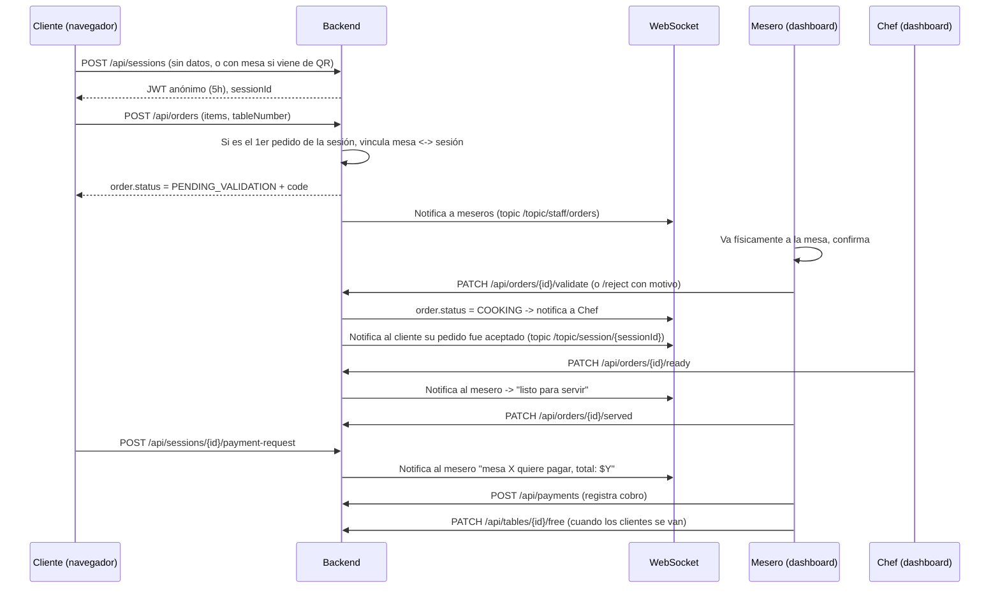

# RestoFlow — Especificación técnica completa
### Sistema de pedidos para restaurante con validación de mesa en tiempo real
**Stack objetivo:** Spring Boot (Java) + Arquitectura Hexagonal (Ports & Adapters) + PostgreSQL + WebSocket + JWT

> Este documento está escrito para ser **precisa y directamente utilizable por un agente de IA** (Claude Code, Cursor, etc.) como brief de desarrollo. Contiene decisiones de diseño ya tomadas — no ambigüedades para que el agente "adivine".

---

## 0. Resumen del sistema

RestoFlow es una plataforma web para restaurantes con 4 roles (`ADMIN`, `CHEF`, `MESERO`, `CLIENTE`). El cliente **no crea cuenta**: obtiene una sesión anónima (JWT, 5h de validez) al entrar, indica su número de mesa en su primer pedido, y desde ese momento la mesa queda "reclamada" por esa sesión. Cada pedido nuevo pasa por una **validación humana del mesero** (anti-fraude: evita pedidos remotos de gente que no está físicamente en el restaurante) antes de llegar a cocina.

---

## 0.1 Estructura del repositorio: Monorepo (decisión y layout)

**Decisión: un único repositorio, con `backend/` y `frontend/` como carpetas de primer nivel.** Los repos separados solo se justifican con equipos y ciclos de deploy independientes, que no es el caso de un proyecto de portafolio construido por una sola persona.

```
restoflow/
├── README.md                      # visión general del producto (problema, demo, arquitectura)
├── docker-compose.yml             # levanta backend + frontend + Postgres juntos
├── docs/
│   ├── architecture.md
│   └── security.md
├── backend/
│   ├── src/main/java/com/restoflow/...   # estructura hexagonal (sección 5)
│   └── pom.xml
├── frontend/
│   ├── src/
│   │   ├── features/               # client/, waiter/, chef/, admin/ (por rol)
│   │   ├── shared/                 # componentes UI reutilizables, cliente HTTP, cliente WebSocket
│   │   └── App.tsx
│   └── package.json
└── .github/
    └── workflows/
        ├── backend-ci.yml          # trigger: paths: backend/**
        └── frontend-ci.yml         # trigger: paths: frontend/**
```

Cada carpeta (`backend/`, `frontend/`) puede tener su propio README técnico con detalle de setup, pero el `README.md` de la raíz es el que ve primero un recruiter y debe explicar el producto completo, no solo una mitad.

---

## 1. Roles y permisos

| Acción | Cliente (anónimo) | Mesero | Chef | Admin |
|---|---|---|---|---|
| Ver menú | ✅ | ✅ | ✅ | ✅ (+editar) |
| Crear sesión anónima / indicar mesa | ✅ | — | — | — |
| Enviar pedido | ✅ (solo su sesión/mesa) | — | — | — |
| Ver estado de sus pedidos y total | ✅ | — | — | — |
| Solicitar pago | ✅ | — | — | — |
| Validar/rechazar pedido | — | ✅ | — | — |
| Ver mesas libres/ocupadas | — | ✅ | — | ✅ |
| Liberar mesa | — | ✅ | — | ✅ |
| Marcar pedido como "listo" | — | — | ✅ | — |
| Ver cola de cocina | — | — | ✅ | ✅ |
| Marcar plato agotado/disponible | — | — | ✅ | ✅ (también) |
| Registrar cobro | — | ✅ | — | ✅ (reportes) |
| CRUD de menú, mesas, usuarios de staff | — | — | — | ✅ |
| Ver reportes (ventas, tiempos) | — | — | — | ✅ |

Login **solo existe para** `MESERO`, `CHEF`, `ADMIN` (email + password). El cliente nunca hace login.

---

## 2. Flujo completo del cliente



**Regla clave de negocio:** una mesa solo puede estar vinculada a **una sesión activa a la vez**. Si otra sesión intenta crear un pedido para una mesa ya ocupada por otra sesión, el backend rechaza con `409 Conflict` (`TABLE_ALREADY_CLAIMED`). Esto se decide en el dominio, no en el frontend.

---

## 3. Máquinas de estado

**Order (Pedido):**
```
CREATED → PENDING_VALIDATION → COOKING → READY → SERVED
                ↓
            CANCELLED (requiere reasonCode + reasonText, solo el mesero puede cancelar desde PENDING_VALIDATION)
```

**Table (Mesa):**
```
FREE → OCCUPIED (al vincularse a una sesión) → FREE (mesero libera manualmente tras el pago)
```

**ClientSession (Sesión anónima):**
```
ACTIVE → EXPIRED (a las 5h) | CLOSED (mesero libera la mesa -> cierra la sesión)
```

Ningún estado se salta pasos vía API — cada transición es un endpoint específico con reglas de guardia en el dominio (ver sección 6).

---

## 4. Modelo de datos (PostgreSQL)

```sql
-- Staff (login real)
CREATE TABLE staff_users (
  id UUID PRIMARY KEY DEFAULT gen_random_uuid(),
  email VARCHAR(255) UNIQUE NOT NULL,
  password_hash VARCHAR(255) NOT NULL,
  full_name VARCHAR(255) NOT NULL,
  role VARCHAR(20) NOT NULL CHECK (role IN ('ADMIN','CHEF','MESERO')),
  active BOOLEAN DEFAULT TRUE,
  created_at TIMESTAMP DEFAULT now()
);

CREATE TABLE restaurant_tables (
  id UUID PRIMARY KEY DEFAULT gen_random_uuid(),
  number INT UNIQUE NOT NULL,
  capacity INT NOT NULL,
  status VARCHAR(20) NOT NULL DEFAULT 'FREE' CHECK (status IN ('FREE','OCCUPIED')),
  current_session_id UUID NULL
);

CREATE TABLE client_sessions (
  id UUID PRIMARY KEY DEFAULT gen_random_uuid(),
  table_id UUID NULL REFERENCES restaurant_tables(id),
  status VARCHAR(20) NOT NULL DEFAULT 'ACTIVE' CHECK (status IN ('ACTIVE','EXPIRED','CLOSED')),
  created_at TIMESTAMP DEFAULT now(),
  expires_at TIMESTAMP NOT NULL
);

CREATE TABLE menu_categories (
  id UUID PRIMARY KEY DEFAULT gen_random_uuid(),
  name VARCHAR(50) NOT NULL CHECK (name IN ('BEBIDA','COMIDA','POSTRE'))
);

CREATE TABLE menu_items (
  id UUID PRIMARY KEY DEFAULT gen_random_uuid(),
  category_id UUID NOT NULL REFERENCES menu_categories(id),
  name VARCHAR(150) NOT NULL,
  description TEXT,
  price NUMERIC(10,2) NOT NULL CHECK (price >= 0),
  available BOOLEAN DEFAULT TRUE,
  image_url VARCHAR(500)
);

CREATE TABLE orders (
  id UUID PRIMARY KEY DEFAULT gen_random_uuid(),
  session_id UUID NOT NULL REFERENCES client_sessions(id),
  table_id UUID NOT NULL REFERENCES restaurant_tables(id),
  status VARCHAR(20) NOT NULL DEFAULT 'CREATED',
  validation_code VARCHAR(6) NOT NULL,
  validated_by UUID NULL REFERENCES staff_users(id),
  validated_at TIMESTAMP NULL,
  cancel_reason_code VARCHAR(50) NULL,
  cancel_reason_text VARCHAR(255) NULL,
  total_amount NUMERIC(10,2) NOT NULL DEFAULT 0,
  created_at TIMESTAMP DEFAULT now()
);

CREATE TABLE order_items (
  id UUID PRIMARY KEY DEFAULT gen_random_uuid(),
  order_id UUID NOT NULL REFERENCES orders(id) ON DELETE CASCADE,
  menu_item_id UUID NOT NULL REFERENCES menu_items(id),
  quantity INT NOT NULL CHECK (quantity > 0),
  unit_price NUMERIC(10,2) NOT NULL,
  notes VARCHAR(255)
);

CREATE TABLE payments (
  id UUID PRIMARY KEY DEFAULT gen_random_uuid(),
  session_id UUID NOT NULL REFERENCES client_sessions(id),
  registered_by UUID NOT NULL REFERENCES staff_users(id),
  total_amount NUMERIC(10,2) NOT NULL,
  payment_method VARCHAR(20) NOT NULL CHECK (payment_method IN ('EFECTIVO','TARJETA','TRANSFERENCIA')),
  paid_at TIMESTAMP DEFAULT now()
);

CREATE INDEX idx_orders_status ON orders(status);
CREATE INDEX idx_orders_session ON orders(session_id);
CREATE INDEX idx_tables_status ON restaurant_tables(status);
```

---

## 5. Arquitectura hexagonal — estructura de paquetes exacta

```
src/main/java/com/restoflow/
├── domain/
│   ├── model/               # Order, OrderItem, Table, ClientSession, MenuItem, StaffUser, Payment
│   ├── vo/                  # OrderStatus, TableStatus, Role, Money, ValidationCode
│   ├── exception/           # TableAlreadyClaimedException, InvalidOrderTransitionException...
│   └── port/
│       ├── in/               # PlaceOrderUseCase, ValidateOrderUseCase, MarkOrderReadyUseCase,
│       │                     # RequestPaymentUseCase, RegisterPaymentUseCase, FreeTableUseCase...
│       └── out/               # OrderRepositoryPort, TableRepositoryPort, SessionRepositoryPort,
│                              # NotificationPort, ClockPort, CodeGeneratorPort
│
├── application/
│   └── usecase/              # Implementaciones de los puertos "in". Sin anotaciones de Spring
│                              # aquí salvo @Service. Orquestan dominio + puertos "out".
│
├── infrastructure/
│   ├── adapter/
│   │   ├── in/
│   │   │   ├── rest/          # Controllers REST + DTOs + mappers (uno por rol: ClientController,
│   │   │   │                  # WaiterController, ChefController, AdminController, AuthController)
│   │   │   └── websocket/     # STOMP: OrderNotificationHandler
│   │   └── out/
│   │       ├── persistence/   # Entidades JPA + Spring Data Repos + implementación de *RepositoryPort
│   │       ├── security/      # JwtTokenProvider, JwtAuthFilter, ClientSessionAuthFilter
│   │       └── notification/  # WebSocketNotificationAdapter implements NotificationPort
│   └── config/                # SecurityConfig, WebSocketConfig, RateLimitConfig, OpenApiConfig
│
└── RestoflowApplication.java
```

**Regla de dependencia (la clave de hexagonal):** `domain` no importa nada de Spring ni de JPA. `application` solo depende de `domain`. `infrastructure` depende de `domain` y `application`, nunca al revés. Esto es lo que un entrevistador senior te va a preguntar primero al ver el repo — asegúrate de que sea cierto y no solo carpetas con el nombre correcto.

---

## 6. Reglas de dominio importantes (para que el agente de IA no las invente mal)

1. **Vinculación de mesa:** al crear un pedido, si `ClientSession.tableId == null`, se asigna la mesa indicada y se marca `restaurant_tables.status = OCCUPIED`. Si `ClientSession.tableId != null`, el pedido debe usar esa misma mesa — si el cliente manda otra mesa, `400 Bad Request`.
2. **Un pedido nunca se auto-valida.** Solo transiciona de `PENDING_VALIDATION` a `COOKING` vía el endpoint del mesero. No existe timeout automático que la valide sola (evita que alguien "spamee" pedidos sabiendo que se aprueban solos).
3. **Rate limiting:** máximo 1 pedido en estado `PENDING_VALIDATION` simultáneo por sesión (el cliente no puede crear un segundo pedido hasta que el primero sea validado o rechazado) — esto es intencional, no solo anti-abuso: evita que el mesero reciba una avalancha de códigos de la misma mesa. Además, máximo 10 pedidos por sesión en 5 horas (límite duro).
4. **El total del cliente** (`GET /api/sessions/{id}/summary`) es la suma de `total_amount` de todos sus pedidos con estado distinto de `CANCELLED`.
5. **Liberar mesa** solo lo puede hacer el mesero/admin, y solo si no hay pedidos en estado `PENDING_VALIDATION` o `COOKING` sin servir asociados a la sesión activa (evita liberar una mesa con comida pendiente).
6. **Código de validación:** se genera al crear el pedido (`SecureRandom`, 6 dígitos), se muestra únicamente en el dashboard del mesero (nunca se envía al cliente por API) — es una referencia visual para que el mesero confirme "pedido #… código 482913" al llegar a la mesa, no un secreto criptográfico. Si en el futuro quieres que el cliente también lo escriba como doble factor, es un cambio de V2 (ver roadmap).

---

## 7. Endpoints REST

**Auth / Sesión**
```
POST /api/auth/login                    (staff: email+password -> JWT con rol)
POST /api/sessions                      (cliente: crea sesión anónima -> JWT 5h)
GET  /api/sessions/{id}/summary         (cliente: pedidos + total)
POST /api/sessions/{id}/payment-request (cliente: notifica al mesero)
```

**Menú**
```
GET    /api/menu                        (público, filtrable por categoría)
POST   /api/admin/menu-items            (admin)
PUT    /api/admin/menu-items/{id}       (admin)
PATCH  /api/chef/menu-items/{id}/availability   (chef: marcar agotado/disponible)
```

**Pedidos**
```
POST   /api/orders                      (cliente)
GET    /api/orders?status=PENDING_VALIDATION   (mesero)
PATCH  /api/orders/{id}/validate        (mesero)
PATCH  /api/orders/{id}/reject          (mesero, body: reasonCode, reasonText)
GET    /api/chef/orders?status=COOKING  (chef)
PATCH  /api/orders/{id}/ready           (chef)
PATCH  /api/orders/{id}/served          (mesero)
```

**Mesas**
```
GET    /api/tables                      (mesero/admin: libres/ocupadas)
PATCH  /api/tables/{id}/free            (mesero/admin)
```

**Pagos**
```
POST   /api/payments                    (mesero: registra cobro)
GET    /api/admin/reports/sales         (admin)
```

---

## 8. WebSocket (notificaciones en tiempo real)

Usa **STOMP sobre WebSocket** (`spring-boot-starter-websocket`), no polling — es lo correcto para este caso de uso y es un punto fuerte técnico para tu portafolio.

| Topic | Quién escucha | Evento |
|---|---|---|
| `/topic/staff/orders` | Todos los meseros conectados | Nuevo pedido `PENDING_VALIDATION` |
| `/topic/chef/queue` | Chef | Pedido pasó a `COOKING` |
| `/topic/staff/ready` | Meseros | Chef marcó pedido `READY` |
| `/topic/staff/payments` | Meseros | Cliente solicitó pagar |
| `/topic/session/{sessionId}` | El cliente específico (su navegador) | Su pedido cambió de estado |

El cliente se suscribe a su propio topic con su `sessionId` al conectar — así ve en tiempo real "tu pedido fue aceptado / está listo" sin refrescar la página.

---

## 9. Seguridad

- **Dos flujos de autenticación distintos**, ambos con JWT pero distinto propósito:
  - **Staff:** login clásico (email + password con BCrypt), JWT contiene `role` y expira en, por ejemplo, 8h (turno laboral).
  - **Cliente:** JWT anónimo sin credenciales, claim `sessionId`, expira en 5h. Se emite en `POST /api/sessions` sin body ni auth previa.
- **Nunca confíes en el `tableNumber` que manda el cliente en el body** una vez la sesión ya tiene mesa asignada — siempre se valida contra `ClientSession.tableId` en el backend (regla de dominio #1).
- **Rate limiting** con **Bucket4j** (no viene en Spring Initializr, se agrega a mano) sobre el endpoint `POST /api/orders`, keyed por `sessionId`.
- **CORS** configurado explícitamente (whitelist del dominio del frontend), nunca `*` en producción.
- **Validación de input** con `spring-boot-starter-validation` (`@Valid`, `@NotNull`, `@Positive` en cantidades, etc.) en todos los DTOs.
- **Autorización por rol** con `@PreAuthorize("hasRole('MESERO')")` a nivel de método en los use cases expuestos, no solo en el controller.

**Vulnerabilidades a practicar deliberadamente y luego corregir (para tu sección de seguridad del README):**
- IDOR: que un mesero pueda validar pedidos de un restaurante/sucursal que no es la suya (si en el futuro hay multi-sucursal) — corrige comprobando pertenencia.
- Que el cliente pueda editar `unit_price` en el body del pedido (nunca debe hacerlo — el precio siempre se recalcula server-side desde `menu_items`, ignora cualquier precio que venga del cliente).
- Que el JWT anónimo no tenga expiración corta — pruébalo con uno que no expire, luego corrige a 5h reales.

---

## 10. Dependencias de Spring Initializr

**Generador:** https://start.spring.io — Project: Maven, Language: Java, Spring Boot: última versión estable 3.x, Packaging: Jar, Java: 21 (LTS).

Marca estas dependencias directamente en el Initializr:

| Dependencia | Para qué |
|---|---|
| **Spring Web** | REST controllers |
| **Spring Data JPA** | Persistencia |
| **PostgreSQL Driver** | Conexión a la base de datos |
| **Spring Security** | Auth de staff + filtros JWT |
| **Validation** | `@Valid` en DTOs |
| **WebSocket** | STOMP para notificaciones en tiempo real |
| **Lombok** | Reduce boilerplate (getters/builders) |
| **Spring Boot Actuator** | Healthchecks/observabilidad |
| **Flyway Migration** | Migraciones de base de datos versionadas |
| **Testcontainers** | Tests de integración contra Postgres real en Docker |
| **Spring Boot DevTools** | Solo para desarrollo local |

**Añadir manualmente al `pom.xml` después de generar el proyecto** (no están en el Initializr):
```xml
<!-- JWT -->
<dependency>
  <groupId>io.jsonwebtoken</groupId>
  <artifactId>jjwt-api</artifactId>
  <version>0.12.6</version>
</dependency>
<dependency>
  <groupId>io.jsonwebtoken</groupId>
  <artifactId>jjwt-impl</artifactId>
  <version>0.12.6</version>
  <scope>runtime</scope>
</dependency>
<dependency>
  <groupId>io.jsonwebtoken</groupId>
  <artifactId>jjwt-jackson</artifactId>
  <version>0.12.6</version>
  <scope>runtime</scope>
</dependency>

<!-- Rate limiting -->
<dependency>
  <groupId>com.bucket4j</groupId>
  <artifactId>bucket4j-core</artifactId>
  <version>8.10.1</version>
</dependency>

<!-- Documentación OpenAPI/Swagger -->
<dependency>
  <groupId>org.springdoc</groupId>
  <artifactId>springdoc-openapi-starter-webmvc-ui</artifactId>
  <version>2.6.0</version>
</dependency>
```
*(Verifica siempre la última versión estable de cada una en Maven Central antes de fijarla — las de arriba son referencia, no las copies a ciegas dentro de 6 meses.)*

---

## 11. Testing

- **Unit tests** (JUnit 5 + Mockito): lógica de dominio pura — sobre todo las reglas de la sección 6 (vinculación de mesa, rate limiting, transiciones de estado inválidas deben lanzar excepción).
- **Integration tests** (Testcontainers + `@SpringBootTest`): flujo completo `POST /api/sessions` → `POST /api/orders` → `PATCH /validate` → `PATCH /ready` → `PATCH /served`, contra una PostgreSQL real en Docker, no H2 (evita falsos positivos por diferencias de dialecto SQL).
- **Contract tests del WebSocket:** verifica que al validar un pedido efectivamente se publica en `/topic/chef/queue`.

---

## 12. Docker y despliegue gratuito

```yaml
# docker-compose.yml (desarrollo local)
services:
  db:
    image: postgres:16
    environment:
      POSTGRES_DB: restoflow
      POSTGRES_USER: restoflow
      POSTGRES_PASSWORD: restoflow
    ports: ["5432:5432"]
  app:
    build: .
    depends_on: [db]
    ports: ["8080:8080"]
    environment:
      SPRING_DATASOURCE_URL: jdbc:postgresql://db:5432/restoflow
```

**Despliegue gratuito recomendado (sin tarjeta ni AWS todavía):** [Render.com](https://render.com) (free tier para web services + PostgreSQL gratuito con límite de almacenamiento) o **Railway** (crédito gratuito mensual). Cuando avances con el roadmap de cloud de tu plan general, migra a AWS (RDS + ECS) como hiciste con ShiftSync — la arquitectura hexagonal no cambia, solo el adaptador de persistencia y el despliegue.

---

## 13. Roadmap MVP → V2 → V3

**MVP:** sesión anónima, menú, crear pedido, validación por mesero, cocina marca listo, mesero marca servido, solicitud y registro de pago, liberar mesa. Un solo turno, un solo local.

**V2:** doble validación (mesero **y** cliente ingresan el código), soporte de "mesa compartida" por varias sesiones (grupos), impresión de comanda física para cocina, historial de pedidos por mesa para el admin, notificaciones push (no solo WebSocket mientras la pestaña está abierta).

**V3:** múltiples sucursales, panel de métricas (tiempo promedio de validación, tiempo de cocina por plato), sistema de propinas, integración con pasarela de pago real (Stripe/MercadoPago) en vez de solo "registrar cobro manual".

---

## 14. Plan de implementación paso a paso (orden de construcción del MVP)

**Por qué este orden y no otro:** en arquitectura hexagonal el error más común es empezar por los controllers REST porque "es lo que se ve". Eso te obliga a inventar el dominio sobre la marcha y termina en lógica de negocio metida dentro de los controllers. El orden correcto es de adentro hacia afuera: **dominio puro → puertos → casos de uso → adaptadores de salida (persistencia) → adaptadores de entrada (REST/WebSocket) → seguridad y cross-cutting → integración end-to-end**.

Cada fase de abajo es **una sesión de trabajo independiente** con tu agente de IA. No pases a la siguiente fase hasta cumplir el "Definición de terminado" de la actual — eso es literalmente lo que hace un equipo profesional (cerrar un sprint antes de abrir el siguiente), y es lo que vas a poder explicar en una entrevista: *"construí esto en capas, validando cada una antes de avanzar"*.

### Fase 0 — Andamiaje del proyecto
**Objetivo:** tener el proyecto arrancando en local, con base de datos, sin ninguna lógica todavía.
**Construir:**
- Proyecto generado desde start.spring.io con las dependencias de la sección 10.
- Estructura de carpetas vacía exactamente como en la sección 5 (con un `package-info.java` o `.gitkeep` si hace falta para que Git trackee carpetas vacías).
- `docker-compose.yml` (sección 12) levantando PostgreSQL.
- `application.yml` con perfiles `local` y `docker`.
- Primer commit + repo en GitHub + README inicial (solo título y stack).
**Definición de terminado:** `./mvnw spring-boot:run` levanta la app sin errores y se conecta a Postgres en Docker. No hay endpoints todavía, y **eso está bien**.
**Prompt para el agente:**
```
Genera el proyecto Spring Boot inicial descrito en la sección 5 (estructura de paquetes)
y sección 10 (dependencias) del documento adjunto. Crea solo el andamiaje: pom.xml,
application.yml con perfiles local/docker, docker-compose.yml con PostgreSQL, y la
estructura de carpetas vacía de domain/application/infrastructure. NO implementes
ninguna entidad, endpoint ni lógica todavía. El objetivo de esta fase es solo que el
proyecto arranque y conecte a la base de datos.
```

### Fase 1 — Dominio puro (sin Spring)
**Objetivo:** modelar las reglas de negocio de la sección 6 como código Java plano, testeable sin levantar el framework.
**Construir:**
- Clases en `domain/model`: `Order`, `OrderItem`, `RestaurantTable`, `ClientSession`, `MenuItem`, `StaffUser`, `Payment`.
- `domain/vo`: `OrderStatus`, `TableStatus`, `Role`, `Money`, `ValidationCode`.
- Métodos de negocio **dentro** de las entidades (no anémicas): ej. `Order.validate(StaffUserId)`, `Order.reject(reason)`, `RestaurantTable.claimBy(sessionId)`, con las excepciones de dominio de la sección 6 lanzadas ahí mismo.
- `domain/exception`: `TableAlreadyClaimedException`, `InvalidOrderTransitionException`, `OrderLimitExceededException`.
**Definición de terminado:** tests unitarios JUnit (sin Spring context) que prueban: no se puede validar un pedido dos veces, no se puede reclamar una mesa ya ocupada, no se puede exceder el límite de pedidos por sesión. Todo pasa con `mvn test` en segundos, sin base de datos.
**Prompt para el agente:**
```
Implementa SOLO el paquete domain/ del proyecto (sin anotaciones de Spring, sin JPA).
Modela Order, OrderItem, RestaurantTable, ClientSession, MenuItem, StaffUser, Payment
como clases Java planas con lógica de negocio dentro de la entidad, no en servicios
externos. Aplica exactamente las reglas de negocio de la sección 6 del documento:
una mesa solo puede reclamarse si está FREE, un pedido solo transiciona
PENDING_VALIDATION -> COOKING vía un método explícito de validación, máximo 1 pedido
PENDING_VALIDATION por sesión. Lanza las excepciones de dominio correspondientes.
Escribe tests unitarios JUnit 5 puros (sin @SpringBootTest) para cada regla.
No crees controllers, repositorios ni nada de infraestructura en esta fase.
```

### Fase 2 — Puertos (contratos)
**Objetivo:** definir las interfaces que conectan dominio con el mundo exterior, sin implementarlas todavía.
**Construir:** interfaces en `domain/port/in` (`PlaceOrderUseCase`, `ValidateOrderUseCase`, `RejectOrderUseCase`, `MarkOrderReadyUseCase`, `MarkOrderServedUseCase`, `RequestPaymentUseCase`, `RegisterPaymentUseCase`, `FreeTableUseCase`) y `domain/port/out` (`OrderRepositoryPort`, `TableRepositoryPort`, `SessionRepositoryPort`, `MenuRepositoryPort`, `NotificationPort`, `ClockPort`, `CodeGeneratorPort`).
**Definición de terminado:** compila. Son solo interfaces, cero implementación. Este paso es corto a propósito.
**Prompt para el agente:**
```
A partir del dominio ya implementado en la Fase 1, define las interfaces de
domain/port/in y domain/port/out listadas en la sección 5 del documento.
Son solo contratos (interfaces), sin implementación. No toques el paquete domain/model
que ya existe.
```

### Fase 3 — Casos de uso (application)
**Objetivo:** orquestar el dominio a través de los puertos, sin saber todavía cómo se persiste nada (usa mocks/fakes en los tests).
**Construir:** `application/usecase` implementando cada puerto "in", inyectando los puertos "out" por constructor.
**Definición de terminado:** tests unitarios con Mockito mockeando los puertos "out" (repos y notificaciones falsas), verificando que cada caso de uso llama correctamente al dominio y a los puertos en el orden correcto (ej. `ValidateOrderUseCase` llama a `Order.validate()`, guarda, y luego notifica).
**Prompt para el agente:**
```
Implementa application/usecase/ para todos los puertos "in" definidos en la Fase 2,
usando los puertos "out" solo como interfaces inyectadas por constructor (no los
implementes todavía). Escribe tests con Mockito mockeando los puertos "out" para
verificar la orquestación de cada caso de uso. No agregues anotaciones de Spring
salvo @Service en la implementación del caso de uso.
```

### Fase 4 — Persistencia (adaptador de salida)
**Objetivo:** implementar los puertos "out" contra PostgreSQL real.
**Construir:** entidades JPA (separadas de las del dominio, con mappers entre ambas — no mezcles `@Entity` con tu modelo de dominio), Spring Data repositories, clases `*RepositoryAdapter` en `infrastructure/adapter/out/persistence` que implementan los puertos "out", migraciones Flyway con el esquema de la sección 4.
**Definición de terminado:** tests de integración con **Testcontainers** (Postgres real en Docker) que prueban guardar y recuperar cada entidad, y que las migraciones Flyway corren limpias desde cero.
**Prompt para el agente:**
```
Implementa infrastructure/adapter/out/persistence/: entidades JPA equivalentes al
esquema SQL de la sección 4 del documento, Spring Data JPA repositories, y clases
adapter que implementen los puertos "out" de domain/port/out usando mappers explícitos
entre entidad JPA y modelo de dominio (no anotes el modelo de dominio con @Entity).
Crea las migraciones Flyway en src/main/resources/db/migration siguiendo el esquema
de la sección 4. Escribe tests de integración con Testcontainers (PostgreSQL real)
para cada repositorio.
```

### Fase 5 — Autenticación y seguridad base
**Objetivo:** los dos flujos de JWT (staff y cliente anónimo) funcionando end-to-end.
**Construir:** `JwtTokenProvider`, filtros de seguridad, `SecurityConfig`, endpoint `POST /api/auth/login` (staff) y `POST /api/sessions` (cliente anónimo), con BCrypt para passwords de staff.
**Definición de terminado:** puedes loguearte como mesero/chef/admin y recibir un JWT con rol; puedes crear una sesión anónima y recibir un JWT de 5h; un endpoint protegido rechaza sin token y acepta con el rol correcto.
**Prompt para el agente:**
```
Implementa la seguridad descrita en la sección 9: JwtTokenProvider, SecurityConfig,
un filtro para JWT de staff (con rol) y otro para JWT de sesión anónima de cliente.
Implementa POST /api/auth/login (staff, BCrypt) y POST /api/sessions (cliente, sin
credenciales, expira en 5h). No implementes todavía los endpoints de negocio
(pedidos, menú, etc.) - solo autenticación y la configuración de seguridad.
```

### Fase 6 — REST: flujo del cliente
**Objetivo:** el cliente puede ver el menú y crear pedidos de principio a fin (aunque el mesero todavía no tenga dashboard).
**Construir:** `ClientController` con `GET /api/menu`, `POST /api/orders`, `GET /api/sessions/{id}/summary`, `POST /api/sessions/{id}/payment-request`. DTOs de request/response y mappers hacia los casos de uso de la Fase 3.
**Definición de terminado:** con Postman/curl puedes crear una sesión, ver el menú, crear un pedido indicando mesa, y ver que queda en `PENDING_VALIDATION`. Puedes validarlo manualmente actualizando la BD a mano todavía (el endpoint del mesero viene en la siguiente fase).
**Prompt para el agente:**
```
Implementa infrastructure/adapter/in/rest/ClientController usando los casos de uso
ya implementados (Fase 3) y la seguridad de sesión anónima (Fase 5). Endpoints:
GET /api/menu, POST /api/orders, GET /api/sessions/{id}/summary,
POST /api/sessions/{id}/payment-request. Crea los DTOs necesarios y mappers hacia
los casos de uso. No implementes todavía los endpoints de mesero/chef/admin.
```

### Fase 7 — REST: flujo de mesero, chef y admin
**Objetivo:** cerrar el ciclo completo del pedido.
**Construir:** `WaiterController` (`GET /api/orders?status=`, `validate`, `reject`, `served`, `GET /api/tables`, `free`), `ChefController` (`ready`, disponibilidad de platos), `AdminController` (CRUD de menú/mesas/usuarios, reportes básicos).
**Definición de terminado:** puedes ejecutar el flujo completo de la sección 2 (secuencia) de punta a punta vía API, sin WebSocket todavía (el mesero refresca manualmente para ver pedidos nuevos).
**Prompt para el agente:**
```
Implementa WaiterController, ChefController y AdminController siguiendo los endpoints
de la sección 7 del documento, usando los casos de uso ya existentes y protegidos por
rol con @PreAuthorize. Verifica que el flujo completo cliente -> validación mesero ->
cocina -> servido -> pago -> liberar mesa funcione de punta a punta vía llamadas REST
manuales (Postman/curl), sin WebSocket todavía.
```

### Fase 8 — WebSocket (tiempo real)
**Objetivo:** reemplazar el refresco manual por notificaciones push.
**Construir:** `WebSocketConfig` con STOMP, `WebSocketNotificationAdapter implements NotificationPort`, y que los casos de uso ya existentes (Fase 3) empiecen a recibir esa implementación real en vez de un mock.
**Definición de terminado:** conectas dos pestañas del navegador (o Postman con WS), una simulando mesero y otra cliente, y ves las notificaciones de la tabla de la sección 8 llegar en tiempo real al validar/marcar listo/etc.
**Prompt para el agente:**
```
Implementa infrastructure/adapter/out/notification/WebSocketNotificationAdapter
(implementa NotificationPort) y la configuración STOMP de WebSocketConfig, con los
topics exactos de la tabla de la sección 8. Conecta esta implementación real a los
casos de uso de la Fase 3 (que hasta ahora usaban un NotificationPort mock/no-op).
No cambies la lógica de los casos de uso, solo la implementación del puerto.
```

### Fase 9 — Rate limiting y hardening
**Objetivo:** aplicar la sección 6 regla 3 (límites de pedidos) y las vulnerabilidades a corregir de la sección 9.
**Construir:** filtro Bucket4j sobre `POST /api/orders` keyed por `sessionId`, y revisión explícita de que el precio se recalcula server-side (no confiar en el cliente).
**Definición de terminado:** un test que intenta crear 2 pedidos `PENDING_VALIDATION` seguidos para la misma sesión recibe `429`/`409`; un test que manda un `unitPrice` manipulado en el body es ignorado y se usa el precio real de `menu_items`.
**Prompt para el agente:**
```
Agrega rate limiting con Bucket4j al endpoint POST /api/orders, aplicando la regla de
la sección 6 (máximo 1 pedido PENDING_VALIDATION simultáneo por sesión, máximo 10 en
la ventana de 5h). Además, audita ClientController/PlaceOrderUseCase para confirmar
que el precio de cada order_item se recalcula siempre desde MenuItem en el servidor
y que cualquier precio recibido en el request se ignora. Escribe tests que prueben
ambos casos.
```

### Fase 10 — Integración end-to-end, documentación y pulido
**Objetivo:** el proyecto queda demostrable, no solo funcional.
**Construir:** test de integración completo del flujo de la sección 2, documentación OpenAPI/Swagger (springdoc), README profesional (problema que resuelve, arquitectura con diagrama, cómo correrlo local en 3 comandos), `docs/security.md` documentando las vulnerabilidades corregidas.
**Definición de terminado:** cualquier persona clona el repo, hace `docker-compose up`, y en menos de 5 minutos tiene la app corriendo y puede seguir el flujo completo desde Swagger UI.
**Prompt para el agente:**
```
Escribe un test de integración end-to-end que ejecute el flujo completo de la
sección 2 del documento (crear sesión -> pedido -> validar -> cocinar -> listo ->
servido -> solicitar pago -> registrar pago -> liberar mesa). Agrega springdoc-openapi
y verifica que Swagger UI documente todos los endpoints. Genera un README.md
profesional con: descripción del problema, diagrama de arquitectura (usa el mermaid
de la sección 2), instrucciones de setup local con docker-compose, y un docs/security.md
resumiendo las decisiones de seguridad de la sección 9.
```

---

## 14.1 Frontend — stack y fases (ritmadas con el backend)

**Stack:** React + TypeScript + Vite (consistente con el resto de tu portafolio), React Router (rutas por rol: `/cliente`, `/mesero`, `/chef`, `/admin`), Tailwind CSS, `@tanstack/react-query` (manejo de llamadas a la API, cache, reintentos — evita `useEffect` + `fetch` a mano por todos lados), `@stomp/stompjs` + `sockjs-client` (consumo del WebSocket de la sección 8), Zustand o Context API para el estado mínimo de sesión (JWT del cliente/staff guardado en memoria + `localStorage`).

**Regla de ritmo general:** el **maquetado visual** (F0-F1) puede arrancar en paralelo al backend desde el día 1, con datos falsos (mocks). La **integración real** de cada pantalla (F2 en adelante) siempre espera a que la fase de backend correspondiente esté "terminada" según su propia definición de terminado — no antes, porque conectarías contra un contrato que todavía puede cambiar.

| Fase Frontend | Depende de (Backend) | Se puede hacer en paralelo con |
|---|---|---|
| F0 — Setup del proyecto | Fase 0 (ninguna dependencia real) | Backend Fase 0-1 |
| F1 — Maquetado con datos falsos | Ninguna | Backend Fase 1-4 |
| F2 — Cliente: sesión + menú real | Backend Fase 5 (auth) y Fase 6 (REST cliente) | — (secuencial) |
| F3 — Cliente: flujo de pedido completo | Backend Fase 6 | — (secuencial) |
| F4 — Mesero: login + mesas + validación | Backend Fase 5 y Fase 7 | — (secuencial) |
| F5 — Chef: cola de cocina | Backend Fase 7 | Frontend F4 (mismo momento) |
| F6 — Admin: CRUD de menú/mesas/usuarios | Backend Fase 7 | Frontend F4-F5 |
| F7 — WebSocket: notificaciones en tiempo real | Backend Fase 8 | — (secuencial, reemplaza polling de F3-F6) |
| F8 — Pulido, manejo de errores, responsive, deploy | Backend Fase 9-10 | Backend Fase 10 |

### Fase F0 — Setup del frontend
**Objetivo:** proyecto React corriendo, sin pantallas reales.
**Construir:** Vite + React + TS, Tailwind configurado, React Router con rutas vacías por rol, cliente HTTP base (Axios o fetch wrapper) apuntando a `http://localhost:8080` vía variable de entorno.
**Definición de terminado:** `npm run dev` levanta la app y navega entre 4 rutas vacías (`/cliente`, `/mesero`, `/chef`, `/admin`).
**Prompt para el agente:**
```
Crea el proyecto frontend/ con Vite + React + TypeScript + Tailwind CSS + React Router.
Define rutas vacías para /cliente, /mesero, /chef, /admin (solo un placeholder de texto
en cada una). Configura un cliente HTTP base (axios) que lea la URL del backend desde
una variable de entorno VITE_API_URL. No conectes a ningún endpoint real todavía.
```

### Fase F1 — Maquetado con datos falsos (mock data)
**Objetivo:** todas las pantallas visualmente terminadas, sin backend real detrás.
**Construir:** vista de menú con categorías (Bebida/Comida/Postre) y carrito, dashboard de mesero (grid de mesas libres/ocupadas + lista de pedidos pendientes), dashboard de chef (cola de pedidos), panel admin (tablas de menú/mesas/usuarios) — todo con arrays de JavaScript hardcodeados simulando la respuesta de la API.
**Definición de terminado:** puedes navegar y "usar" visualmente las 4 pantallas principales, aunque ningún botón haga nada real todavía.
**Prompt para el agente:**
```
Maqueta las pantallas principales del frontend usando datos falsos (arrays hardcodeados
en el propio componente, con la misma forma que tendrá la respuesta real de la API
según los DTOs de la sección 7 del documento backend): vista de menú + carrito para
cliente, dashboard de mesas y pedidos pendientes para mesero, cola de cocina para chef,
tablas CRUD para admin. No conectes a ningún endpoint todavía ni implementes lógica
de negocio - es solo maquetado visual con Tailwind.
```

### Fase F2 — Cliente: sesión y menú real
**Objetivo:** reemplazar los mocks del menú por datos reales del backend.
**Construir:** llamada a `POST /api/sessions` al entrar (guardar JWT anónimo), `GET /api/menu` real con React Query, manejo del token en cada request subsiguiente.
**Definición de terminado:** el menú que ves en pantalla viene de tu backend corriendo en Docker, no de datos hardcodeados.
**Prompt para el agente:**
```
Conecta la pantalla de cliente a la API real: al entrar, llama POST /api/sessions y
guarda el JWT devuelto (localStorage + header Authorization en las siguientes
peticiones). Reemplaza los datos falsos del menú por una llamada real a GET /api/menu
usando React Query. El backend ya expone estos endpoints (Fase 5 y 6 del documento
de backend) - no modifiques nada del backend.
```

### Fase F3 — Cliente: flujo de pedido completo
**Objetivo:** el cliente puede pedir, ver el estado en vivo (todavía sin WebSocket, con polling) y solicitar pagar.
**Construir:** carrito funcional → `POST /api/orders` con el número de mesa, pantalla de "esperando validación" con polling cada pocos segundos a `GET /api/sessions/{id}/summary`, botón de "pedir la cuenta" → `POST /api/sessions/{id}/payment-request`.
**Definición de terminado:** puedes hacer un pedido real de principio a fin desde el navegador y ver su estado cambiar (aunque sea refrescando/polling, el WebSocket llega en F7).
**Prompt para el agente:**
```
Implementa el flujo completo de pedido del cliente: carrito -> POST /api/orders
(incluye tableNumber solo en el primer pedido de la sesión) -> pantalla de estado del
pedido con polling cada 5s a GET /api/sessions/{id}/summary -> botón "Pedir la cuenta"
que llama POST /api/sessions/{id}/payment-request. Usa React Query para el polling
(refetchInterval). El WebSocket se implementa en una fase posterior, por ahora usa
polling simple.
```

### Fase F4 — Mesero: login, mesas y validación
**Objetivo:** el mesero puede loguearse y cerrar el ciclo de validación.
**Construir:** pantalla de login (`POST /api/auth/login`), dashboard con grid de mesas (`GET /api/tables`), lista de pedidos pendientes de validar con botones "Validar"/"Rechazar" (con motivo), botón "Marcar servido", botón "Liberar mesa".
**Definición de terminado:** puedes loguearte como mesero real y validar un pedido creado desde la pantalla de cliente (F3), viendo el ciclo completo funcionar entre dos pestañas del navegador.
**Prompt para el agente:**
```
Implementa login de staff (POST /api/auth/login, guarda JWT con rol) y el dashboard
de mesero: grid de mesas desde GET /api/tables, lista de pedidos PENDING_VALIDATION
con acciones Validar/Rechazar (PATCH /api/orders/{id}/validate y /reject con motivo),
botón para marcar servido y botón para liberar mesa. Usa polling simple por ahora.
```

### Fase F5 — Chef: cola de cocina
**Objetivo:** cerrar el ciclo de cocina.
**Construir:** dashboard de chef con pedidos en `COOKING`, botón "Marcar listo", vista simple de disponibilidad de platos.
**Definición de terminado:** puedes marcar un pedido como listo desde la pantalla de chef y verlo reflejado (con polling) en la de mesero.
**Prompt para el agente:**
```
Implementa el dashboard de chef: lista de pedidos con status COOKING (GET
/api/chef/orders?status=COOKING), botón "Marcar listo" (PATCH /api/orders/{id}/ready),
y una vista simple para marcar platos como agotados/disponibles.
```

### Fase F6 — Admin: CRUD de menú, mesas y usuarios
**Objetivo:** el admin puede gestionar el sistema sin tocar la base de datos a mano.
**Construir:** tablas CRUD para menú, mesas y usuarios de staff, con formularios de creación/edición.
**Definición de terminado:** puedes crear un plato nuevo desde el panel admin y verlo aparecer en el menú del cliente.
**Prompt para el agente:**
```
Implementa el panel de admin: CRUD de menu_items, restaurant_tables y staff_users,
usando los endpoints /api/admin/* del backend. Tablas con formularios de creación
y edición, sin lógica de negocio adicional del lado del frontend.
```

### Fase F7 — WebSocket en el frontend
**Objetivo:** reemplazar todo el polling por notificaciones en tiempo real.
**Construir:** cliente STOMP (`@stomp/stompjs`), suscripción a los topics de la sección 8 según el rol conectado, actualización del estado local (React Query cache o Zustand) al recibir un mensaje, en vez de refetch por intervalo.
**Definición de terminado:** apagas el polling y el sistema sigue actualizándose en tiempo real en las 4 pantallas al hacer una acción desde cualquiera de ellas.
**Prompt para el agente:**
```
Reemplaza el polling de las fases F3-F6 por WebSocket real usando @stomp/stompjs y
sockjs-client. Suscribe cada pantalla al topic correspondiente de la sección 8 del
documento backend (/topic/staff/orders, /topic/chef/queue, /topic/staff/ready,
/topic/staff/payments, /topic/session/{sessionId}). Al recibir un mensaje, invalida o
actualiza directamente la cache de React Query correspondiente en vez de esperar al
próximo refetch por intervalo.
```

### Fase F8 — Pulido y despliegue
**Objetivo:** el frontend queda demostrable, no solo funcional.
**Construir:** manejo de errores (toasts/mensajes claros en vez de pantallas rotas), estados de carga, diseño responsive (funciona en el celular del mesero, no solo en desktop), build de producción, despliegue (Vercel o Netlify, ambos con capa gratuita generosa para SPAs).
**Definición de terminado:** cualquier persona abre el link en vivo desde su celular y puede hacer un pedido real como cliente sin errores visibles.
**Prompt para el agente:**
```
Agrega manejo de errores consistente (toasts para errores de red/validación), estados
de loading en cada pantalla, y ajusta el diseño para que sea usable en móvil (sobre
todo la vista de cliente, que se usará desde el celular en la mesa). Prepara el build
de producción y configura el despliegue en Vercel, leyendo VITE_API_URL desde variables
de entorno de la plataforma.
```

---

## 15. Brief condensado para pegar directamente a un agente de IA (visión general del proyecto)

Usa esto **una sola vez, al principio**, para que el agente entienda el proyecto completo — pero para el trabajo real, dale los prompts fase por fase de la sección 14, uno por sesión de trabajo, no todo junto.

```
Construye "RestoFlow", un backend Spring Boot 3.x + Java 21 con arquitectura hexagonal
(paquetes domain/application/infrastructure, domain sin dependencias de Spring/JPA).

Roles: ADMIN, CHEF, MESERO (login con email+password, JWT 8h) y CLIENTE (sesión anónima
sin login, JWT 5h emitido en POST /api/sessions).

Flujo: el cliente crea sesión -> ve menú (GET /api/menu) -> crea pedido (POST /api/orders,
requiere tableNumber en el primer pedido de la sesión, vincula mesa a sesión) -> pedido
queda PENDING_VALIDATION con un código de 6 dígitos generado con SecureRandom -> el mesero
lo ve en su dashboard vía WebSocket (topic /topic/staff/orders) y llama a
PATCH /api/orders/{id}/validate (pasa a COOKING) o /reject con motivo (pasa a CANCELLED) ->
el chef ve la cola en /topic/chef/queue y llama a PATCH /api/orders/{id}/ready -> el mesero
ve /topic/staff/ready y llama a PATCH /api/orders/{id}/served -> el cliente pide pagar
(POST /api/sessions/{id}/payment-request) -> el mesero recibe notificación en
/topic/staff/payments y registra el cobro (POST /api/payments) -> libera la mesa
(PATCH /api/tables/{id}/free, solo si no hay pedidos PENDING_VALIDATION o COOKING sin servir).

Reglas de dominio obligatorias:
- Una mesa solo puede estar vinculada a una sesión ACTIVE a la vez (409 si ya está OCCUPIED
  por otra sesión).
- Máximo 1 pedido PENDING_VALIDATION simultáneo por sesión, máximo 10 pedidos por sesión
  en su ventana de 5h.
- El precio de cada order_item SIEMPRE se recalcula server-side desde menu_items; nunca se
  confía en un precio enviado por el cliente.
- Ningún pedido se auto-valida; solo transiciona vía el endpoint del mesero.

Usa PostgreSQL (esquema en la sección 4 de este documento), Flyway para migraciones,
Spring Security con dos filtros JWT distintos (staff vs cliente anónimo), STOMP sobre
WebSocket para notificaciones en tiempo real, Bucket4j para rate limiting en POST /api/orders,
Testcontainers para tests de integración contra Postgres real, y springdoc-openapi para
documentación Swagger. Sigue exactamente la estructura de paquetes de la sección 5.

Empieza por el MVP de la sección 13. No implementes V2/V3 todavía.
```

---

**Siguiente paso sugerido:** genera el proyecto en start.spring.io con las dependencias de la sección 10, pega el brief de la sección 14 a tu agente de IA para el scaffolding inicial, y luego revisa cada use case a mano — no dejes que el agente escriba las reglas de negocio de la sección 6 sin que tú entiendas exactamente qué hacen. Eso es lo que te van a preguntar en la entrevista.
